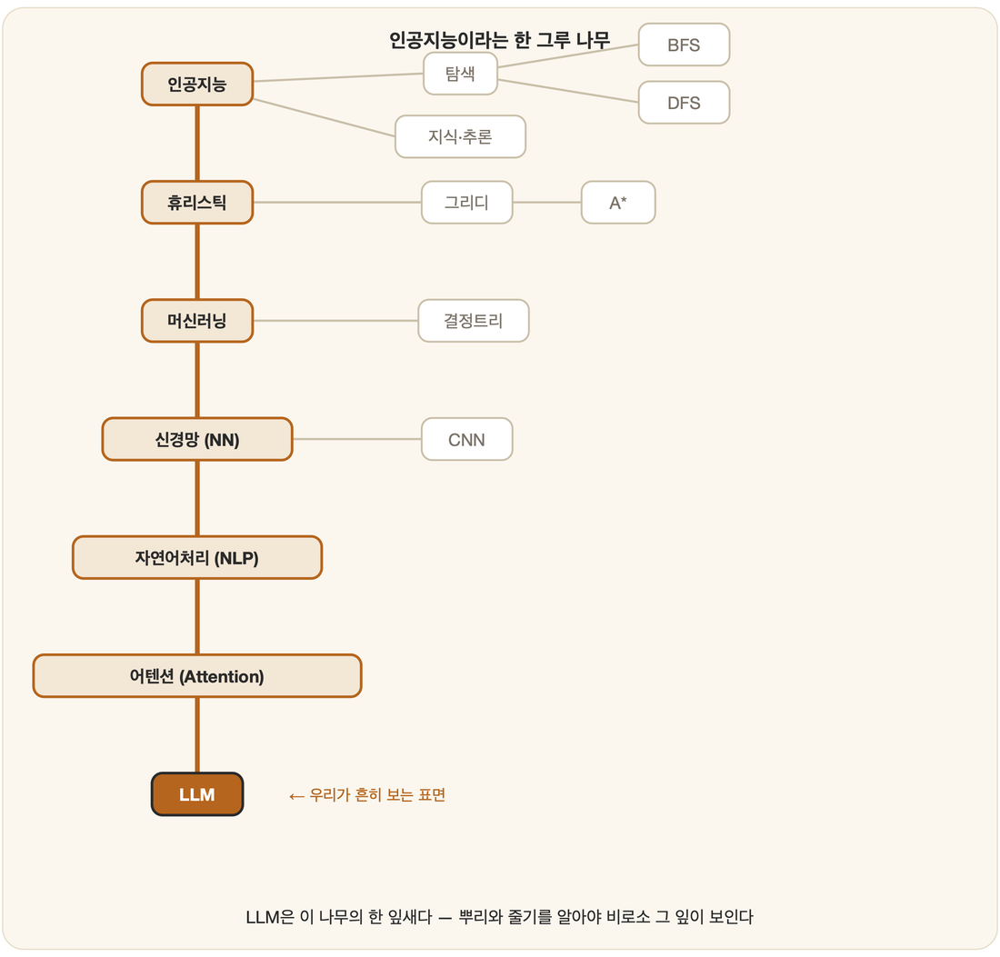

# 00. 들어가며 — 왜 지금 '기초'인가

> "내가 만들 수 없는 것은, 내가 이해하지 못하는 것이다."
> — 리처드 파인만

## 트렌드가 아니라 토대를

어제 또 새 모델이 나왔다. 파라미터는 더 커졌고, 벤치마크는 또 한 번 갱신되었으며, 어딘가의 누군가는 벌써 다음 논문을 올렸다. 그 속도는 분명 경이롭다. 그러나 빠르게 흐르는 강물 위에서는 발을 디딜 곳을 찾기 어려운 법이다. 새 모델이 등장할 때마다 처음부터 다시 배우는 기분이 든다면, 그것은 우리가 **흐름**만 쫓았을 뿐 그 아래의 **바닥**을 한 번도 딛지 못했기 때문이다.

여기서는 그 바닥을 다진다. 가장 화려한 최신 기술을 뒤쫓는 대신, 인공지능이라는 분야가 애초에 어떤 질문에서 출발했고 어떤 개념 위에 세워졌는지를 처음부터 차근차근 짚어 나간다. 탐색, 논리, 추론, 지식 표현, 학습, 신경망, 언어 — 수십 년 전에 다듬어진 이 개념들은 지금의 거대한 모델 안에서도 여전히 살아 숨 쉬고 있다. 단지 표면의 이름만 바뀌었을 뿐이다.

한 장의 그림으로 이 책 전체를 미리 펼쳐 보자. 인공지능은 한 그루의 나무다.

요즘 모두가 이야기하는 **LLM**은, 알고 보면 이 나무의 가장 끝에 매달린 잎새 하나다. 뿌리에서 출발해 *휴리스틱 → 머신러닝 → 신경망 → 자연어처리 → 어텐션*이라는 줄기를 타고 한참을 올라가야 닿는 자리에 있다. 그러니 잎새만 들여다봐서는 그것이 왜 거기 있는지, 무엇을 할 수 있고 무엇을 못 하는지 보이지 않는다. **표면의 LLM 하나가 아니라 이 나무 전체를 알 때, 비로소 그 잎새가 이해된다.** 이 책이 가지 끝이 아니라 뿌리에서 시작하는 이유다.

## 이 책이 지향하는 것

그래서 여기서는 오늘의 유행어가 아니라 10년 뒤에도 유효할 개념을 붙잡는다. 트렌드에 휘둘리지 않겠다는 약속이다. 또한 건너뛰지 않는다. 수학과 논리, 사람의 사고와 뇌에서 시작해 탐색과 추론, 학습으로 한 계단씩 올라간다. 읽고 끄덕이는 데서 멈추지도 않는다. 직접 만들어 보며 이해를 확인하는데, 파인만의 말처럼 만들 수 없다면 아직 이해한 것이 아니기 때문이다. 그리고 조금은 클래식하게 간다. LISP와 Prolog, 전문가 시스템, 미니맥스처럼 흔히 '고전'으로 분류되는 것들을 일부러 다루는데, 바로 이것들이야말로 인공지능의 사고방식을 가장 맑게 보여 주기 때문이다.

## 누구를 위한 책인가

최신 기술을 다뤄 봤지만 어딘가 기초가 비어 있다고 느끼는 사람, 인공지능을 한철 유행이 아니라 하나의 학문으로 제대로 공부하고 싶은 사람, 빠르게 답을 얻기보다 천천히 원리를 쌓아 단단한 실력을 갖추고 싶은 사람 — 이런 이들을 위해 쓰였다.

## 어떻게 읽으면 좋은가

순서대로 읽도록 설계되어 있다. 1부에서 인공지능이 무엇인지 큰 그림을 그리고, 2부에서 그 토대가 되는 기초 체력, 곧 수학과 논리와 심리와 뇌를 다진다. 이후 탐색(3부)을 거쳐 지식과 추론(4부), 학습(5부), 언어와 지각(6부)으로 나아가며, 마지막 7부에서는 고전 AI의 언어인 LISP와 Prolog로 지금까지의 개념을 직접 손으로 다뤄 본다.

급할 것은 없다. 한 장(章)을 읽고 나면 잠시 멈춰, 방금 배운 것을 스스로의 언어로 다시 설명해 보길 권한다. 설명할 수 있다면 그것은 이제 당신의 것이다.

---

> "우리는 앞을 짧은 거리만 볼 수 있지만, 거기에 해야 할 일이 많다는 것은 볼 수 있다."
> — 앨런 튜링

자, 이제 첫 걸음을 내딛어 보자.
