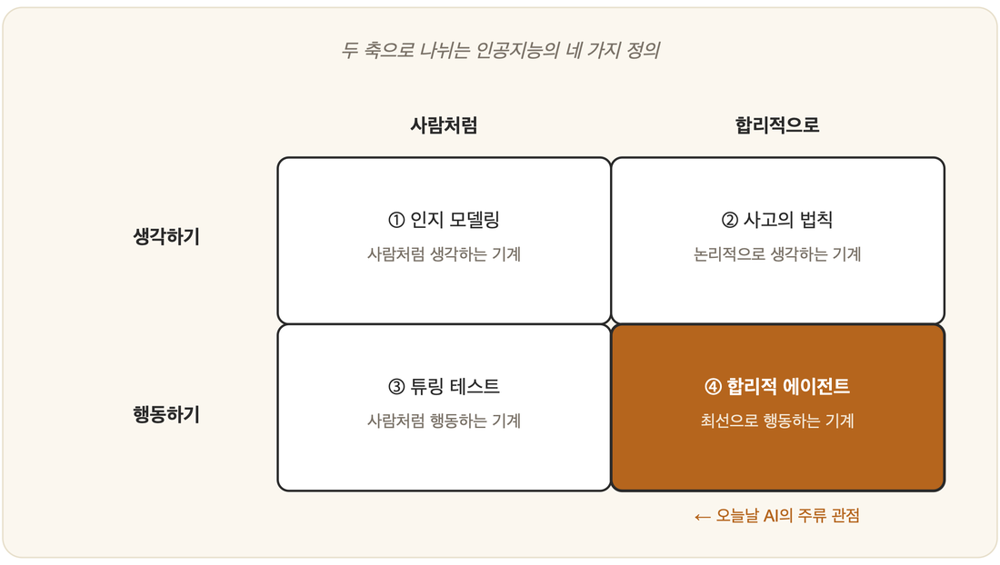

# 01-02. 인공지능의 정의와 목표

지능이라는 말 하나조차 손에 쥐려고 하면 모래처럼 빠져나간다는 것을, 우리는 이미 보았다. 그렇다면 그 앞에 '인공'이라는 두 글자를 붙인 말은 어떨까. 더 단단해질까, 아니면 더 흐려질까. 흥미롭게도 '인공지능'에도 정답 같은 단 하나의 정의는 없다. 연구자가 무엇을 **목표**로 삼고 책상 앞에 앉았느냐에 따라, 같은 단어가 전혀 다른 얼굴을 한다.

## 두 개의 축, 네 개의 정의

다행히 그 흩어진 얼굴들을 두 개의 축 위에 가지런히 세워둔 사람들이 있다. 스튜어트 러셀과 피터 노빅이 정리해 널리 알려진 분류다.

첫 번째 축은 '사람처럼 할 것인가, 합리적으로 할 것인가'를 묻는다. 사람이 하는 방식을 그대로 본받을 것인가, 아니면 사람과 무관하게 '이상적으로 옳은' 방식을 좇을 것인가. 두 번째 축은 '생각인가, 행동인가'를 묻는다. 머릿속에서 일어나는 사고 과정을 흉내 낼 것인가, 아니면 겉으로 드러나는 행동을 만들어낼 것인가. 이 두 물음을 교차시키면, 네 칸짜리 격자 위에 네 가지 정의가 또렷하게 떠오른다.

|              | 사람처럼 (human-like)        | 합리적으로 (rational)         |
|--------------|------------------------------|-------------------------------|
| **생각하기** | ① 사람처럼 **생각하는** 기계 | ② **합리적으로 생각하는** 기계 |
| **행동하기** | ③ 사람처럼 **행동하는** 기계 | ④ **합리적으로 행동하는** 기계 |

### ① 사람처럼 생각하는 기계 — 인지 모델링

첫 번째 길은 기계가 사람과 **같은 방식으로** 생각하기를 바란다. 그러나 그러려면 먼저 알아야 할 것이 있다. 사람은 대체 어떻게 생각하는가. 이 물음 앞에서 인공지능은 자연스레 심리학·인지과학과 손을 잡는다. (2부의 인지심리학·뇌가 여기에 닿아 있다.)

### ② 합리적으로 생각하는 기계 — 사고의 법칙

두 번째 길은 사람의 머릿속 따위는 묻지 않고, 그저 '올바른 추론'의 규칙만을 따르게 한다. 아득히 아리스토텔레스의 논리학에서 출발한 이 전통은, 전제에서 타당한 결론을 이끌어내는 **논리**를 기계 안에 새겨 넣는다. (2부의 논리, 4부의 추론이 여기에 해당한다.)

### ③ 사람처럼 행동하는 기계 — 튜링 테스트

세 번째 길은 속을 들여다보기를 포기한다. 내부가 어떻든, **겉으로 사람과 구별되지 않게 행동**한다면 지능적이라고 보자는 것이다. 다음 절에서 만나게 될 **튜링 테스트**가 바로 이 정의의 얼굴이다.

### ④ 합리적으로 행동하는 기계 — 합리적 에이전트

네 번째 길은 가장 실용적이다. 주어진 상황에서 **목표를 가장 잘 달성하는 행동**을 하는 시스템을 만들겠다는 것. '사람을 흉내 내는 일'에 매이지 않고 오로지 '최선의 행동'만을 좇기에, 이 관점은 오늘날 인공지능 연구의 주류로 올라섰다. 이 책에서 거듭 모습을 드러낼 **에이전트(agent)** 개념(6부)이 바로 이 자리에서 태어난다.

## 어느 정의가 옳은가?

정답을 굳이 말하자면 "상황에 따라 다르다"이다. 사람의 사고 자체를 이해하려는 연구자에게는 ①·③이 소중하고, 그저 잘 작동하는 시스템을 짓고 싶은 공학자에게는 ②·④가 든든한 연장이 된다. 정작 잊지 말아야 할 것은 따로 있다. **인공지능이라는 한 단어 안에 이렇게 서로 다른 목표들이 함께 살고 있다**는 사실이다. 누군가 "이건 진짜 AI가 아니다"라고 단언할 때, 그는 십중팔구 이 네 정의 중 하나를 남몰래 기준으로 쥐고 있는 셈이다.

> **이 책의 입장**
> 우리는 ④ '합리적으로 행동하는 기계'를 한가운데 두되, 사람처럼 생각하고 행동하는 접근(①·③)도 그 뿌리를 더듬기 위해 함께 다룬다. 어느 한쪽만 들여다보면, 인공지능의 절반만 보고 만 셈이 되기 때문이다.

---

### 정리

- 인공지능의 정의는 **〈사람처럼 ↔ 합리적으로〉 × 〈생각 ↔ 행동〉**의 네 갈래로 나뉜다.
- 각 정의는 서로 다른 학문(심리학, 논리학, 공학)과 연결된다.
- 오늘날 주류는 **합리적으로 행동하는 에이전트**라는 관점이다.

### 생각해보기

- 스마트폰의 음성 비서는 네 정의 중 어디에 가장 가까울까요? 그 이유는?
