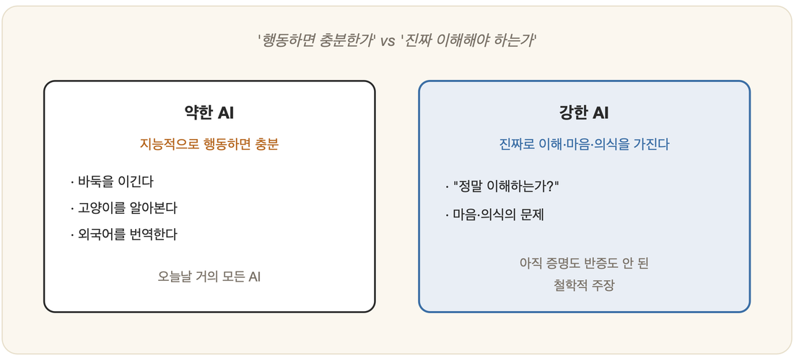

# 01-04. 강한 AI와 약한 AI

체스판 너머에 누가 앉아 있는지 보이지 않는다고 상상해 보자. 벽 하나가 막혀 있고, 당신은 오가는 수만으로 상대를 짐작한다. 상대가 사람일 때와 기계일 때, 그 수가 똑같이 영리하다면 당신은 둘을 구별할 수 있을까. 더 곤란한 물음이 그 뒤에 숨어 있다. 설령 구별하지 못한다 해도, 저 벽 너머의 기계는 *정말로* 무언가를 생각하고 있는 것일까, 아니면 그저 생각하는 척 수를 둘 뿐일까. 튜링 테스트를 둘러싼 논쟁은 결국 이 한 가지 갈림길로 모인다. 기계가 **정말로 마음을 가지는가**, 아니면 그저 **마음을 가진 것처럼 행동하는가**. 철학자 존 설(John Searle)은 이 둘에 각각 **강한 AI**와 **약한 AI**라는 이름을 붙였다. 이 구분을 손에 쥐고 있으면, 앞으로 마주칠 많은 혼란이 미리 가라앉는다.

## 약한 AI (Weak AI)

약한 AI는 **지능적인 것처럼 행동하는** 기계를 가리킨다. 이 입장에서 기계는 마음도, 의식도, 이해도 실제로 갖출 필요가 없다. 지능이 필요해 보이는 일을 그저 잘 해내면 그것으로 족하다.

바둑판 앞에서 사람을 이기는 프로그램, 흐릿한 사진 속에서 고양이를 정확히 짚어내는 시스템, 낯선 외국어를 막힘없이 옮기는 번역 도구 — 이런 것들이 정말로 바둑을 '즐기'거나 고양이를 '아는'지는 약한 AI가 묻지 않는 물음이다. 중요한 것은 오직 **결과로서 지능적인 행동**을 내놓는가이다. 오늘날 우리가 쓰는 거의 모든 인공지능은 바로 이 약한 AI에 속하며, 이 책이 다루는 기술들 또한 대부분 그 울타리 안에 있다.

## 강한 AI (Strong AI)

강한 AI는 거기서 한 걸음을 더 내딛는다. 적절히 프로그래밍된 기계는 지능을 흉내 내는 데 그치지 않고 **진짜로 마음을 가지며, 진짜로 이해하고, 의식을 가진다**는 주장이다. 강한 AI의 눈으로 보면 사람의 뇌마저도 일종의 정보처리 기계일 뿐이니, 같은 처리를 구현한 컴퓨터라면 똑같이 '마음'을 가질 수 있어야 한다.

이것은 공학의 주장이라기보다 **철학의 주장**이다. 강한 AI가 과연 가능한지는, 아직 누구도 증명하지도 반증하지도 못한 채 열려 있다.

## 두 입장이 갈리는 지점

이 구분이 왜 중요한지는, 똑같은 시스템 하나를 앞에 놓고 두 입장이 정반대의 판결을 내리는 순간에 가장 또렷이 드러난다.

> 어떤 프로그램이 튜링 테스트를 완벽히 통과했다고 합시다.
> - **약한 AI**: "훌륭하다. 목표를 달성했다. 더 따질 것은 없다."
> - **강한 AI**: "그래서, 그 프로그램은 *정말로* 이해하고 있는가?"

존 설은 이 두 번째 물음에 "아니다"라고 답하기 위해 그 유명한 **중국어 방** 사고실험을 고안했다. 그 논변은 다음 장(03-02)에서 자세히 다룬다.

## 이 책의 태도

이 책의 거의 모든 페이지는 **약한 AI**에, 그러니까 '어떻게 하면 지능적으로 행동하는 시스템을 만들 수 있는가'에 바쳐진다. 탐색도 추론도 학습도 언어도, 결국은 결과로서의 지능적 행동을 빚어내는 기술이다.

그렇다고 강한 AI의 질문을 **하찮게 여기지는 않는다.** "기계가 정말 이해할 수 있는가"라는 물음은, 우리가 만드는 시스템이 무엇을 할 수 있고 무엇을 할 수 없는지를 도리어 또렷이 비춰 준다. 도구를 만드는 사람일수록, 그 도구의 한계를 정직하게 아는 일이 더없이 중요하다.

> **용어 주의 — '강한/약한 AI'와 'AGI'**
> 요즘 흔히 쓰는 **범용 인공지능(AGI)**, 즉 '여러 분야를 두루 잘하는 AI'는 *능력의 폭*에 관한 말이다. 반면 설이 말한 강한/약한 AI는 *진짜 마음을 갖느냐*에 관한 말로, 서로 다른 구분이다. 폭넓게 똑똑한(AGI) 기계라도 약한 AI일 수 있다. 두 개념을 섞지 말자.

---

### 정리

- **약한 AI**: 지능적으로 *행동*하면 충분하다 — 오늘날 거의 모든 AI.
- **강한 AI**: 기계가 진짜 *마음·이해·의식*을 가진다는 (철학적) 주장.
- 'AGI(범용성)'와 '강한 AI(진짜 마음)'는 다른 개념이다.

### 생각해보기

- 당신은 강한 AI가 원리적으로 가능하다고 보십니까? 그 판단의 근거는 무엇인가요?
- 약한 AI만으로도 사회를 크게 바꿀 수 있을까요? '진짜 이해' 여부가 실제 쓰임에 얼마나 중요할까요?
