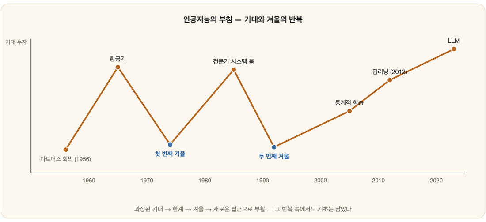

# 02. 인공지능의 역사

> 꿈에서 현실로 — 인공지능이 어떤 부침을 거쳐 오늘에 이르렀는지 시대순으로 짚는다.

## 이 장에서 다루는 것

- **02-01 태동: 다트머스 회의** — 1956년, '인공지능'이라는 이름이 처음 붙은 순간과 그 배경.
- **02-02 황금기와 첫 번째 겨울** — 초기의 낙관, 그리고 과장된 기대가 식으며 찾아온 첫 침체.
- **02-03 전문가 시스템과 두 번째 겨울** — 규칙 기반 시스템의 상업적 성공과 그 한계가 부른 두 번째 침체.
- **02-04 연결주의의 부활과 오늘** — 신경망의 재등장, 데이터와 연산의 시대가 열리기까지.

---

한 무리의 연구자들이 여름 한철을 비워 회의실에 모인다. 그들은 몇 주면 생각하는 기계의 윤곽 정도는 그려낼 수 있으리라 믿는다. 그로부터 수십 년, 그 여름의 약속은 환호와 냉소를 번갈아 받으며 묻혔다가 되살아나기를 반복한다. 그 긴 곡선을 멀찍이서 바라보면 한 가지 리듬이 손에 잡힌다. **낙관 → 한계 → 겨울 → 부활**의 되풀이다. 그러니 이 곡선을 따라 걸으며 마음에 새겨야 할 것은 연도의 나열이 아니라, 그 리듬이 매번 돌아올 때마다 무엇이 끝내 남았는가 하는 점이다. 거기에 *기초의 힘*이 있다.

