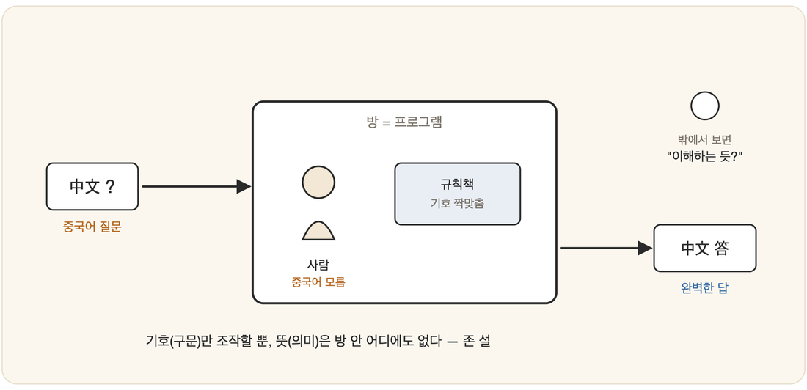

# 03-02. 중국어 방 논변

앞 절의 기능주의는 올바른 프로그램을 돌리는 기계라면 마음을 가질 수 있다고 속삭였다. 그 속삭임이 채 가라앉기도 전인 1980년, 철학자 **존 설(John Searle)**은 그 주장을 무너뜨릴 작정으로 머릿속에 작은 방 하나를 지었다. 인공지능 철학에서 가장 자주 인용되는 사고실험, **중국어 방(Chinese Room)** 논변이 그렇게 태어났다.

## 사고실험: 방 안의 사람

방 안에 한 사람이 갇혀 있다고 상상해 보자. 그는 중국어를 **전혀 모른다.** 한 글자도. 방에는 중국어 기호를 처리하는 **방대한 규칙책**이 놓여 있는데, 다행히 그 책은 그가 읽을 수 있는 영어로 쓰여 있다. 규칙은 단순하다. 이런 모양의 기호가 들어오면 저런 모양의 기호를 내보내라, 그런 식이다.

밖에서 중국어로 쓴 질문이 쪽지가 되어 문틈으로 들어온다. 방 안의 사람은 그 기호들의 뜻은 모르는 채, 오직 규칙책을 뒤져 모양을 맞추고 답이 될 기호를 골라 다시 문밖으로 내보낸다. 그런데 밖에 선 중국인이 보기엔 그 답이 **완벽하게 자연스럽다.** 방은 마치 중국어를 이해하는 존재처럼 보인다.

바로 여기서 설의 질문이 날아든다. **그 방 안의 사람은 중국어를 이해하고 있는가?** 아니다. 그는 기호의 *모양*을 규칙대로 짜맞췄을 뿐, 그 *뜻*은 끝내 한 톨도 알지 못한다.

## 핵심 주장: 구문은 의미가 아니다

이 방은 사실 **컴퓨터의 은유**다. 규칙책은 프로그램이고, 사람은 CPU이며, 중국어 기호는 데이터다. 방 전체는 튜링 테스트를 너끈히 통과할 만큼 그럴듯하게 행동한다. 그럼에도 그 어디에도 *이해*는 깃들어 있지 않다. 설이 끌어낸 결론은 이렇다.

> **구문(syntax)만으로는 의미(semantics)가 생기지 않는다.**
> 프로그램은 기호를 형식적으로 조작할 뿐이며, 아무리 정교해도 그 자체로는 *이해*에 이르지 못한다.

요컨대 튜링 테스트를 통과한다 해도, 즉 사람처럼 행동한다 해도, 그것이 곧 *이해*나 *마음*을 뜻하지는 않는다. 1장의 구분으로 보면 이는 **강한 AI에 대한 정면 반박**이다. 지능적으로 행동하기를 가리키는 약한 AI라면 설도 굳이 부정하지 않는다.

## 반론과 재반론

중국어 방은 가라앉기는커녕 거센 논쟁의 파도를 일으켰다. 대표적인 반론 몇 가지에는 설이 매번 되받아쳤다.

먼저 **시스템 반론**이 있다. 사람 혼자야 이해 못 하더라도 사람과 규칙책과 종이를 합친 *방 전체 시스템*은 이해하는 것 아니냐는 것이다. 설은 답한다. 사람이 규칙책을 통째로 암기해 방을 머릿속에 통째로 넣어 버려도, 그는 여전히 중국어를 모른다고.

다음은 **로봇 반론**이다. 방을 몸에 집어넣어 세상과 감각으로, 행동으로 연결하면 비로소 의미가 생기지 않겠느냐는 기대다. 설은 다시 고개를 젓는다. 감각 입력이라는 것도 결국 또 하나의 기호일 뿐, 구문에서 의미로 건너뛰는 도약은 여전히 일어나지 않는다고.

끝으로 **뇌 시뮬레이션 반론**이 있다. 중국인의 뇌 뉴런을 하나하나 그대로 시뮬레이션한다면 어떻겠느냐는 물음이다. 설의 대답은 서늘하다. 물을 아무리 정교하게 시뮬레이션해도 그 시뮬레이션이 젖지는 않듯, 시뮬레이션은 결코 진짜가 아니라고.

이 논쟁은 지금도 결판나지 않은 채다. 그러나 정작 중요한 것은 어느 쪽이 이겼느냐가 아니라, **이 논변이 우리에게 무엇을 보게 하는가**다.

## 왜 이것을 알아야 하는가

사람과 매끄럽게 대화하는 시스템 앞에 앉아 본 사람이라면 누구나 한 번쯤 멈칫한다. 이건 정말 이해하는 걸까? 중국어 방은 바로 그 의문을 **40년 전에 이미 또렷하게** 던져 두었다. 도구를 만드는 사람일수록, 그럴듯하게 행동함과 진짜 이해함을 뒤섞지 않는 분별이 절실하다. 그리고 이 분별은 다음 절에서 마주하게 될 **기호주의 대 연결주의** 논쟁의 밑바탕이기도 하다.

특히 오늘의 거대 언어 모델(LLM)은 이 사고실험을 박물관에서 끌어내 현실로 데려왔다. 방대한 텍스트의 통계로 '다음에 올 그럴듯한 기호'를 내놓는 LLM은, 규칙책이 어마어마하게 두꺼워진 **중국어 방**과 다르지 않다는 시선이다. 답은 더없이 매끄럽지만 '이해'인지는 여전히 설의 질문 그대로다 — 이 물음은 19-05(어텐션의 천장)에서 신경-기호의 필요로 다시 이어진다.

---

### 정리

- **중국어 방**(설, 1980): 규칙대로 기호를 조작해도 *이해*는 생기지 않는다.
- 핵심 명제: **"구문 ≠ 의미"** → 강한 AI에 대한 반박(약한 AI는 부정하지 않음).
- 시스템·로봇·뇌 시뮬레이션 반론이 있으나 논쟁은 미결.

### 생각해보기

- "구문에서 의미는 결코 나올 수 없다"는 설의 단언은 옳을까요? 그렇다면 탄소로 된 *당신의 뇌*에서는 어떻게 의미가 생겨났을까요? 뇌는 무엇이 다르기에?
