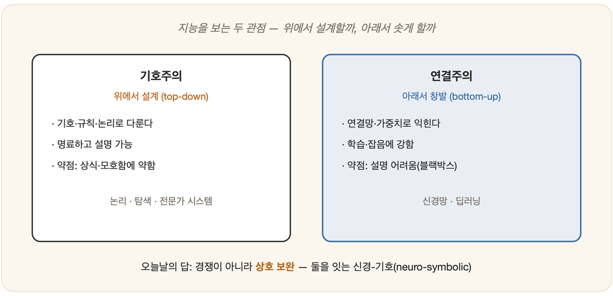

# 03-03. 기호주의와 연결주의

지능을 기계로 옮겨 담으려던 사람들 앞에는, 처음부터 두 갈래의 길이 놓여 있었다. 한쪽은 지능을 *기호를 다루는 일*로 여겼고, 다른 한쪽은 지능을 *연결망에서 솟아나는 일*로 여겼다. 같은 산을 오르는 두 등산로처럼 보였지만, 실은 "지능이란 무엇인가"라는 질문에 대한 서로 다른 대답이었다. 앞의 길에 붙은 이름이 **기호주의**, 뒤의 길에 붙은 이름이 **연결주의**다.

## 기호주의 (symbolism, GOFAI)

종이 위에 명제를 적고, 규칙을 따라 한 줄씩 결론을 끌어내는 사람을 떠올려 보자. 그가 머릿속에서 굴리는 것은 개념이라는 기호이고, 그 기호를 잇는 것은 논리의 규칙이다. 기호주의는 바로 이 장면을 지능의 본모습으로 보았다. 사람의 사고가 기호를 규칙에 따라 다루는 과정이라면, 기계도 그렇게 만들면 된다는 것이다. 뉴얼과 사이먼은 이 믿음을 한 문장에 못 박았으니, 곧 **물리 기호 체계 가설(Physical Symbol System Hypothesis, 1976)**이다.

> 물리 기호 체계는 **일반적 지능 행동에 필요하고도 충분한** 수단을 갖는다.

이 전통에 'GOFAI(Good Old-Fashioned AI, 좋았던 옛날식 AI)'라는 이름이 붙었다. 논리와 규칙, 탐색, 그리고 전문가 시스템(4부)이 모두 이 깃발 아래 모인다.

그 강점은 명료함에 있다. 추론의 한 걸음 한 걸음을 사람이 읽어 내려갈 수 있고, 왜 그런 결론에 이르렀는지 설명할 수 있으며, 규칙을 또렷하게 손에 쥐고 다룰 수 있다. 그러나 바로 그 또렷함이 약점이 되었다. 세상에 흩어진 모든 상식과 모호함과 예외를, 하나도 빠짐없이 기호와 규칙으로 받아 적는 일은 사실상 불가능했기 때문이다. 2장에서 두 번째 겨울이 보여 준 한계가 바로 이것이었다.

## 연결주의 (connectionism)

연결주의는 정반대 끝에서 길을 시작한다. 지능이란 누군가 위에서 설계해 내려보낸 기호가 아니라, **단순한 단위(뉴런)들이 빽빽이 연결된 망에서 저절로 솟아오르는 무엇**이라는 것이다. 그러니 지식도 어딘가에 또박또박 적힌 규칙으로 존재하지 않는다. 그것은 **연결의 강도, 곧 가중치 속에 분산되어** 담긴다. 신경망(8·19장)이 이 흐름을 대표한다.

이 길의 강점은 스스로 배운다는 데 있다. 데이터를 먹으며 제 손으로 규칙을 빚어내고, 흐릿하고 잡음 섞인 입력 앞에서도 부드럽게 휘어 대응한다. 다만 그 대가가 있다. '왜 그렇게 판단했는가'라는 물음의 답이 수많은 가중치 사이로 흩어져 버려, 좀처럼 설명해 낼 수 없다는 것이다. 사람들은 이 답답함에 이름을 붙였다 — 블랙박스다.

## 하나의 대비, 여러 층위

흥미롭게도 이 대비는 앞서 만난 주제들과 차곡차곡 겹친다.

| | 기호주의 | 연결주의 |
|---|---|---|
| 지능의 자리 | 명시적 기호·규칙 | 연결의 패턴 |
| 방향 | 위에서 설계(top-down) | 아래에서 창발(bottom-up) |
| 대표 | 논리·탐색·전문가 시스템 | 신경망·딥러닝 |
| 심신관(03-01) | 기호 처리 = 사고 | 두뇌 모사 = 사고 |

## 경쟁에서 화해로

한때 두 진영은 서로의 존재를 부정하는 경쟁자처럼 마주 섰다. 2장의 신경망 부활기가 그 팽팽한 대치의 한 장면이다. 그러나 오늘날 무게중심은 어느 한쪽의 승리가 아니라 **상호 보완** 쪽으로 옮겨 앉았다.

> 연결주의는 **지각과 학습**(보고, 듣고, 패턴을 익히는 일)에 강하고,
> 기호주의는 **추론과 설명**(논리적으로 따지고, 이유를 대는 일)에 강하다.

생각해 보면 사람의 마음도 이 둘을 함께 쓰며 산다. 한눈에 알아보는 직관(연결주의적)과 차근차근 따져 가는 사고(기호주의적) 사이를 우리는 하루에도 수없이 오간다. 그래서 두 길을 한데 묶으려는 **신경-기호(neuro-symbolic)** 접근이 중요한 방향으로 떠올랐다. 어느 한쪽만 아는 것은 지능의 절반만 아는 셈이다. 신경망과 논리를 *함께* 들여다보는 까닭이 여기에 있다.

---

### 정리

- **기호주의(GOFAI)**: 지능 = 기호 조작(물리 기호 체계 가설). 명료하나 상식·모호함에 약하다.
- **연결주의**: 지능 = 연결망의 창발. 학습·강건함에 강하나 설명이 어렵다.
- 오늘의 관점: **경쟁이 아니라 상호 보완** → 신경-기호 결합.

### 생각해보기

- 당신이 처음 보는 글자를 알아볼 때(연결주의적)와 수학 문제를 단계별로 풀 때(기호주의적), 머릿속 작동은 어떻게 다른가요? 둘 중 하나만으로 지능을 만들 수 있을까요?
