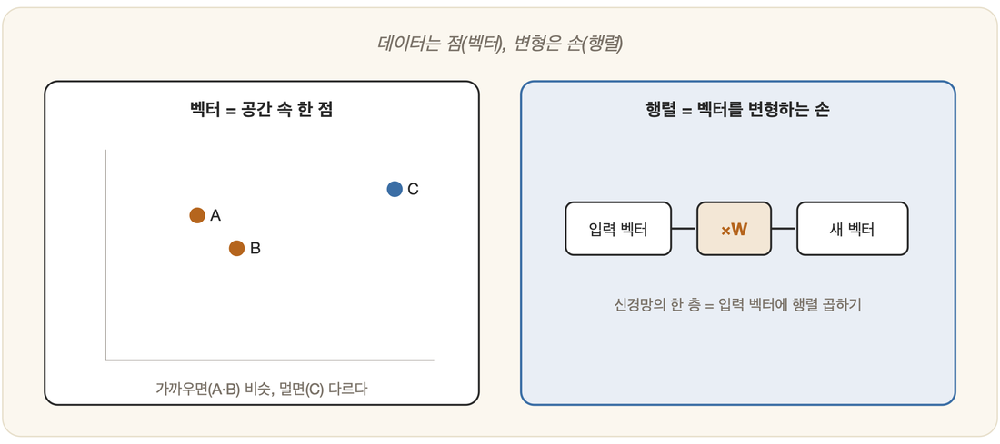

# 05-01. 선형대수: 벡터와 행렬

2부의 문턱에서 가장 먼저 마주치는 것은 수학이다. 겁먹을 필요는 없다. 여기서 증명을 늘어놓을 생각은 없다. 다만 한 가지 질문, "왜 AI에 이 수학이 필요한가"라는 직관부터 또렷이 세워 두려는 것이다. 그 출발점에 선형대수가 있다. AI가 데이터와 변환을 표현하는 언어가 바로 이것이다.

## 벡터: 숫자로 된 한 점

병원 접수대에서 간호사가 당신에 관해 적어 두는 것은 결국 몇 개의 숫자다. 키, 몸무게, 나이. 그 세 칸이 채워지는 순간, 당신은 종이 위의 사람이 아니라 3차원 공간의 한 점이 된다. 숫자들을 그저 한 줄로 늘어놓은 이 묶음에 사람들은 이름을 붙였다 — 벡터(vector)다.

이것이 AI에서 결정적인 까닭은, 거의 모든 데이터를 벡터로 바꿀 수 있기 때문이다. 이미지는 픽셀 값의 벡터가 되고, 문장은 단어를 나타내는 숫자들의 벡터가 된다. 일단 무언가가 벡터가 되고 나면, 우리는 그것을 기하학으로 다룰 수 있다. 두 벡터가 가까이 있으면 두 대상이 서로 비슷하다는 뜻이고, 두 벡터가 같은 쪽을 가리키면 그 성격이 닮았다는 뜻이다.

특히 내적(dot product)은 두 벡터가 얼마나 같은 방향을 바라보는지를 단 하나의 숫자로 일러 준다. "두 문서가 얼마나 비슷한가"(22장의 코사인 유사도) 같은 물음도, 파고들어 보면 결국 이 내적 계산 하나로 풀린다.

## 행렬: 표이자 변환

벡터를 여러 줄 쌓으면 숫자의 표가 된다. 이것이 행렬(matrix)이다. 그리고 행렬은 두 얼굴로 읽을 수 있다.

하나는 데이터 표로서의 얼굴이다. 100명을 각각 세 개의 숫자로 적으면 100×3 행렬이 되고, 한 줄이 곧 한 사람이다. 다른 하나는 변환(transformation)으로서의 얼굴이다. 행렬을 벡터에 곱하면, 그 벡터는 회전하거나 커지거나 자리를 옮기며 모습을 바꾼다.

이 두 번째 얼굴이야말로 신경망의 심장이다. 신경망의 한 층이 하는 일은 본질적으로 입력 벡터에 행렬을 곱하는 것이고, 층을 쌓는다는 건 그런 변환을 잇따라 포개는 것이다. (19장에서 다시 만난다.)

## 왜 AI는 선형대수로 말하는가

이유는 두 갈래다. 먼저 표현의 문제다. 세상의 온갖 데이터를 벡터와 행렬이라는 단 하나의 형식으로 통일해 다룰 수 있다. 그리고 계산의 문제다. 행렬 연산은 정형화되어 있어, GPU가 한꺼번에 대규모로 처리할 수 있다. 딥러닝의 그 아찔한 속도는 상당 부분 바로 여기서 흘러나온다.

지금은 "데이터는 벡터, 변환은 행렬"이라는 그림 한 장만 또렷이 손에 쥐면 그것으로 충분하다. 나머지는 정작 필요해지는 자리에서 다시 펼쳐 보일 것이다.

---

### 정리

- **벡터** = 숫자들의 묶음 = 공간 속 한 점. 데이터를 벡터로 바꾸면 *거리·방향*으로 유사성을 잴 수 있다.
- **행렬** = 데이터 표이자 *변환*. 신경망의 한 층 = 행렬 곱.
- AI가 선형대수를 쓰는 이유: **통일된 표현 + 대규모 병렬 계산**.

### 생각해보기

- 좋아하는 음악 한 곡을 숫자 몇 개의 벡터로 표현한다면, 어떤 특징을 고르겠습니까? 그 벡터들이 가까우면 정말 '비슷한 곡'일까요?
