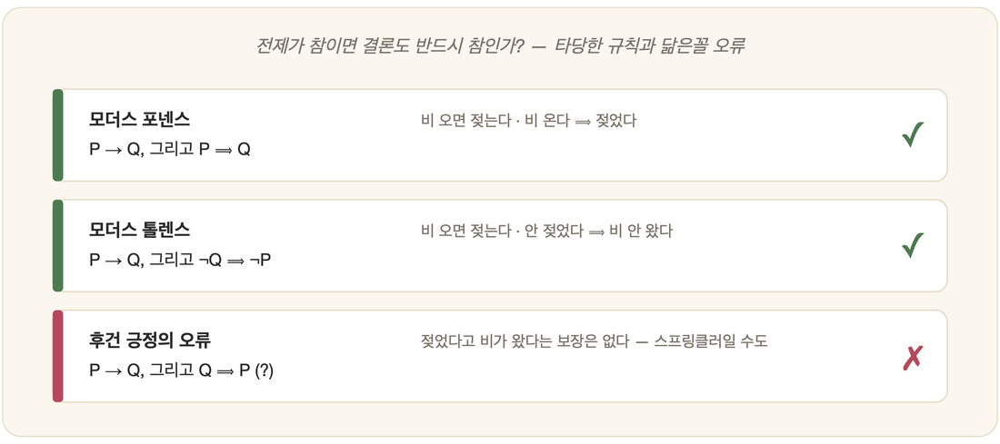

# 06-03. 추론 규칙

비가 내린다. 창밖을 내다보던 당신은 우산을 챙긴다. 누가 가르쳐 준 적도 없는데, 당신의 머릿속에서는 무언가가 조용히 미끄러져 갔다. 비가 오면 길이 젖는다는 것, 그러니 지금 나가면 젖으리라는 것. 아는 것에서 아직 모르던 것으로, 발을 헛디디지 않고 건너가는 이 도약 — 논리가 끝내 다다르려는 곳이 바로 여기다. 전제에서 결론으로 안전하게 나아가는 일, 그것을 **추론**이라 부른다. 4부의 추론 엔진도, 7부의 Prolog도, 결국 이 한 걸음을 기계에게 맡기려는 시도다.

## 타당함이란 무엇인가

그런데 모든 건넘이 안전한 것은 아니다. 어떤 도약은 운이 좋아 착지하고, 어떤 도약은 발판이 무너지지 않기에 반드시 착지한다. 논리가 신뢰하는 것은 후자뿐이다. **타당한(valid)** 추론이란 **전제가 참이면 결론이 반드시 참**인 추론을 말한다. 결론이 우연히 맞아떨어지는 것이 아니라, 전제로부터 빠져나갈 수 없게 따라 나와야 한다. 놀라운 점은 이 보장이 오직 형식만으로 성립한다는 데 있다. 문장의 의미를 한 글자도 이해하지 못하는 기계조차, 그래서 안전하게 추론할 수 있다.

## 기본 추론 규칙

이렇게 발판이 무너지지 않는 걸음에는 오래된 이름들이 붙어 있다.

가장 단순한 것이 **모더스 포넨스**, 긍정식이다. `P → Q`와 `P`가 주어지면 `Q`가 따라 나온다. "비 오면 젖는다. 비 온다. ∴ 젖었다." 그다음은 그 거울상인 **모더스 톨렌스**, 부정식이다. `P → Q`와 `¬Q`에서 `¬P`로 거슬러 오른다. "비 오면 젖는다. 안 젖었다. ∴ 비 안 왔다." 그리고 **삼단논법**, 곧 연쇄다. `P → Q`, `Q → R`이면 `P → R`. 규칙들을 사슬처럼 이어, 한눈에는 보이지 않던 먼 결론에 닿는다.

이 단순한 걸음들을 거듭 포개기만 해도, 처음엔 어디 있는지도 몰랐던 결론까지 도달하게 된다.

## 흔한 오류: 닮았지만 틀린 추론

위험은 가짜 발판에 있다. 멀리서 보면 똑같이 단단해 보이는데, 막상 디디면 꺼지는 걸음이 있다. 둘을 가려내는 일이야말로 추론의 핵심이다.

대표적인 것이 **후건 긍정의 오류**다. `P → Q`와 `Q`에서 `P`를 끌어내는 것 — 타당하지 않다(✗). "비 오면 젖는다. 젖었다. ∴ 비 왔다." 그럴듯하지만, 스프링클러가 적셨을 수도 있다. 또 하나는 **전건 부정의 오류**다. `P → Q`와 `¬P`에서 `¬Q`로 가는 걸음(✗) 역시 무너진다. 전제에서 반드시 따라 나오지 않는다면, 아무리 그럴듯해도 타당함의 자격을 얻지 못한다.

## 추론의 방향: 전향과 후향

같은 규칙이라도 어느 쪽 끝을 잡고 굴리느냐에 따라 길이 갈린다(4부에서 자세히 다룬다). **전향 추론(forward)**은 손에 쥔 사실에서 출발해, 적용할 수 있는 규칙을 차례로 적용하며 결론을 앞으로 쌓아 올린다. **후향 추론(backward)**은 거꾸로, 증명하고 싶은 목표를 먼저 세워 두고 그것을 떠받칠 전제를 거슬러 찾아 내려간다. Prolog가 택한 길이 바로 이 후자다.

## 연역을 넘어서

지금까지의 걸음은 모두 **연역(deduction)** — 전제에서 결론이 확실히 따라 나오는 추론이었다. 그러나 사람은 이 안전한 길만 걷지 않는다. 같은 일이 자꾸 일어나는 것을 보고 일반 규칙을 짐작하는 **귀납**, 눈앞의 결과를 가장 잘 설명하는 원인을 더듬어 보는 **가추**도 함께 쓴다. 이들은 결론을 보장해 주지 않는다. 다만 확실함이 좀처럼 허락되지 않는 세상에서, 그럼에도 한 걸음을 떼야 할 때 없어서는 안 될 도구다. 셋의 자세한 비교는 15장(추론)에서 이어진다.

---

### 정리

- **타당한 추론** = 전제가 참이면 결론이 *반드시* 참.
- 기본 규칙: **모더스 포넨스·톨렌스·삼단논법**. 닮은꼴 **오류**(후건 긍정 등)와 구분해야 한다.
- 적용 방향에 **전향/후향**이 있으며, 연역 외에 **귀납·가추**가 있다(15장).

### 생각해보기

- "알람이 울리면 7시다. 지금 7시다. 그러므로 알람이 울렸다." 이 추론은 타당한가요? 어떤 오류에 해당하는지 짚어 보세요.
