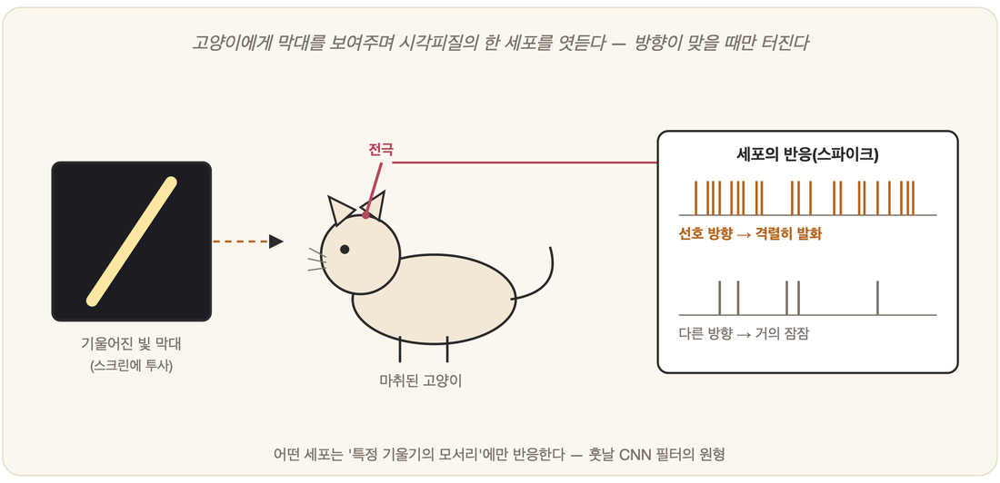

# 08-02. 뇌의 정보처리와 시각피질

뉴런 하나가 어떻게 깨어나는지는 이미 보았다(08-01). 그러나 세포 하나만으로는 아무것도 보지 못한다. 본다는 일은 수많은 뉴런이 *모여* 함께 벌이는 사건이다. 그래서 이번에는 뇌가 **'본다'**는 그 일을 들여다본다. 시각피질을 향한 탐험은 신경과학이 거둔 가장 빛나는 성취 가운데 하나일 뿐 아니라, 먼 훗날 5부의 **합성곱 신경망(CNN)**을 싹틔운 바로 그 씨앗이기 때문이다.

## 계층적으로 처리하는 뇌

지금 당신의 눈앞에 한 사람의 얼굴이 있다고 하자. 뇌는 그 얼굴을 한 번에 통째로 삼키지 않는다. 빛은 먼저 점과 선 같은 가장 단순한 흔적으로 쪼개지고, 그 흔적들이 모여 모서리와 무늬가 되며, 다시 눈과 코 같은 부분이 되고, 마침내 '아, 저 사람이다' 하는 얼굴 전체가 된다. **단순한 것에서 복잡한 것으로**, 여러 층을 차례로 밟아 올라가는 것이다.

이렇게 단계를 쌓아 올리는 방식이 바로 **계층적 처리**다. 그것은 뇌라는 기계의 핵심 설계 원리이며, 먼 훗날 딥러닝이 '깊은 층'을 쌓겠다고 선언했을 때 그 발상과 곧장 맞닿게 된다.

## 휴벨과 비셀의 고양이 실험

이 계층 구조가 단지 짐작이 아니라 실재한다는 것을, 두 사람이 손으로 증명했다. **데이비드 휴벨과 토르스튼 비셀**이다(1959/1962, 1981년 노벨 생리의학상). 그들은 **고양이의 1차 시각피질(V1)**에 머리카락보다 가는 전극을 꽂고, 화면에 온갖 자극을 비추며 어떤 뉴런이 어느 순간 깨어나는지를 끈질기게 기록했다. 그 어두운 실험실에서 그들이 마주친 것은 두 종류의 세포였다.

하나는 **단순세포(simple cell)**다. 이 세포는 특정 **위치**에, 특정 **방향**으로 놓인 모서리(edge)에만 반응했다. 다시 말해 *방향성 에지 검출기*였다. 다른 하나는 **복합세포(complex cell)**다. 이 세포는 방향만 같다면 모서리의 위치가 조금 달라져도 변함없이 반응했다. *위치의 흔들림을 견디는* 세포였던 것이다.

결국 뇌의 시각은 무엇보다 먼저 **'방향이 있는 모서리'**를 붙잡고, 그 위에 점점 더 복잡한 특징을 쌓아 올리는 것으로 드러났다.

## CNN으로 이어진 발견

이 발견은 곧장 공학의 언어로 옮겨졌다.

> - **단순세포** → CNN의 **합성곱(convolution)**: 작은 필터로 국소적 에지를 검출
> - **복합세포** → CNN의 **풀링(pooling)**: 위치가 조금 달라도 견디게 요약

후쿠시마의 **네오코그니트론(1980)**이 이 구조를 처음으로 흉내 냈고, 르쿤의 **CNN**이 그것을 완성된 형태로 다듬었다. 더 놀라운 일은 그다음에 일어났다. 학습을 마친 CNN의 첫 층 필터를 들여다보면, 그 모양이 휴벨과 비셀이 본 단순세포와—그리고 사람이 손으로 설계한 Gabor 필터와도—**거의 똑같다**는 사실이다. 자연이 빚은 세포와, 사람이 손으로 만든 필터와, 기계가 스스로 학습한 필터, 이 세 갈래가 한자리에서 만나는 장면은 **19-03(합성곱 신경망)**에서 자세히 다룬다.

## 왜 AI에 중요한가

뇌의 시각피질은 "어떻게 보아야 하는가"라는 물음에 자연이 오래전에 적어 둔 **답안지**였다. 계층적으로, 가장 단순한 에지부터 시작하라는 답안지. AI는 그 답안지를 베껴 영상 인식의 닫힌 문을 열어젖혔다. 한 시대의 생물학적 발견이 수십 년을 건너 다른 시대 공학의 심장이 된 것이니, 기초가 지닌 힘을 이보다 잘 보여 주는 사례도 드물다.

## 뇌의 지도: 어디서 무엇을 하나

시각피질은 뇌라는 거대한 지도 위의 한 지점일 뿐이다. 뇌는 균질한 덩어리가 아니라, 영역마다 맡은 일이 갈리는 분업의 기관이다. 뒤통수 쪽 후두엽은 방금 본 대로 시각을 처리하고, 옆머리의 측두엽은 언어와 기억을 다루며, 이마 안쪽의 전두엽은 계획하고 판단한다. 본다는 일이 V1에서 시작해 여러 영역으로 흘러가듯, 하나의 능력도 여러 부위가 손을 맞잡아 빚어낸다. AI를 공부하는 입장에서 이 지도는 한낱 해부학이 아니라, 자연이 먼저 풀어 둔 설계의 답안이다.

그 가운데 AI와 유난히 가깝게 맞닿는 곳이 몇 군데 있다. 깊숙이 자리한 해마(hippocampus)는 새로운 경험을 장기기억으로 저장하고 다시 불러오는 일을 맡는데, 무엇을 기억하고 무엇을 흘려보낼지를 다루는 이 구조는 기억을 갖춘 학습 시스템을 설계할 때 곧잘 영감의 원천이 된다. 그 곁의 편도체(amygdala)는 공포와 감정을 관장하며, 특정 소리에 전기 충격을 짝지어 학습시키는 공포 조건화 실험은 보상과 처벌로 행동을 빚는 강화학습의 생물학적 사촌처럼 보인다. 그리고 뉴런에서 뉴런으로 신호를 건네는 화학물질인 신경전달물질(neurotransmitter), 그중에서도 도파민이 특히 그렇다. 도파민이 '기대보다 좋았다'는 보상의 신호를 실어 나른다는 발견은, 강화학습의 핵심인 보상 예측 오차(reward prediction error)와 놀랍도록 닮아 있다. 뇌가 보상을 학습하는 방식과 기계가 보상을 학습하는 방식이, 다른 언어로 같은 이야기를 하고 있는 셈이다.

이 모든 것을 들여다보게 해 준 것이 영상 기법이다. fMRI는 뇌 활동에 따라 달라지는 혈류를 좇아 '지금 어느 영역이 일하는가'를 그려 내고, EEG는 머리 표면의 미세한 전기 신호로 그 활동의 박자를 읽는다. 살아 있는 뇌가 일하는 모습을 직접 엿볼 수 있게 되면서, 인간의 지능을 모형으로 옮기려는 AI는 베껴 적을 답안지를 한층 또렷이 받아 들게 되었다.

---

### 정리

- 뇌는 정보를 **계층적으로**(단순 → 복잡) 처리하며, 시각이 그 전형이다.
- **휴벨-비셀**은 시각피질의 **단순세포(방향성 에지)·복합세포(위치 불변)**를 발견했다.
- 이것이 CNN의 **합성곱·풀링**으로 이어졌다(→ 19-03).

### 생각해보기

- 뇌가 얼굴을 알아볼 때 '에지 → 부분 → 전체'로 쌓아 올린다면, 거꾸로 이 계층 어딘가가 어긋나면 어떤 일이 생길까? (실제로 특정 부위가 손상되면 '얼굴만 못 알아보는' 증상이 나타난다.)
