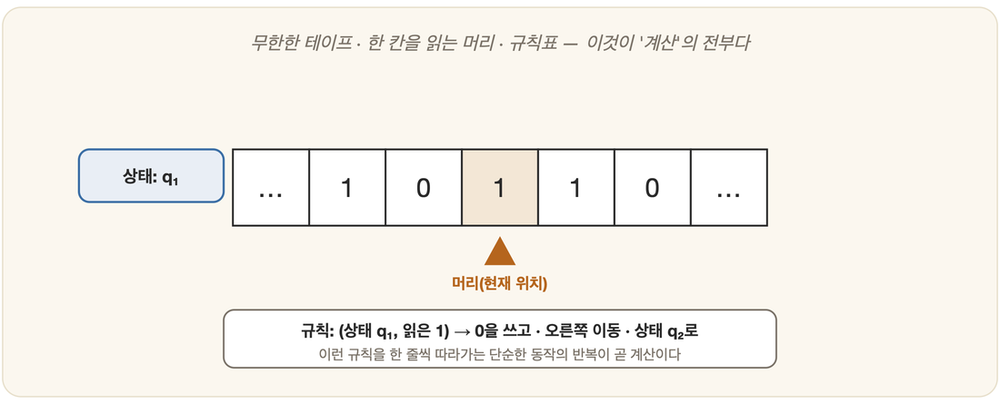

# 09-01. 계산이란 무엇인가: 튜링 기계

수학(5장)과 논리(6장)를 지나, 인지(7장)와 뇌(8장)의 골짜기를 건너온 길이었다. 그 모든 것이 결국 어딘가에서 실제로 *돌아가야* 한다. 책상 위에서, 회로 안에서, 누군가의 머릿속에서. 그러니 "기계가 생각한다"고 입을 떼기 전에 먼저 물어야 할 것이 있다. 기계가 계산한다는 것은, 도대체 무엇인가. 그 바탕에 놓인 것이 바로 계산(computation) 그 자체다.

## 계산을 정의한 사람, 튜링

1936년, 한 청년이 종이 위에 연필을 쥔 사람을 떠올렸다. 칸이 그어진 종이, 한 칸씩 들여다보는 눈, 규칙에 따라 기호를 적고 지우는 손. 앨런 튜링은 "계산한다는 것은 정확히 무엇인가?"라는 물음에 답하려고 그 사람의 동작을 뼈만 남도록 추려, 상상의 기계 하나로 빚어냈다. 훗날 튜링 기계(Turing machine)라 불리게 될 것이다. 그 단순함은 거의 허탈할 정도다.

칸칸이 기호를 적을 수 있는, 무한히 긴 테이프가 있다. 그 테이프의 한 칸을 읽고 쓰는 헤드가 있다. 그리고 현재 상태와 함께, "이 상태에서 이 기호를 보면 → 이렇게 쓰고, 이동하고, 상태를 바꿔라"라고 일러 주는 규칙표가 있다. 이게 전부다. 그런데 튜링은 이 초라해 보이는 장치가 사람이 종이와 연필로 할 수 있는 어떤 계산이든 수행할 수 있음을 보였다. 손과 눈과 종이의 일이, 테이프와 헤드와 규칙표로 고스란히 옮겨졌다.

## 보편 기계라는 혁명적 발상

튜링의 진짜 혁명은 그다음에 왔다. 보편 튜링 기계(Universal Turing Machine)다. 다른 튜링 기계의 규칙표—즉 프로그램—를 테이프 위에 한낱 데이터로 입력받아, 그 기계를 그대로 흉내 내는 단 하나의 기계. 기계가 다른 기계를 삼키는 셈이다.

> 이것이 바로 **'프로그램 가능한 컴퓨터'의 이론적 청사진**이다.
> 하드웨어를 바꾸지 않고, 입력하는 프로그램만 바꾸면 다른 일을 하는 기계 — 지금 당신의 컴퓨터와 스마트폰이 정확히 이 원리 위에 있다.

## 계산할 수 있는 것과 없는 것

그러나 같은 손으로, 튜링은 계산의 한계도 그어 놓았다. 어떤 문제는 어떤 기계로도 풀 수 없다. 그 가운데 가장 유명한 것이 정지 문제(halting problem)다. 임의의 프로그램이 끝까지 돌고 멈출지, 아니면 영원히 돌지를 미리 판정하는 일반적 방법은 없다는 것.

쉬운 쪽부터 보자. `1부터 10까지 세고 멈춰라`는 분명히 멈춘다. 반대로 `1을 끝없이 더하기만 해라`는 영원히 돈다. 이 둘은 눈으로도 안다. 문제는 *세상의 모든 프로그램*에 대해 멈출지 아닐지를 **틀림없이 가려내는 단 하나의 기계**를 만들 수 있느냐다. 튜링은 그런 만능 판정기가 있다고 가정하면 논리적 모순이 터진다는 것을 보였다(09-04에서 다룬다). 그러니 멈춤을 내다보는 기계는, 원리적으로 만들 수 없다.

이 사실은 AI에 묵직한 그림자를 드리운다. 계산은 만능이 아니다. 아무리 강력한 기계라도 원리적으로 못 푸는 문제가 있고, 설령 풀 수 있다 해도 현실적인 시간 안에는 끝내 못 푸는 문제가 또 따로 있다(다음 절의 복잡도).

## 왜 AI에 중요한가

"기계가 생각한다"는 주장은 결국 "사고가 *계산*이다"라는 가정 위에 위태롭게 서 있다(3장 계산주의). 그 가정을 받아들이는 순간, 보편 기계가 의미를 바꾼다. 프로그램만 바꾸면 무엇이든 하는 기계, 그것이 곧 오늘날 AI가 도는 토대이기 때문이다. 그리고 계산의 한계인 정지 문제는, AI가 무엇을 할 수 있고 무엇은 끝내 할 수 없는지, 그 바깥 경계를 미리 일러 준다.

---

### 정리

- **튜링 기계**는 '계산'을 엄밀히 정의한 추상 기계다(테이프·헤드·상태·규칙).
- **보편 튜링 기계**는 프로그램을 데이터로 받아 실행한다 — 프로그램 가능한 컴퓨터의 청사진이다.
- **정지 문제** 등 계산에는 원리적 한계가 있다 — 계산은 만능이 아니다.

### 생각해보기

- "사고가 계산이라면, 사고에도 정지 문제 같은 원리적 한계가 있을까?" 사람의 마음에는 '계산으로 풀 수 없는' 무언가가 있다고 보는가?
