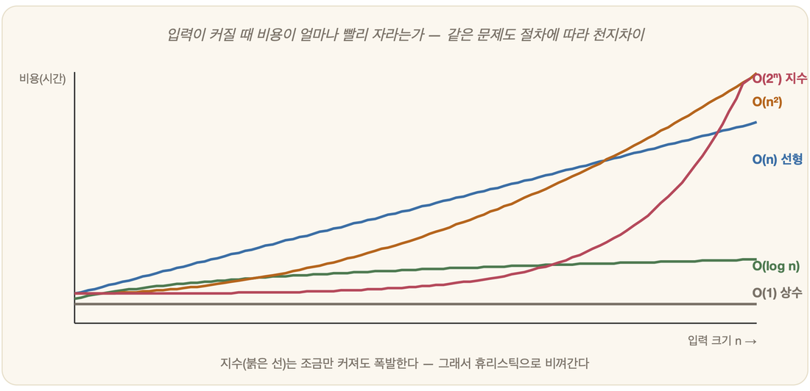

# 09-03. 복잡도와 알고리즘

여행을 떠난다고 하자. 가야 할 도시는 다섯 곳, 한 번씩만 들르고 가장 짧게 돌아오고 싶다. 종이에 경로를 그려 보면 금세 답이 나온다. 그런데 도시가 스무 곳, 쉰 곳으로 늘면 어떨까. 펜을 든 손이 멈추고, 머릿속 계산이 무너진다. 09-01에서 우리는 "무엇을 계산할 수 있는가"를 물었고, 09-02에서 "정보를 어떻게 담는가"를 보았다. 이제 가장 현실적인 물음 앞에 선다 — **"얼마나 빨리, 얼마나 많은 자원으로 풀 수 있는가?"** 이 물음의 답이, AI 역사의 첫 겨울(2장)을 부른 '조합 폭발'의 정체를 일러 준다.

## 알고리즘: 문제를 푸는 절차

문제를 푸는, 단계가 분명한 절차. 그것을 **알고리즘(algorithm)**이라 부른다. 흥미로운 것은 같은 문제라도 어떤 알고리즘을 택하느냐에 따라 걸리는 시간이 하늘과 땅처럼 벌어진다는 사실이다. 그래서 우리가 진짜로 따져야 할 것은 한 번의 실행 시간이 아니라, **입력이 커질수록 비용이 얼마나 빨리 늘어나는가**이다. 이것이 **계산 복잡도(complexity)**다.

## 빅오: 증가의 속도를 보다

복잡도를 적을 때 흔히 쓰는 언어가 **빅오 표기법(Big-O)**이다. 입력 크기 n이 커질 때 비용이 어떤 *모양*으로 늘어나는지, 그 윤곽만을 본다.

| 표기 | 이름 | n이 커지면 | 느낌 |
|---|---|---|---|
| O(1) | 상수 | 그대로 | 즉시 |
| O(log n) | 로그 | 아주 천천히 | 매우 빠름 |
| O(n) | 선형 | 비례해서 | 무난 |
| O(n²) | 제곱 | 가파르게 | 버겁다 |
| O(2ⁿ) | 지수 | **폭발적** | 사실상 불가능 |

이 표에서 눈을 떼지 못하게 하는 것은 맨 아래 줄, **지수 시간 O(2ⁿ)**이다. n이 조금만 커져도 비용은 손쓸 수 없을 만큼 부풀어 오른다. n=10이면 1,024번에 그치지만, n=50이면 약 1,000조 번 — 우주의 나이를 다 써도 끝나지 않는 계산이다.

## 조합 폭발: AI의 오랜 적

바로 이것이 2장에서 만났던 **조합 폭발(combinatorial explosion)**의 정체다. 초기 AI는 순진하면서도 당당했다. "될 때까지 모든 경우를 시도"하면 된다고 믿었다. 그러나 경우의 수가 지수적으로 불어나면서, 작은 예제를 벗어나는 순간 기계는 그 자리에 멈춰 섰다. 체스에서 둘 수 있는 수는 천문학적인 숫자로 흩어졌고, 모든 도시를 최단으로 도는 길을 찾는 외판원 문제에서는 도시 하나가 더해질 때마다 경로의 수가 통째로 폭발했다. 결국 진실은 가혹했다. **모든 경우를 다 보는 무차별 탐색은 거의 항상 불가능하다.** AI는 다른 길을 찾아야만 했다.

## 그래서 휴리스틱이 필요하다

해법은 단순한 발상의 전환에 있었다. 다 보지 않고, **똑똑하게 일부만** 보는 것. 목표에 가까워 보이는 쪽을 어림짐작으로 골라 탐색의 가지를 쳐내는 일 — 그것이 **휴리스틱(heuristic)**이다. 7장에서 본 *사람의 문제 해결 방식*이기도 하다. 복잡도가 'AI가 풀어야 할 문제의 크기'를 가늠하게 해 주었다면, 휴리스틱은 그 벽을 넘어서는 'AI의 무기'다. 이 무기를 본격적으로 휘두르는 무대가 다음 부, **3부 탐색**이다.

## 2부를 마치며

수학·논리·인지·뇌·계산. 2부에서 다진 기초 체력은 앞으로 펼쳐질 모든 장의 밑바탕이 된다. 그중에서도 이 9장이 남긴 두 결론은 오래 기억할 만하다. **계산에는 한계가 있고(정지 문제), 가능한 계산조차 폭발할 수 있다(복잡도).** 그래서 AI는 '무차별'이 아니라 '영리함'을 향해 걷는다. 그 영리함의 첫걸음이 3부에서 시작된다.

---

### 정리

- **복잡도**는 입력이 커질 때 비용이 늘어나는 속도이며, **빅오**로 표기한다.
- **지수 시간 O(2ⁿ)** = 조합 폭발 → 모든 경우를 보는 무차별 탐색은 대개 불가능.
- 그래서 **휴리스틱**(똑똑한 어림짐작)이 필요하다 → 3부로 이어진다.

### 생각해보기

- "모든 경우를 다 따져보면 최선의 답을 찾는다"는 말은 맞다. 그런데 왜 이 '완벽한' 방법을 현실에서는 거의 쓸 수 없을까요? 당신의 일상에서 '다 따지지 않고 어림짐작으로' 결정하는 예를 떠올려 보세요.
