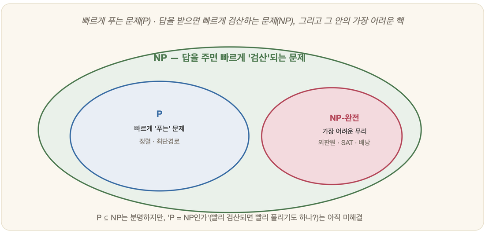

# 09-04. 풀 수 있는가, 빠른가: 계산가능성과 P 대 NP

앞 절(09-03)에서 우리는 같은 답을 내는 알고리즘이라도 걸리는 시간이 천차만별이라는 것, 그리고 입력이 커질 때 시간이 얼마나 가파르게 늘어나는지를 따지는 복잡도라는 잣대를 배웠다. 그날 책상 위에 펼쳐 둔 두 알고리즘을 떠올려 보자. 하나는 입력이 두 배가 되어도 잠깐 더 기다리면 그만이었고, 다른 하나는 입력 하나가 늘 때마다 시계가 무서운 속도로 돌아갔다. 그 광경을 오래 들여다보고 있으면 더 깊은 곳에서 두 개의 물음이 올라온다. 이 문제는 애초에 컴퓨터로 풀 수 있기는 한가. 그리고 풀 수 있다면, 우리가 살아 있는 동안에 풀 수 있는가. 이 두 질문이 인공지능의 기초가 되는 까닭은, AI가 하는 일의 상당수가 결국 거대한 경우의 수 속에서 답을 찾는 일이기 때문이다(3부에서 다룰 조합폭발이 바로 이 이야기다). 어떤 문제는 원리상 답이 없고, 어떤 문제는 답은 있어도 우주의 나이보다 오래 걸린다. 이 절은 그 경계선을 따라 걸어 보는 자리다.

## 모든 문제를 풀어 주는 기계가 있을까: 결정문제

1928년, 독일의 수학자 힐베르트(David Hilbert)가 강단에 서서 한 가지 야심 찬 꿈을 펼쳐 보였다. 어떤 수학 명제를 집어넣으면, 그것이 참인지 거짓인지를 기계가 척척 판정해 주는 장치가 있다면 어떻겠느냐는 것이었다. 손잡이를 돌리면 논리적으로 옳고 그름을 알려 주는 마법 같은 기계, 수학자라면 누구나 한 번쯤 가져 보았을 그 환상에 그는 정식 이름을 붙였다. 결정문제(Entscheidungsproblem)다(2장의 라이프니츠가 꿈꾸던 '생각하는 계산기'의 후예인 셈이다).

이 꿈에 답하려고 1936년 영국의 수학자 튜링(Alan Turing)이 종이 위에 그려 낸 것이 바로 튜링 기계(2장)였다. 그런데 그는 답을 내놓기 전에 더 앞선 일부터 해야 했다. '기계가 푼다', '알고리즘'이라는 말이 정작 무엇을 뜻하는지부터 또렷하게 못 박아야 했던 것이다. 같은 해 처치(Alonzo Church)는 람다 계산법으로, 튜링은 튜링 기계로 '계산할 수 있다'는 것이 무엇인지를 각자 정의했고, 두 사람의 정의는 결국 같은 것임이 드러났다(처치-튜링 명제). 그리고 서로 다른 길을 걸어온 두 사람이 도착한 결론마저 똑같았다. 힐베르트가 꿈꾼 그런 만능 판정 기계는 **존재할 수 없다**는 것이었다.

## 풀 수 없는 문제: 정지문제 복습

튜링이 결정문제의 불가능을 증명하는 데 쓴 무기가 그 유명한 정지문제(Halting Problem)다(이미 가볍게 다룬 내용을 복습해 보자). 질문은 이렇다. 어떤 프로그램과 입력을 주었을 때, 그 프로그램이 언젠가 멈출지 아니면 영원히 돌지를 미리 알려 주는, 단 하나의 일반적인 프로그램이 있는가.

직관적으로는 있을 법하다. 그냥 프로그램을 돌려 보면 되지 않느냐고 누구나 말한다. 하지만 멈추지 않는 프로그램 앞에 앉아 보면 곤란해진다. 우리는 그것이 아직 안 멈춘 것인지, 아니면 영원히 안 멈출 것인지를 영영 구별할 수 없다. 튜링은 만약 그런 만능 판정기가 있다고 가정하면 논리적 모순이 생긴다는 것을 보였다. 자기 자신을 거짓말쟁이라고 말하는 사람처럼, 판정기에게 판정기 자신을 입력으로 넣는 순간 앞뒤가 안 맞는 상황이 벌어지고 마는 것이다. 따라서 그런 프로그램은 없다.

이렇게 무제한의 시간과 메모리를 줘도 어떤 알고리즘으로도 풀 수 없는 문제를 결정불가능(undecidable) 문제라고 한다. 정지문제는 그 첫 사례였고, 이후 어떤 새로운 문제가 풀 수 없음을 보일 때면 학자들은 흔히 그 문제를 정지문제로 환원(reduce)한다는 방법을 쓴다. 이걸 풀 수 있다면 정지문제도 풀 수 있을 텐데 그건 불가능하니, 이것도 불가능하다는 식의 논법이다. 이렇게 풀 수 있는 문제와 없는 문제를 가르는 분야가 계산가능성 이론(Computability Theory)이다.

정지문제가 '계산의 한계'를 그었다면, 그보다 5년 앞서 같은 결의 한계를 '형식체계' 쪽에서 먼저 그어 둔 사람이 있었다. 1931년, 스물다섯 살의 괴델(Kurt Gödel)이다. 그가 증명한 불완전성 정리는 이렇게 말한다. 산술을 담을 만큼 충분히 강력한 형식체계에는, *참이지만 그 체계 안에서는 결코 증명할 수 없는* 명제가 반드시 존재한다. 어떻게 그럴 수 있을까. 직관은 거짓말쟁이의 역설에 닿아 있다. 괴델은 "이 명제는 증명되지 않는다"고 *스스로를 가리키는* 명제 P를 체계 안에 교묘히 심어 두었다. 만약 P가 증명된다면 P는 거짓이 되어 체계가 모순에 빠지고, 그러니 P는 증명될 수 없다. 그런데 바로 그렇게 증명되지 않으므로 P가 말하는 내용은 정확히 참이 된다. 자기 자신을 향해 접히는 이 자기지시·대각선화의 솜씨가, 증명의 그물을 영원히 빠져나가는 참을 만들어 낸 것이다. 이 한 방으로 괴델은, 몇 개의 공리에서 출발해 모든 수학적 진리를 빠짐없이 증명해 내리라던 힐베르트의 꿈을 무너뜨렸다. 증명할 수 있는 것과 참인 것은 끝내 포개지지 않는다는 이 결론은, 튜링이 곧이어 보일 정지문제와 정확히 같은 결의 한계다. 실제로 두 결과는 추상적으로 같은 것임이 밝혀졌다. 기계든 형식체계든, 규칙을 따라 굴러가는 모든 것에는 손이 닿지 않는 자리가 남는다.

## 풀 수 있어도 너무 오래 걸린다면: P와 NP

이제 한 걸음 더 나아가자. 정지문제처럼 아예 풀 수 없는 문제는 잠시 제쳐 두고, **원리상 풀 수는 있는** 문제만 골라 본다. 그런데 풀 수 있다고 다 같은 것이 아니다. 답이 분명히 있긴 한데 그 답을 찾는 데 수억 년이 걸린다면, 그것은 풀 수 없는 것이나 마찬가지다.

여기서 갈림길이 되는 것이 다항식(polynomial)과 지수함수(exponential)다. 말은 어렵게 들려도 중·고등학교 수학이면 충분하다. 입력 크기를 n이라 하자. n², 2n³ 처럼 n에 붙은 지수가 2, 3 같은 정해진 숫자면 다항식이다. 반대로 2ⁿ 처럼 n이 지수 자리로 올라가 있으면 지수함수다. 이 둘의 차이는 상상을 초월한다. 입력이 하나 늘 때마다 다항식은 그저 조금씩 더 걸리지만, 지수함수는 매번 두 배씩 불어난다. 종이를 단 50번만 접어도 그 두께가 지구에서 태양까지 닿는다는 이야기, 바로 그것이 2ⁿ의 위력이다.

그래서 복잡도 이론에서는 다항식 시간에 풀리는 문제를 **P**(Polynomial)라 부르고 '쉬운 문제'로 친다. 한편 **NP**(Nondeterministic Polynomial)는 답을 직접 찾기는 어렵지만, 누군가 답을 건네주면 그게 맞는지는 다항식 시간에 빠르게 **검산**할 수 있는 문제들이다. 여기서 한 가지 단단히 짚어 둘 것이 있다. NP는 'Non-Polynomial(다항식이 아님)'이 아니다. '다항식으로 풀리는지 아직 모름'이라는 뜻이다. 이 둘 사이에는 엄청난 차이가 있다.

비유하자면 이렇다. 1000조각짜리 직소 퍼즐을 맨바닥에서 맞추는 것은 무척 어렵지만(찾기), 누가 완성된 퍼즐을 보여 주면 제대로 맞춰졌는지 확인하는 것은 금방이다(검산). 스도쿠도, 미로 탈출도 마찬가지다. 답을 채점하기는 쉬운데 답을 만들어 내기는 어려운 이 비대칭, 그것이 NP의 본질이다.

## 가장 어려운 NP들: NP-완전과 조합폭발

NP 안에서도 '가장 어려운' 무리가 따로 있다. NP-완전(NP-complete) 문제다. 이들에게는 신기한 성질이 하나 있다. 그중 단 하나라도 빠르게(다항식 시간에) 푸는 법을 찾아내면, **NP에 속한 모든 문제를 한꺼번에 빠르게 풀 수 있다**는 것이다. 마치 모두가 한 가닥 운명으로 묶여 있는 셈이다. 1971년 쿡(Stephen Cook)이 불 만족성 문제(SAT)가 NP-완전임을 보이면서 이 분야가 활짝 열렸다.

가장 친숙한 두 사례를 보자. 하나는 외판원 문제(Travelling Salesman Problem)다. 여러 도시를 한 번씩 다 들르고 출발지로 돌아오는 가장 짧은 경로를 찾는 문제인데, 도시가 늘수록 가능한 경로의 수가 폭발적으로 불어나 도시가 스무 곳 남짓만 돼도 모든 경로를 일일이 따져 보는 것은 사실상 불가능하다. 다른 하나는 배낭 문제(Knapsack Problem)다. 무게 제한이 있는 배낭에 값어치를 최대로 채워 넣을 짐 조합을 고르는 문제로, 이삿짐을 싸거나 예산을 나눌 때 우리가 늘 마주치는 상황이다. 이렇게 경우의 수가 입력에 따라 눈덩이처럼 불어나는 현상이 바로 3부에서 본격적으로 다룰 조합폭발이다.

그렇다면 한 가지 의심이 고개를 든다. NP에 속한 어려운 문제들도 사실은 다 쉬운(P) 문제 아닐까. 이것이 바로 **P = NP** 라는, 컴퓨터 과학 최대의 미해결 문제다. 반세기가 넘도록 아무도 증명하지도, 반증하지도 못했다. 대부분의 학자는 P ≠ NP, 즉 어려운 문제는 정말 어렵다고 믿지만, 누구도 확신하지는 못한다.

그래서 현실의 AI와 공학은 NP-완전 문제를 정면으로, 완벽하게 풀려 하지 않는다. 대신 '거의 정답'에 빠르게 도달하는 영리한 우회로를 택한다. 적당히 좋은 답으로 만족하는 근사(approximation), 경험적 요령으로 후보를 좁혀 가는 휴리스틱(heuristic) 같은 방법들이 그것이며(12장), 이는 인공지능이 탐색을 다루는 방식의 핵심 철학이기도 하다.

### 정리

- 계산가능성은 '풀 수 있는가'를, 복잡도는 '현실적인 시간 안에 풀 수 있는가'를 묻는다. 정지문제처럼 아예 풀 수 없는 결정불가능 문제가 존재한다.
- P는 빠르게 푸는 쉬운 문제, NP는 답을 받으면 빠르게 검산할 수 있는 문제다. NP는 '다항식이 아님'이 아니라 '풀리는지 모름'을 뜻한다.
- NP-완전 문제(외판원·배낭)는 NP 중 가장 어려운 무리로, 하나만 빨리 풀어도 전부 풀린다. P = NP는 여전히 미해결이며, 현실에서는 근사와 휴리스틱으로 우회한다.

### 생각해보기

- 답을 찾기는 어렵지만 채점하기는 쉬운 일을 일상에서 떠올려 봅시다. 그것이 P일지 NP일지 짐작해 본다면 어떤가요?
- 만약 누군가 P = NP를 증명한다면, 암호·물류·신약 개발 같은 분야에서 어떤 일이 벌어질까요? 좋기만 한 일일까요?
