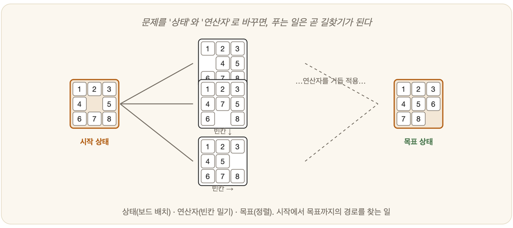

# 10-01. 상태·연산자·목표

어린아이 앞에 흩어진 퍼즐 조각이 놓여 있다. 아이는 조각 하나를 집어 이리저리 돌려 보고, 빈자리에 밀어 넣었다 빼기를 반복한다. 그러는 사이 머릿속에서는 조용한 일이 벌어진다. 지금의 배치, 손이 만들 수 있는 다음 배치, 그리고 끝내 닿고 싶은 완성된 그림 — 이 셋이 끊임없이 오간다. 사람이 문제를 푼다는 것은 결국 이 더듬는 과정이다. 그리고 AI가 문제를 풀려면, 가장 먼저 이 더듬음을 기계가 만질 수 있는 형태로 옮겨야 한다. 그 형태에는 이름이 있다 — 상태공간이다.

## 문제를 상태공간으로 바꾸기

7장에서 보았듯, 사람은 문제를 풀 때 "지금 상황 → 가능한 행동 → 새 상황"을 더듬어 나간다. AI는 이 흐름을 네 가지 요소로 단단히 붙들어 정식화한다.

먼저 **상태(state)** 가 있다. 문제의 한 순간을 그대로 찍어낸 스냅샷이며, 퍼즐로 치면 조각들의 현재 배치다. 그 가운데 출발점이 되는 상태를 따로 **초기 상태(initial state)** 라 부른다. 한 상태를 다른 상태로 바꾸는 동작은 **연산자(operator)/행동(action)** 이다. "빈 칸을 위로 민다" 같은 것이 그렇다. 그리고 우리가 닿고 싶은 자리, 혹은 그 자리에 닿았는지 판별하는 조건이 **목표(goal)** 다.

이 네 가지가 정해지는 순간, 가능한 모든 상태와 그 사이를 잇는 전이가 거대한 그물망으로 떠오른다. 이것이 **상태공간(state space)** 이다. 9장의 자료구조로 말하면, 상태는 노드이고 연산자는 간선인 **그래프**다.

## 문제 해결 = 길찾기

문제를 상태공간으로 옮겨 놓고 나면, 한때 막막했던 것이 놀랄 만큼 단순한 모습으로 바뀐다.

> **문제를 푼다 = 초기 상태에서 목표 상태까지, 연산자를 따라가는 '길(path)'을 찾는다.**

미로를 빠져나오는 일이든, 퍼즐을 맞추는 일이든, 하루 일정을 짜는 일이든 — 이 틀에 넣고 보면 모두 *그래프에서 길찾기*가 된다. 이 추상화가 그토록 강력한 까닭은 단순하다. 한 번 길찾는 법을 익혀 두면, 겉모습이 전혀 다른 문제들에까지 똑같이 쓸 수 있기 때문이다.

## 탐색 트리

탐색을 시작하면, 초기 상태를 뿌리로 삼은 한 그루의 나무가 자란다. 연산자를 적용할 때마다 새 가지가 뻗고, 그 끝에서 또 다른 가지가 갈라진다. 이렇게 자라나는 것이 **탐색 트리(search tree)** 다. 우리가 11장부터 만날 탐색 알고리즘들은, 따지고 보면 모두 **"이 트리를 어떤 순서로 펼쳐 볼 것인가"** 라는 한 질문에 대한 서로 다른 대답이다.

그런데 여기서 9장의 경고가 되살아난다. 가지가 매 단계 b개씩 갈라지고 깊이가 d라면, 들여다봐야 할 상태는 약 bᵈ개 — **지수적으로 폭발한다.** 그러니 어떤 순서로, 얼마나 똑똑하게 가지를 펼치느냐가 사활을 가른다.

---

### 정리

- 문제를 **상태·초기상태·연산자·목표** 네 요소로 정식화하면 **상태공간**(그래프)이 된다.
- **문제 해결 = 초기 상태 → 목표까지의 길찾기.** 다양한 문제를 한 틀로 다룰 수 있다.
- 탐색은 **탐색 트리**를 펼치는 일이며, 트리는 지수적으로 커진다(→ 전략이 중요).

### 생각해보기

- 당신의 일상 문제 하나(예: 약속 장소까지 가기)를 상태·연산자·목표로 정식화해 보세요. 무엇이 '상태'이고 무엇이 '연산자'인가요?
