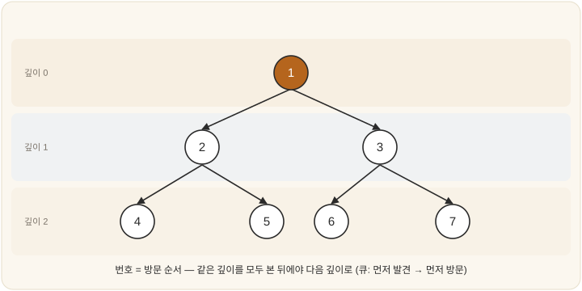

# 11-01. 너비 우선 탐색(BFS)

잔잔한 연못 한가운데로 작은 돌을 던진다. 돌이 수면에 닿는 순간, 거기서부터 물결이 동심원을 그리며 퍼져나간다. 처음엔 손바닥만 한 원, 다음엔 그보다 한 뼘 넓은 원, 또 그다음엔 더 넓은 원. 물결은 결코 멀리 있는 가장자리를 먼저 건드리는 법이 없다. 늘 가까운 곳을 한 겹 적신 뒤에야 그다음 겹으로 나아간다.

상태공간(10장)을 뒤지는 일도 여기서 시작할 수 있다. 목표가 어디쯤 숨어 있는지 아무런 단서도 쥐지 않은 채, 그저 정해진 순서로 공간을 훑어나가는 방법이 있다. 목표에 대한 정보 없이 더듬는다 하여 이를 맹목적 탐색(blind search)이라 부른다. 그 맹목 속에서도 가장 먼저 떠오르는 질서가, 방금 본 물결의 질서다. 가까운 곳부터 한 겹씩. 이렇게 깊이를 한 겹씩 넓혀가며 훑는 방식에 사람들은 이름을 붙였다 — 너비 우선 탐색(BFS, Breadth-First Search)이다.

## 가까운 곳부터, 한 겹씩

원리는 돌이 던져진 연못만큼이나 단순하다. 초기 상태에서 한 걸음으로 갈 수 있는 곳을 모조리 본다. 그러고 나서야 두 걸음으로 갈 수 있는 곳을 모조리 보고, 그다음에 세 걸음짜리를 본다. 한 겹을 다 적시기 전에는 다음 겹으로 넘어가지 않는다. 동심원이 안에서 밖으로 차곡차곡 번지듯, 탐색의 경계도 그렇게 바깥으로 밀려난다.

그림 속 번호의 순서를 눈으로 따라가 보면 질서가 한눈에 들어온다. 뿌리를 1번으로 방문한 뒤, 그 자식들(2·3)을 먼저 모두 보고, 그다음에야 손자들(4·5·6·7)로 내려간다. 깊이가 같은 형제들은 늘 함께, 그리고 먼저 처리된다.

이 질서를 떠받치는 도구가 9장에서 만난 큐(queue, FIFO)다. 새로 발견한 상태를 큐의 뒤에 줄 세우고, 처리할 때는 큐의 앞에서 하나씩 꺼낸다. 먼저 줄 선 것이 먼저 불려 나오니, 먼저 발견한 것 — 곧 더 가까운 것 — 부터 보게 되는 일은 애써 만들 필요 없이 저절로 따라온다.

> **BFS = 탐색 후보를 큐에 담는다**

## 무엇이 좋은가: 최단 경로 보장

이 방식이 안기는 가장 값진 선물은, 최단 경로를 반드시 찾아낸다는 점이다. 가까운 곳부터 차례로 훑는 까닭에, 목표와 처음 마주치는 그 순간이 곧 가장 적은 걸음 수로 닿는 길이다. 더 짧은 길이 어딘가 숨어 있었다면 진작 그 겹에서 목표를 만났을 테니까. 다만 이 약속은 모든 행동의 비용이 똑같을 때에만 유효하다. 걸음마다 무게가 다르면 12장의 방법을 빌려야 한다.

정리하자면 BFS는 두 가지 미덕을 갖는다. 해가 존재하기만 하면 끝내 찾아낸다는 완전성(completeness), 그리고 비용이 균일할 때 가장 적은 단계의 해를 골라낸다는 최적성(optimality)이다.

## 무엇이 문제인가: 메모리 폭발

그러나 공짜인 미덕은 없다. BFS가 치르는 대가는 메모리다. 다음 한 겹으로 물결을 밀어내려면, 지금까지 번진 가장자리의 모든 상태를 한꺼번에 기억하고 있어야 한다. 가지가 b개씩 갈라지며 깊이 d까지 뻗어간다면, 머릿속에 붙잡고 있어야 할 상태는 어림잡아 bᵈ개에 이른다. 9장에서 마주쳤던 그 지수 폭발이 여기서 다시 고개를 든다.

깊이가 조금만 깊어져도 기억은 이내 바닥을 드러낸다. 그래서 BFS의 진짜 벽은 시간보다 공간인 경우가 잦다. 물결은 멀리 퍼질 수 있을 만큼 영리하지만, 그 모든 가장자리를 동시에 붙잡고 있을 만큼 너른 손은 갖지 못한 셈이다. 이 약점을 메우려는 시도가 다음 절의 DFS이고, 그 둘의 장점을 한데 묶은 것이 반복적 깊이심화(11-03)다.

---

### 정리

- **BFS**는 가까운 곳부터 **깊이를 한 겹씩** 넓혀 탐색한다(**큐**로 구현).
- **완전**하고, 비용이 균일하면 **최단 경로를 보장**한다.
- 약점은 **메모리 폭발**(약 bᵈ개의 상태를 동시에 저장).

### 생각해보기

- BFS가 "최단 경로를 보장"하는 이유를, '물결이 동심원으로 퍼진다'는 비유로 친구에게 설명한다면 어떻게 말하겠어요?
