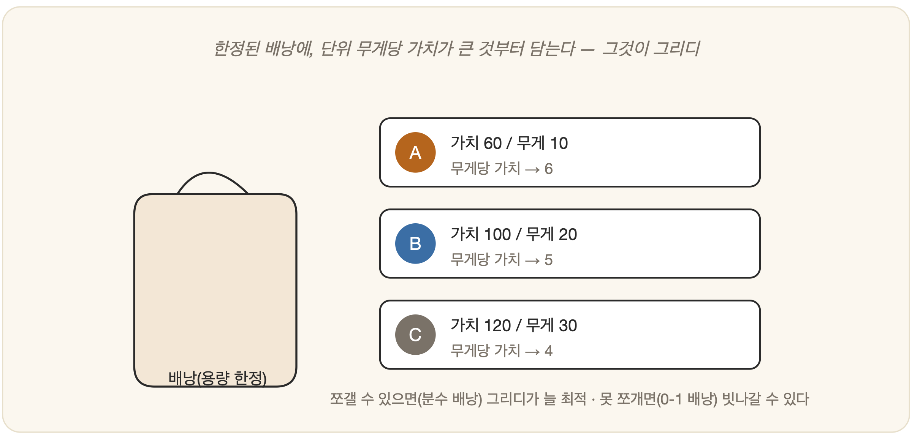

# 12-02. 탐욕적 최선 우선 탐색

낯선 도시에서 약속 장소를 찾는다고 해 보자. 스마트폰은 없고, 손에는 나침반 하나뿐이다. 목적지가 어느 방향에 있는지 화살표가 알려 준다. 당신은 망설임 없이 그 방향으로 걷는다. 골목이 나오면 목적지 쪽으로 더 기운 골목을 고르고, 갈림길에서도 화살표가 가리키는 쪽으로 발을 옮긴다. 휴리스틱이라는 나침반을 손에 넣었으니(12-01), 가장 단순한 방식으로 써 보는 셈이다. 매 순간 목표에 가장 가까워 보이는 곳으로 간다 — 이 솔직하고 단순한 전략에 사람들은 이름을 붙였다. **탐욕적 최선 우선 탐색(Greedy Best-First Search)**이다. 단순하고 빠르지만, 그 함정을 아는 것이 다음에 만날 A*를 이해하는 열쇠가 된다.

## 가장 가까워 보이는 쪽으로

이 탐색이 보는 것은 오직 하나다. 휴리스틱 `h(n)` — "목표까지 남은 추정 거리" — 그 값만 들여다보고, 가장 **작은** 상태를 다음으로 고른다. 9장의 **우선순위 큐**에 `h(n)`을 기준으로 상태를 담아 두면 그대로 구현된다.

BFS와 DFS가 '큐'와 '스택'이라는 단순한 그릇에서 순서대로 상태를 꺼냈다면, 탐욕적 탐색은 그릇을 바꾼다. 목표에 가까운 순으로 꺼내는 우선순위 큐다. 늘 가장 가까워 보이는 후보가 맨 앞으로 올라온다.

이름 그대로 *탐욕적(greedy)*이다. 멀리 내다보는 법이 없다. 지금 당장 가장 좋아 보이는 선택, 오직 그것뿐이다.

## 빠르지만, 최선은 아니다

이 전략의 미덕은 **속도**다. 목표 쪽으로 곧장 돌진하니, 운이 좋으면 거의 직선으로 도착한다. 곁눈질 없이 화살표만 따라가는 걸음은 빠르다. 하지만 그 빠른 걸음에는 두 개의 함정이 숨어 있다.

첫째, 지나온 비용을 무시한다. 탐욕적 탐색은 "앞으로 얼마 남았나"(`h`)만 헤아릴 뿐, "여기까지 오는 데 얼마를 썼나"는 묻지 않는다. 그래서 멀리 돌아가는 비싼 길을 택하고도 스스로는 알아채지 못한다. 결국 최적이 아니다.

둘째, '가까워 *보이는*' 함정에 빠진다. 직선거리로는 가까워 보여도, 그 끝이 막다른 골목이거나 거대한 장애물 뒤일 수 있다. 눈앞의 추정값만 좇다 보면 엉뚱한 곳에서 헤매게 된다.

> **비유**: 산속에서 "목적지가 저 방향"이라는 나침반만 보고 직진하면, 그 사이에 협곡이 가로놓여 있어도 무작정 들어가 버린다. 지나온 거리도, 길의 험함도 따지지 않으니까.

## 또 하나의 그리디: 배낭에 무엇을 담을까

'그리디'라는 사고방식은 길찾기에만 사는 것이 아니다. 가장 깔끔한 예가 **배낭 문제(knapsack problem)**다. 멜 수 있는 무게가 정해진 배낭 하나에, 저마다 가치와 무게가 다른 물건들을 골라 담는다. 어떻게 담아야 가장 값지게 채울까?

그리디의 답은 단순하다. **"1kg당 가치가 가장 높은 것부터 담아라."** 위 그림에서 A는 1kg당 가치가 6, B는 5, C는 4다. 그러니 욕심껏 A부터, 그다음 B, 그다음 C 순서로 담는다.

흥미로운 건 이 단순한 전략의 운명이 '쪼갤 수 있느냐'에 갈린다는 점이다. 물건을 가루처럼 **쪼개 담을 수 있다면(분수 배낭)**, 그리디는 *언제나* 최적이다 — 가장 값진 것부터 채우다 마지막 남는 자리를 다음 것으로 메우면 그만이니까. 그러나 물건을 **통째로만 담아야 한다면(0-1 배낭)**, 이야기가 달라진다. 무게당 가치가 가장 높은 것을 덥석 집었다가, 정작 배낭을 더 알차게 채울 *조합*을 놓쳐 버릴 수 있다. 당장 값져 보이는 한 개에 눈이 멀어 전체를 그르치는 것이다.

어디서 들어 본 이야기 같지 않은가. 그렇다, 방금 본 탐욕적 탐색이 빠지던 바로 그 함정이다. 길 위에서든 배낭 속에서든, 그리디는 똑같은 약점을 안고 있다 — **순간의 최선이 전체의 최선은 아니다.**

## 무엇이 빠진 걸까

탐욕적 탐색의 약점은 결국 한 문장으로 모인다 — 지나온 비용을 무시하고, 앞으로의 추정만 본다. 흥미롭게도 11장의 균일비용 탐색은 정반대였다. 그쪽은 *지나온 비용만* 꼼꼼히 따지고 *앞으로*는 까맣게 몰랐다. 한쪽은 과거만 보고, 한쪽은 미래만 본다.

그렇다면 자연스러운 물음이 떠오른다. "지나온 비용 + 앞으로의 추정"을 함께 보면 어떻게 될까? 단순하지만 결정적인 이 결합이 바로 다음에 만날 **A\* 알고리즘**이다.

---

### 정리

- **탐욕적 최선 우선 탐색**은 휴리스틱 `h(n)`만 보고 *가장 가까워 보이는* 쪽으로 간다(**우선순위 큐**).
- **빠르지만 최적이 아니다** — 지나온 비용을 무시하고, '가까워 보이는' 함정에 빠질 수 있다.
- 해법의 실마리: **지나온 비용 + 남은 추정**을 함께 보기 → A*.

### 생각해보기

- 탐욕적 탐색은 "당장 가장 좋아 보이는 선택"만 한다. 인생의 결정에서도 이런 '탐욕적' 선택이 전체로는 손해인 경우가 있다. 그런 경험을 떠올려 보자 — 무엇을 놓쳤던 걸까?
