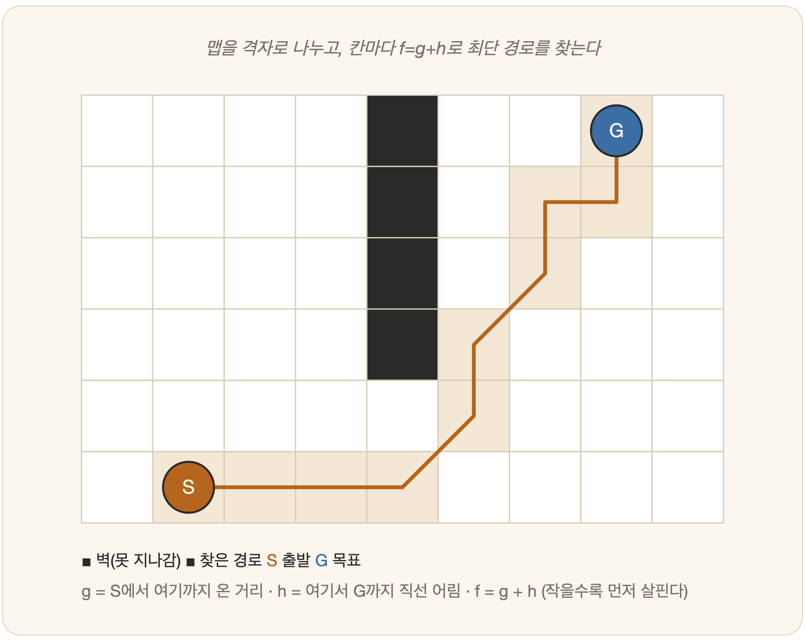

# 12-03. A* 알고리즘

낯선 도시에서 길을 잃어 본 사람은 안다. 한 손에는 여기까지 걸어온 거리를 기억하는 발이 있고, 다른 손에는 "목적지는 저쪽 어디쯤"이라는 막연한 감각이 있다. 둘 중 하나만 믿으면 길은 어긋난다. 지나온 거리만 세면 엉뚱하게 멀리 돌고, 남은 방향만 좇으면 막다른 골목에서 헤맨다. 앞서 본 탐색의 두 갈래도 꼭 그러했다. 균일비용 탐색은 **지나온 비용**만, 탐욕적 탐색은 **남은 추정**만 보았다. 둘 다 반쪽짜리 지혜였다. 이 둘을 한자리에 앉혀, 걸어온 발과 가리키는 손을 동시에 쓰게 한 방법이 있다. **A\* 알고리즘**(에이스타)이다. 정보 기반 탐색의 정점에 선, AI 탐색에서 가장 유명하고 널리 쓰이는 알고리즘이다.

## 핵심 공식: f = g + h

A*는 각 상태 n을 하나의 값으로 가늠한다.

$$f(n) = g(n) + h(n)$$

여기서 **`g(n)`**은 초기 상태에서 n까지 **실제로 지나온 비용**이다 — 균일비용 탐색이 응시하던 바로 그 수치다. **`h(n)`**은 n에서 목표까지의 **남은 추정 비용**, 곧 휴리스틱이다 — 탐욕적 탐색이 좇던 그 감각이다. 그리고 둘을 더한 **`f(n)`**은 n을 거치는 경로의 **전체 비용 추정**이 된다.

공식이라 하니 딱딱해 보이지만, 말로 풀면 이렇다. **g는 "여기까지 실제로 걸어온 거리"**, **h는 "여기서 목적지까지 남은 거리의 어림짐작"**, 그리고 **f는 그 둘을 그냥 더한 값** — "이 칸을 거쳐 가면 총 얼마쯤 들겠다"는 예상치다. A*는 우선순위 큐에서 이 **f가 가장 작은** 칸부터 살핀다. 지나온 길(g)과 남은 길(h)을 **함께** 저울에 올리는 셈이다.

## 왜 강력한가: 최적성 보장

A*가 가진 빛나는 성질이 있다. 휴리스틱이 **허용적**(과대평가하지 않음, 12-01)이기만 하면, A*는 **반드시 최적해(최소 비용 경로)를 찾는다**.

그 까닭은 단순하면서도 정교하다. `h`가 결코 과대평가하지 않으므로, A*는 진짜로 더 나은 길을 섣불리 내치는 법이 없다. 그러면서도 `h`라는 나침반을 손에 쥔 덕에, 맹목적 탐색이라면 헤집고 다녔을 수많은 상태 가운데 **훨씬 적은 수만** 들여다보고 목표에 가닿는다.

> **두 세계의 좋은 점만**
> - BFS/균일비용처럼 → **최적**을 보장하고,
> - 탐욕적 탐색처럼 → 휴리스틱으로 **빠르게** 목표로 향한다.

## 휴리스틱이 A*를 좌우한다

A*의 운명은 휴리스틱의 질에 달려 있다. 같은 알고리즘이라도 어떤 나침반을 쥐어 주느냐에 따라 전혀 다른 걸음을 걷는다.

만약 `h(n) = 0`이라면, 그것은 나침반이 아예 없는 것과 같다. 이때 A*는 **균일비용 탐색**으로 되돌아간다 — 느리지만 여전히 최적이다. 반대로 `h`가 실제 비용에 **가까워질수록** A*는 더 적은 상태만 보고 더 빠르게 도착한다. 그리고 `h`가 실제 비용과 **꼭 들어맞는다면**, 알고리즘은 한 번도 헤매지 않고 곧장 최적 경로 위를 미끄러진다.

요컨대 A*는 "휴리스틱이 좋을수록 빨라지는" 알고리즘이다. 좋은 휴리스틱을 설계하는 일(12-01)이 그토록 중요한 이유가 여기에 있다.

## 어디에 쓰이나

A*는 칠판 위 이론으로 머물지 않았다. **내비게이션의 경로 탐색, 게임 속 캐릭터의 길찾기, 로봇의 이동 계획** — "최소 비용 경로"가 필요한 곳이라면 어디에나 이 알고리즘이 숨 쉬고 있다. 1960년대 후반에 다듬어진 이 고전이 반세기를 넘겨 지금도 현역으로 뛰는 모습은, 다시 한번 *기초는 오래 남는다*는 이 책의 주제를 조용히 증언한다.

## 스타크래프트의 길찾기, 그리고 그 한계

게임을 해 본 사람에게 A*는 사실 익숙한 얼굴이다. 스타크래프트에서 일꾼에게 저 멀리 광물을 찍어 주면, 녀석은 벽과 언덕을 알아서 피해 길을 찾아간다. 그 속에서 도는 것이 바로 이런 길찾기다. 맵을 격자로 잘게 나누고, 칸마다 *여기까지 온 거리(g)*와 *목적지까지의 직선 어림(h)*을 더해, f가 작은 칸부터 살피며 최단 경로를 그린다 — 위 격자 그림 그대로다.

그런데 이 게임은 A*의 *한계*도 함께 보여 준다. 실시간 전략 게임에서는 수십, 수백 기의 유닛이 *동시에* 길을 찾아야 한다. 유닛 하나하나가 매번 정직하게 A*를 처음부터 돌리면 계산이 폭발한다(9장의 조합 폭발이 떠오른다). 게다가 A*는 본래 *맵이 가만히 있다*고 가정하는데, 게임 속 세상은 쉴 새 없이 움직인다 — 방금 비어 있던 길목을 다른 유닛이 막아서고, 그 사이 건물이 들어선다.

그래서 옛 스타크래프트의 길찾기에는 성능을 위한 타협과 꼼수가 가득했고, 그 탓에 우리가 아는 익숙한 풍경들이 생겨났다. 좁은 길목에서 서로 뒤엉켜 **오도 가도 못하는 유닛들**, 길을 못 찾고 제자리를 **빙글빙글 도는 드라군**, 명령 한 번에 **한데 뭉쳐** 따로 노는 부대. 모두 "많은 유닛 × 끊임없이 변하는 맵"이라는 현실 앞에서 순수한 A*가 비틀거린 흔적이다.

그래서 요즘 게임은 순수 A*만 고집하지 않는다. 여러 유닛이 한 줄기로 흐르도록 미리 길을 깔아 두는 흐름장(flow field), 서로 부딪히기 전에 비켜서는 군집 회피 같은 기법을 A* 위에 덧댄다. 고전 알고리즘은 단단한 토대로 남되, 현실의 까다로움은 그 위에 얹은 장치들이 메우는 셈이다. *기초를 알아야 그 위에 무엇을 더할지도 보인다* — 이 책이 줄곧 말해 온 그대로다.

## 3부를 마치며

탐색은 AI가 손에 쥔 가장 근본적인 문제 해결 도구다. 우리는 아무것도 모른 채 더듬던 맹목적 탐색(11장)에서 출발해, 휴리스틱으로 어둠 속 길을 밝히고(12장), 마침내 `f=g+h`라는 한 줄로 최적과 효율을 동시에 거머쥐었다. 이제 길은 또 한 번 갈라진다. 13장에서 기다리는 것은 **상대가 있는** 탐색 — 게임의 세계다.

---

### 정리

- **A\***는 **`f(n) = g(n) + h(n)`** (지나온 비용 + 남은 추정)이 가장 작은 상태를 확장한다.
- 휴리스틱이 **허용적**이면 **최적해를 보장**하면서도 맹목적 탐색보다 빠르다.
- 성능은 **휴리스틱의 질**에 달려 있다(`h=0`이면 균일비용 탐색).

### 생각해보기

- A*의 `f = g + h`는 "이미 쓴 것(g)과 앞으로 들 것(h)을 함께 보라"는 지혜입니다. 의사결정에서 *매몰비용*에 얽매이거나 반대로 *지나온 노력*을 무시하는 실수와 견주어, 이 균형이 왜 현명한지 생각해 보세요.
