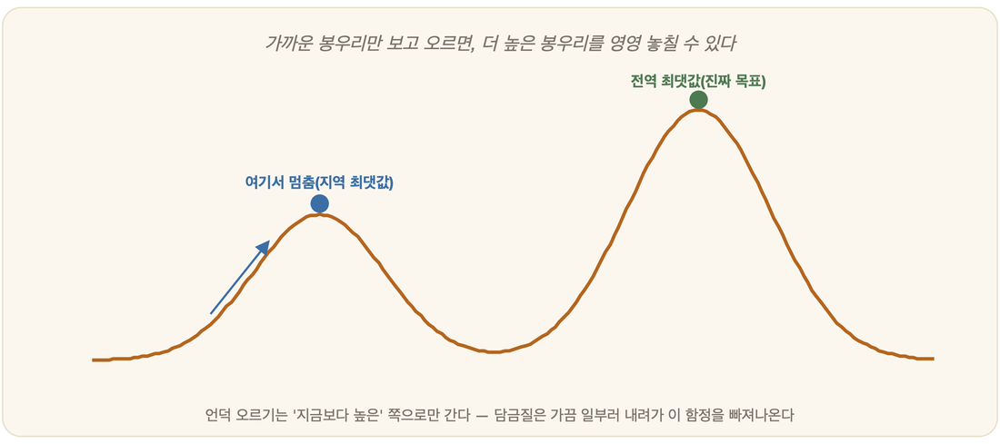

# 12-04. 지역 탐색과 제약 충족

짙은 안개 속에서 산을 오르는 등산가를 떠올려 보자. 한 치 앞도 보이지 않으니 정상이 어디인지 알 길이 없다. 그가 할 수 있는 일이라곤 발끝으로 땅의 기울기를 더듬는 것뿐이다. 한 발짝 디뎌 보아 위로 올라가면 그쪽으로 가고, 또 한 발짝, 또 한 발짝, 오르막이 이어지는 한 계속 올라간다. 더 오를 곳이 없어 사방이 다 내리막이면 거기서 멈춘다 — "여기가 정상이겠거니" 하고.

A* 이야기까지 우리가 풀던 문제는 한결같이 *길을 찾는* 문제였다. 출발에서 목표까지 어떤 순서로 움직여야 하는가, 그 *경로*가 답이었다. 그런데 세상에는 경로 따위는 아무래도 좋고 *최종 상태 그 자체*가 답인 문제가 따로 있다. 8개의 퀸을 어떻게 늘어놓아야 서로 잡지 않을까. 스도쿠의 빈칸을 어떻게 메워야 규칙에 맞을까. 여기서 중요한 건 "어떤 순서로 놓았는가"가 아니라 "최종 배치가 조건을 만족하는가"다. 이렇게 *상태 자체가 답*인 문제를 다루는 또 한 갈래의 탐색이 있다. 그 첫걸음이 바로 안개 속 등산가의 방법, **언덕 오르기(hill climbing)**다.

## 언덕 오르기와 지역 최댓값의 함정

언덕 오르기의 발상은 안개 속 등산가만큼이나 단순하다. 어떤 상태에 함수 하나를 붙여 그 값을 "고도"라고 부르자. 고도가 높을수록 좋은 답이다. 그러면 모든 상태는 울퉁불퉁한 지형 위의 한 점이 되고, 우리는 그 지형 어딘가에서 출발해 *더 높은 이웃으로* 한 걸음씩 옮겨 가면 된다. 지금 자리보다 높은 이웃이 하나도 없으면 멈춘다.

이것은 사람들이 낯선 문제 앞에서 흔히 쓰는 방법이기도 하다. *지금 상태와 목표 사이의 차이를 조금씩 줄여 나가는 것* — 심리학에서 차이 감소법(difference reduction)이라 부르는 그 방식 그대로다. 한 걸음마다 목표에 조금이라도 닮은 쪽으로 바꿔 가니, 결국 목표를 향해 "더 높이" 올라가는 셈이다.

문제는 이 방법이 지독하게 *근시안적*이라는 데 있다. 언덕 오르기는 딱 다음 한 걸음이 나아지는지만 볼 뿐, 그 너머의 큰 그림은 보지 못한다. 그래서 안개 속 등산가는 종종 엉뚱한 곳에서 멈춰 선다. 진짜 정상(전역 최댓값, global maximum)이 아니라, 그저 *주변보다 조금 높을 뿐인* 야트막한 봉우리에 올라서서 "다 왔다"고 착각하는 것이다. 이 가짜 정상을 **지역 최댓값(local maximum)**이라 부른다. 사방이 내리막이니 더 갈 데가 없어 멈췄지만, 안개 너머 저편에는 훨씬 높은 진짜 정상이 솟아 있다.

함정은 이뿐이 아니다. 펑퍼짐한 **고원(plateau)**에 들어서면 사방이 죄다 평지라 어느 쪽이 나은지 가늠할 수가 없어 목적 없이 헤맨다. 좁고 가파른 **산등성이(ridge)**에서는 어느 방향으로 디뎌도 일단 내려가는 것처럼 보여, 능선을 타고 더 오를 길을 코앞에 두고도 발길을 돌려 버린다. 그래서 언덕 오르기는 *늘 최적의 답을 찾아 준다고 결코 보장하지 못한다*. 빠르고 단순하지만, 출발 지점이 어디였느냐에 운명을 맡기는 도박에 가깝다.

## 담금질: 가끔은 내려가야 더 높이 오른다

지역 최댓값에 갇힌 등산가를 어떻게 구해 낼까. 답은 의외로 거꾸로 가는 데 있다. *가끔은 일부러 내리막도 디뎌 보는 것*이다. 지금 봉우리에서 한 발 내려와야, 그 골짜기를 건너 더 높은 산으로 갈아탈 수 있기 때문이다.

이 발상을 우아하게 다듬은 것이 **시뮬레이티드 어닐링(simulated annealing)**, 우리말로 **담금질 기법**이다. 이름은 대장간에서 왔다. 대장장이는 쇠를 다룰 때 벌겋게 달구었다가 천천히 식힌다. 뜨거울 때는 쇠 속의 원자들이 활발히 이리저리 자리를 옮기며 들뜬 상태를 풀고, 서서히 식으면서 가장 안정된 결정 구조로 자리를 잡는다. 처음부터 차갑게 두면 원자들이 엉성하게 굳어 약한 쇠가 되지만, 달궜다 식히면 단단한 강철이 된다.

담금질 탐색은 이 과정을 흉내 낸다. "온도"라는 값을 하나 두고, 처음엔 뜨겁게 시작한다. 온도가 높을 때는 *내리막 걸음도 너그럽게 받아들인다* — 답이 나빠지는 쪽으로도 곧잘 움직여 지형 곳곳을 헤집고 다닌다. 그러다 온도를 조금씩 낮추면 점점 까다로워져, 나중에는 오르막만 디디는 평범한 언덕 오르기로 수렴한다. 즉 *처음엔 대담하게 멀리 떠돌며 진짜 정상이 있을 만한 곳을 찾고, 나중엔 신중하게 그 봉우리를 정밀하게 오르는* 셈이다. 초반의 과감한 내리막 허용 덕에, 야트막한 가짜 봉우리에 갇힐 위험에서 빠져나올 수 있다.

> **한 줄 요약**: 언덕 오르기는 *절대 안 내려간다*. 담금질은 *처음엔 가끔 내려가 줄 수 있고, 식어 갈수록 안 내려간다*. 그 작은 차이가 지역 최댓값의 감옥을 연다.

## 제약 충족 문제와 백트래킹: 8-퀸의 경우

이번엔 지형을 잠시 잊고 다른 종류의 문제로 눈을 돌려 보자. *조건을 만족시키는 것 자체가 목표인* 문제들이다.

> "사람의 말을 흉내 낼 수 있는 새다. 이름이 세 글자다. 첫 글자는 '앵'이다. 무엇일까?"

우리는 조건을 하나씩 포개어 답을 좁혀 간다. 말을 흉내 내고, 세 글자고, '앵'으로 시작하고 — 그러면 앵무새 하나만 남는다. 이렇게 *여러 조건(제약)을 동시에 만족하는 값을 찾는* 문제를 **제약 충족 문제(Constraint Satisfaction Problem, CSP)**라고 한다. 변수가 여럿 있고, 각 변수가 가질 수 있는 값의 범위가 있으며, 그 값들 사이에 지켜야 할 제약이 걸려 있다. 스도쿠도, 지도에 인접한 나라끼리 다른 색을 칠하는 지도 색칠 문제도, 모두 한식구다.

CSP의 교과서적인 예가 **8-퀸 문제**다. 8×8 체스판 위에 퀸 8개를 놓되, 어느 두 퀸도 서로 잡지 못하게 해야 한다. 퀸은 가로·세로·대각선을 마음대로 가니, 결국 *같은 행, 같은 열, 같은 대각선에 두 퀸이 함께 있어선 안 된다*는 제약이다. 이 문제는 깔끔하게 변수로 옮길 수 있다. 어차피 한 열에 퀸이 하나씩 들어가야 하니, "1열의 퀸은 몇 번째 행?", "2열의 퀸은 몇 번째 행?" … "8열의 퀸은 몇 번째 행?" 이렇게 변수 8개를 두고, 각 변수에 1부터 8까지의 행 번호 중 하나를 *제약을 어기지 않게* 배정하는 일이 된다.

이 배정을 풀어 가는 가장 기본적인 도구가 **백트래킹(backtracking, 되추적)**이다. 방식은 사람이 손으로 푸는 것과 똑같다. 1열에 퀸을 한 줄 골라 놓고, 2열에는 그것과 충돌하지 않는 자리를 고른다. 그렇게 한 열씩 채워 나가다가 *어느 열에서도 놓을 자리가 하나도 없는 막다른 골목*에 다다르면, 그제야 직전 선택이 잘못됐음을 깨닫는다. 그러면 *한 칸 뒤로 물러나(back-track)* 그 열의 다른 자리를 시도한다. 거기서도 막히면 또 한 칸 뒤로. 이렇게 막히면 물러나고 다시 뻗기를 반복하며 빈틈없이 가능성을 훑는다. 8-퀸에는 이런 식으로 찾을 수 있는 답이 무려 92가지나 있다(회전·대칭을 같은 것으로 치면 12가지다).

여기서 한 가지 영리한 곁가지가 **제약 전파(constraint propagation)**다. 한 변수에 값을 정하는 순간, 그 결정이 다른 변수들의 선택지를 *미리* 깎아낸다. 가령 1열 1행에 퀸을 놓으면, 같은 행과 대각선에 걸리는 자리들은 다른 열에서 곧장 후보에서 지워진다. 이런 솎아내기를 연쇄로 밀고 나가다 보면, *어떤 변수의 후보가 몽땅 사라지는 일*이 생긴다. 그건 곧 "이 길로는 답이 없다"는 신호이니, 굳이 끝까지 가 보지 않고도 일찍 돌아설 수 있다. 막다른 골목에 *부딪히기 전에* 그것이 막다른 골목임을 알아채는 셈이라, 탐색해야 할 양이 확 줄어든다.

## 분기한정법: 가망 없는 가지는 잘라낸다

CSP가 "조건을 만족하느냐"를 묻는다면, 한 걸음 더 나아가 "그중에서도 *가장 좋은* 답은 무엇이냐"를 묻는 최적화 문제도 있다. 가장 짧은 순회 경로(순회 판매원 문제), 가장 값지게 채운 배낭(0-1 배낭 문제) 같은 것들이다. 이런 문제를 푸는 일반적인 틀이 **분기한정법(branch and bound)**이다.

이름이 곧 설명이다. **분기(branch)**는 답의 후보 영역을 작은 조각들로 갈라 탐색 트리를 펼치는 일이고, **한정(bound)**은 각 조각이 *기껏해야 얼마나 좋아질 수 있는지* 그 한계를 빠르게 어림하는 일이다. 핵심은 이 둘을 맞붙이는 데 있다. 지금까지 찾은 가장 좋은 답을 기억해 두었다가, 어떤 가지를 들여다보기 전에 그 가지가 줄 수 있는 *최선*을 가늠해 본다. 그 최선이 *이미 손에 쥔 답보다도 못하다면*, 그 가지는 더 볼 것도 없이 통째로 **잘라낸다(pruning, 가지치기)**.

비유하자면, 여러 갈래로 갈라지는 보물찾기에서 "저 갈림길 끝에 있는 보물은 아무리 커 봐야 내가 이미 찾은 것보다 작다"는 걸 입구에서 알아채고 그쪽으로는 발도 들이지 않는 것이다. 덕분에 *모든 경우를 일일이 다 헤아리는 무지막지한 전수 탐색*(9장의 조합 폭발이 떠오른다)을 피하면서도, 최적의 답을 놓치지 않는다. 13장에서 만날 게임 탐색의 알파-베타 가지치기도 실은 이 분기한정의 한 갈래다.

---

### 정리

- **언덕 오르기**는 더 높은 이웃으로만 올라가는 단순·빠른 방법이지만, 가짜 봉우리인 **지역 최댓값**에 갇히기 쉽다.
- **담금질 기법**은 처음엔 내리막도 너그럽게 허용했다가 "온도"를 식혀 가며 신중해지는 방식으로, 지역 최댓값을 빠져나온다.
- **CSP**는 조건을 만족하는 상태 자체가 답인 문제이며(8-퀸·스도쿠), **백트래킹**으로 막히면 물러나며 풀고, **분기한정법**은 가망 없는 가지를 잘라 최적해를 효율적으로 찾는다.

### 생각해보기

- 담금질 기법은 "더 높이 오르려고 일부러 잠시 내려간다"는 발상에 기대고 있어요. 우리 삶에서도 당장은 손해처럼 보이는 후퇴가 결국 더 나은 곳으로 이끌었던 경험이 있으신가요?
- A*가 풀던 길찾기와 8-퀸 같은 CSP는 "경로가 답이냐, 최종 상태가 답이냐"에서 갈립니다. 주변에서 마주치는 문제들 중 어느 쪽에 해당하는지 한번 가려 보시겠어요?
