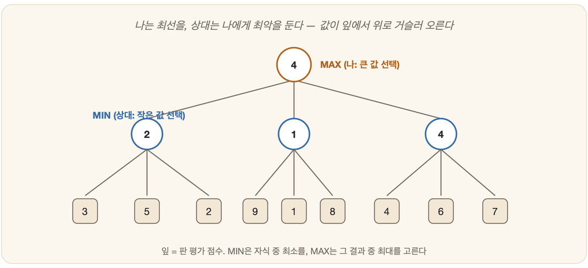

# 13-02. 미니맥스

체스판을 사이에 두고 마주 앉은 두 사람을 떠올려 보자. 한 사람이 말을 옮기려 손을 뻗었다가 멈춘다. 그가 망설이는 이유는 자신의 수가 아니라 상대의 응수다. "내가 여기를 두면, 저쪽은 분명 가장 아픈 곳을 찌를 텐데." 게임 트리(13-01)를 다 그려 놓고 나면 결국 남는 물음도 이와 똑같다 — 상대가 최선을 다해 나를 막는다고 할 때, 나는 어떤 수를 두어야 하는가. 이 오래된 물음에 대한 고전적 해법에 사람들은 이름을 붙였다. 한쪽은 점수를 **최대화(MAX)**하려 하고 다른 쪽은 **최소화(MIN)**하려 하니, 그 둘을 합쳐 **미니맥스(minimax)**라 부른다.

## 최악을 가정하고, 최선을 고른다

미니맥스가 딛고 선 땅은 하나의 비관적 믿음이다. 상대는 언제나 나에게 가장 불리한 수를 둔다는 것. 어둡지만 안전한 가정이다. 적이 어디서 실수해 주기를 바라며 운에 기대는 대신, 적이 한 치의 빈틈도 없다고 못 박아 두는 편이 무너지지 않기 때문이다. 그 어두운 전제 위에서 나는 내가 통제할 수 있는 것, 곧 나의 선택지들 가운데서만 최선을 고른다.

값을 매기는 손길은 노드의 주인이 누구냐에 따라 갈린다. 내 차례인 MAX 노드에서는 자식들 중 가장 큰 값을 집어 든다. 나는 점수를 키우고 싶으니까. 상대 차례인 MIN 노드에서는 자식들 중 가장 작은 값을 집어 든다. 상대는 내 점수를 깎고 싶어 하니까. 그리고 더 내려갈 곳이 없는 잎 노드에 이르면, 평가 함수가 그 자리에 점수를 새긴다(13-01).

## 아래에서 위로 값이 거슬러 오른다

미니맥스의 계산은 강물을 거슬러 오르는 연어처럼 움직인다. 트리의 잎에서 시작해 뿌리를 향해 값을 끌어올리는 것이다. 사람들은 이 거슬러 오름을 백업(backup)이라 불렀다.

먼저 가장 깊은 잎들의 점수를 평가 함수로 정한다. 그 위로 한 층 올라서면, MIN 층은 자식 중 가장 작은 값을 거두고 MAX 층은 가장 큰 값을 거둔다. 이 거둠을 한 층씩 되풀이하며 뿌리까지 올라가면, 마침내 뿌리에 — 내 차례인 그곳에 — 가장 큰 값을 안겨 주는 가지 하나가 남는다. 그것이 내가 두어야 할 수다.

> **직관**: "내가 이 수를 두면 → 상대는 최선의 응수로 날 괴롭히고 → 그래도 내가 받을 수 있는 최선의 결과는 이것"을, 모든 첫 수에 대해 계산해 가장 나은 첫 수를 고르는 것.

## 강점과 한계

미니맥스의 미덕은 그 정직함에 있다. 상대가 완벽하다는 가정 아래에서라면, 이 방법은 이론적으로 최선의 수를 보장한다. 명료하고, 흔들림이 없다. 그러나 바로 그 철저함이 약점으로 돌아온다. 최선을 증명하려면 트리 전체를 빠짐없이 훑어야 하고, 그 순간 미니맥스는 bᵈ의 조합 폭발(13-01) 앞에 고스란히 몸을 드러낸다. 체스나 바둑처럼 가지가 무성한 게임에서는 끝까지 계산하는 일 자체가 불가능하다.

그래서 현실은 두 개의 버팀목을 마련했다. 하나는 깊이를 제한하고 그 자리에서 평가 함수로 점수를 매기는 것이다. 끝까지 내다보는 욕심을 버리고 적당한 지점에서 멈춰 서는 타협이다. 다른 하나는 애초에 들여다볼 필요 없는 가지를 미리 쳐내는 것 — 그 가지치기의 이름이 알파-베타다.

---

### 정리

- **미니맥스**: 상대가 최선으로 방해한다고 가정하고, 그 안에서 내 최선을 고른다.
- **MAX 노드는 최댓값, MIN 노드는 최솟값**을 취하며, 값이 잎에서 뿌리로 거슬러 오른다.
- 이론상 최선이지만 **bᵈ 폭발**에 노출 → 깊이 제한·평가 함수, 그리고 알파-베타로 보완.

### 생각해보기

- 미니맥스는 "상대가 항상 최선을 둔다"고 가정합니다. 만약 상대가 실수투성이라면, 이 비관적 가정은 나에게 손해일까요 이득일까요? 안전함과 공격성 사이의 트레이드오프를 생각해 보세요.
