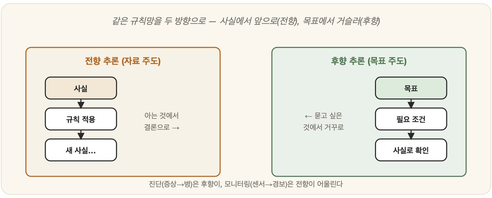

# 15-01. 전향 추론과 후향 추론

열이 오른 아이를 앞에 두고, 의사는 두 가지 길 중 하나를 택한다. 하나는 눈앞의 증상을 하나씩 주워 모으며 "이것들이 가리키는 결론이 무엇인가"를 묻는 길이고, 다른 하나는 마음속에 떠오른 병명 하나를 붙들고 "이게 맞으려면 무엇이 확인되어야 하는가"를 거슬러 캐묻는 길이다. 14장에서 우리는 지식을 *표현*하는 법을 익혔다. 사실과 규칙으로 정리된 그 지식은, 그러나 가만히 놓여 있을 때는 아무것도 말해주지 않는다. 거기서 **새로운 결론을 끌어내는 일** — 추론(reasoning)이 시작되어야 비로소 지식은 움직인다. 그리고 규칙이라는 톱니바퀴를 어느 쪽으로 돌리느냐에 따라, 6장에서 잠깐 스쳤던 두 갈래 길이 갈라진다. 전향과 후향이다.

## 전향 추론: 사실에서 출발해 앞으로

**전향 추론(forward chaining)**은 의사가 택한 첫 번째 길을 닮았다. 발은 언제나 **가진 사실** 위에 놓인다.

먼저 지금 손에 쥔 사실들을 들여다본다. 그 다음, 조건(IF)이 충족되는 규칙을 찾아내 적용하고, 거기서 따라 나온 결론(THEN)을 새로운 사실로 더한다. 그렇게 한 걸음 나아간 자리에서 다시 처음으로 돌아가, 더 적용할 규칙이 남지 않을 때까지 같은 일을 반복한다.

```
사실: 열이 난다, 기침을 한다
규칙: IF 열+기침 THEN 감기 의심  →  '감기 의심' 추가
규칙: IF 감기 의심 THEN 휴식 권고  →  '휴식 권고' 추가
```

열과 기침이라는 두 사실에서 출발해 '감기 의심'이 쌓이고, 그 위에 '휴식 권고'가 또 한 층 얹힌다. 데이터에서 출발해 *결론을 향해 쌓아 올리므로* 이것을 **데이터 주도(data-driven)** 방식이라 부른다. 묻는 말은 늘 한결같다 — "지금 아는 것으로 무엇을 더 알 수 있나?" 모니터링이나 진단처럼 사실이 끊임없이 흘러드는 상황에서, 이 방식은 들어오는 정보마다 곧장 새 결론으로 번역해낸다.

## 후향 추론: 목표에서 출발해 거슬러

두 번째 길을 걷는 의사는 거꾸로 간다. **후향 추론(backward chaining)**은 손에 쥔 사실이 아니라 **증명하고 싶은 목표**에서 출발한다.

먼저 가설을 하나 세운다 — 이를테면 "이 환자는 감기인가?" 그리고 그 목표를 결론(THEN)으로 품고 있는 규칙을 찾아낸다. 찾았다면, 그 규칙의 조건(IF)을 이번엔 *새로운 하위 목표*로 삼아 다시 한 단계 거슬러 오른다. 이렇게 목표가 또 다른 목표를 부르며 올라가다, 마침내 모든 하위 목표가 사실로 뒷받침되는 순간 목표는 증명에 성공한다.

목표에서 거꾸로 내려오므로 이쪽은 **목표 주도(goal-driven)** 방식이다. 던지는 질문도 방향이 반대다 — "이것이 참임을 보이려면 무엇이 필요한가?" 7부의 **Prolog**가 바로 이 후향 추론으로 우리의 질의에 답한다.

## 어느 쪽을 쓸까



| | 전향 | 후향 |
|---|---|---|
| 출발점 | 사실 | 목표 |
| 성격 | 데이터 주도 | 목표 주도 |
| 알맞은 상황 | 사실이 쏟아질 때(모니터링) | 특정 가설을 확인할 때(진단) |

탐색(3부)의 눈으로 다시 보면 두 길의 정체는 더 또렷해진다. 전향은 초기 상태에서 가지를 펼쳐 나가는 일이고, 후향은 목표 지점에서 출발해 거슬러 더듬는 일이다. 결국 둘은 같은 지식의 그물을 *서로 다른 방향으로* 누비는 두 전략일 뿐이다.

---

### 정리

- **전향 추론**: 사실 → 규칙 적용 → 결론 쌓기 (**데이터 주도**, 모니터링·진단).
- **후향 추론**: 목표 → 필요한 조건으로 거슬러 → 사실로 확인 (**목표 주도**, Prolog).
- 둘은 같은 규칙을 *반대 방향으로* 굴리는 전략이다.

### 생각해보기

- "범인이 누구인가"를 추리할 때, 단서에서 출발하는 탐정(전향)과 특정 용의자를 의심하고 알리바이를 캐는 탐정(후향) — 당신의 추리 스타일은 어느 쪽에 가깝나요?
