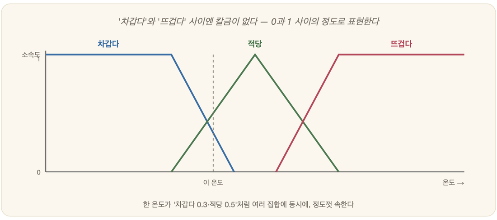

# 17-02. 퍼지 집합과 퍼지 논리

확실성 요인(17-01)이 "이 결론을 얼마나 믿어도 되는가"를 따졌다면, 이번에는 한 걸음 더 안쪽으로 들어간다. 문제는 믿음의 강도가 아니라, 우리가 쓰는 말 자체에 있다. "키가 크다", "물이 뜨겁다", "차가 빠르다." 입에서 나오는 순간 모두가 알아듣지만, 막상 어디까지가 '크다'이고 어디부터 '안 크다'인지 선을 그으라 하면 누구도 그 선을 정확히 짚지 못한다. 경계가 흐릿한 것이다. **퍼지 논리(fuzzy logic)**는 바로 그 흐릿함을 피하지 않고 정면으로 끌어안는다.

## 흐릿한 경계: 퍼지 집합



전통적인 집합은 칼이다. 키 180cm 이상이면 '큰 키' 집합 안으로 들어가고(1), 179cm면 바깥에 남는다(0). 그런데 이 칼질은 어딘가 어색하다. 단 1cm 차이로 한 사람은 '큰 사람'이 되고 다른 한 사람은 '안 큰 사람'이 되어버리니, 우리가 실제로 사람을 바라보는 방식과는 영 딴판이다.

**퍼지 집합(fuzzy set)**은 그 칼을 내려놓는다. 대신 **소속의 정도**를 허락한다. 루트피 자데(Lotfi Zadeh, 1965)가 내놓은 발상이다. 키 190cm인 사람은 '큰 키'에 소속도 **1.0**으로 들어앉고, 178cm인 사람은 소속도 **0.7**쯤으로 거의 들어와 있으며, 165cm인 사람은 소속도 **0.1** 정도로 가장자리에 겨우 걸쳐 있다. 0과 1 사이의 값으로 **"어느 정도는 큰 키에 속한다"**고 말하는 셈이다. 6장 명제논리가 참 아니면 거짓, 0 아니면 1로만 세상을 갈랐다면, 퍼지는 그 사이를 **0~1의 연속**으로 활짝 열어젖힌 것이다.

## 퍼지 논리와 퍼지 규칙

이 퍼지 집합 위에 "그리고", "또는", "아니다"를 다시 정의해 얹으면 **퍼지 논리**가 된다. 그리고 이것을 규칙에 쓰는 순간, 사람이 평소에 내뱉는 애매한 말을 거의 손대지 않고 그대로 옮겨 담을 수 있게 된다.

```
IF  온도가 '약간 높고' AND 습도가 '높다'
THEN 에어컨을 '세게' 튼다
```

여기서 '약간 높다'와 '세게'는 흑백으로 딱 떨어지지 않는다. 저마다 소속도를 거느린 퍼지 개념이다. 여러 규칙이 동시에 *정도껏* 발동하고, 그 결과들을 한데 모아 다시 또렷한 숫자로 풀어내면(비퍼지화) 비로소 최종 출력이 나온다. 이를테면 에어컨 세기 73% 같은 값이다.

## 어디에 쓰이나: 퍼지 제어

퍼지 논리가 가장 환하게 빛난 무대는 **제어(control)**였다. 정밀한 수식 모델을 손에 쥐지 못한 상황에서도, 현장 전문가가 *말로 풀어놓은 경험칙*을 그대로 규칙으로 받아 적어 매끄럽게 기계를 다룰 수 있었기 때문이다.

그래서 퍼지는 에어컨과 세탁기, 밥솥 같은 가전 속으로 파고들었고, 특히 1990년대 일본 가전에서 크게 유행했다. 센다이 지하철의 부드러운 가감속이 유명해진 것도 퍼지 덕이었고, 자동 운전이 사람처럼 자연스럽게 속도를 올리고 내렸다. 카메라가 초점을 잡는 일이나 자동차가 기어를 바꾸는 일에도 같은 손길이 닿았다.

흐릿한 말로 된 지식이 오히려 더 부드럽고 더 강건한 제어를 낳는다는 역설 — 그것이 퍼지의 매력이었다.

## 4부를 마치며

확실성 요인과 퍼지 논리는 결국 같은 곳을 가리킨다. 세상은 흑백이 아니라 회색이며, AI는 그 회색을 다룰 줄 알아야 한다는 것이다. 여기서 4부 「지식 표현과 추론」이 막을 내린다. 지식을 표현하고(14장), 추론하고(15장), 시스템으로 엮고(16장), 끝내 불확실성까지 품에 안는(17장) 데까지 — 기호주의의 전 영역을 한 바퀴 돌아온 셈이다.

5부는 정반대 방향으로 길을 튼다. 지식을 *사람이 한 줄씩 적어 넣는* 대신, *데이터로부터 기계가 스스로 깨치게* 만드는 **학습**의 세계가 그 너머에서 기다린다.

---

### 정리

- **퍼지 집합**(자데, 1965)은 0~1의 **소속도**로 '큰 키' 같은 흐릿한 개념을 표현한다.
- **퍼지 논리/규칙**은 '약간 높다' 같은 애매한 말을 그대로 다뤄, 특히 **제어**(가전·지하철)에서 빛났다.
- 4부의 결론: *세상은 회색이며, AI는 그 회색(정도·불확실성)을 다뤄야 한다.*

### 생각해보기

- '뜨거운 물'의 경계는 몇 도일까? 칼 같은 경계를 하나 정해두는 것과, 소속도로 흐릿하게 남겨두는 것 — 어느 쪽이 실제 우리의 느낌에 더 가까운가?
