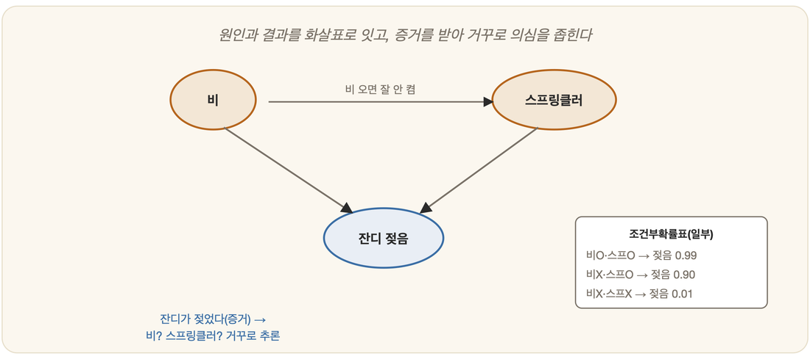

# 17-03. 베이지안 네트워크

아침에 현관문을 나서던 그는 잔디가 흠뻑 젖어 있는 것을 본다. 잠깐 멈춰 선다. 간밤에 비가 왔던가? 아니면 스프링클러가 돌았던가? 그는 하늘을 올려다본다. 구름 한 점 없이 맑다. 그렇다면 비는 아닌 듯하고, 자연스레 스프링클러 쪽으로 마음이 기운다. 그러다 다시 옆집 보도까지 젖어 있는 것을 발견하자, 마음은 또 한 번 비 쪽으로 흔들린다. 젖은 잔디 하나를 두고 그의 머릿속에서는 원인을 거슬러 오르내리는 작은 추리가 쉴 새 없이 벌어진다.

이 평범한 아침의 추리 속에 17장이 줄곧 쫓아온 물음의 해답이 들어 있다. 17-01의 확실성 요인은 끝에서 한마디를 남겼다 — 더 엄밀하고 정교한 길은 그 뒤에 **베이즈 네트워크** 같은 형태로 따로 자라난다고. 이제 그 약속을 받을 차례다. 확률을, 그러니까 5장의 베이즈 정리를, 여러 변수가 서로 얽힌 현실의 그물 위에 펼쳐 놓는 방법이 여기 있다.

## 변수를 잇는 그래프



베이지안 네트워크(Bayesian network)는 다른 이름으로 **믿음 네트워크(belief network)**, 또는 **인과 네트워크(causal network)**라고도 불린다. 이름이 여럿인 만큼 보는 각도도 여럿이지만, 그림 자체는 뜻밖에 단순하다. **노드(node)**와 **화살표(arc)**, 그게 전부다.

노드 하나하나는 하나의 **변수**다. '비가 왔다', '스프링클러가 돌았다', '잔디가 젖었다' — 각각이 참이거나 거짓일 수 있는 변수다. 그리고 노드와 노드를 잇는 화살표는 그들 사이의 **의존 관계**, 흔히 **인과 관계**를 나타낸다. '비'에서 '젖은 잔디'로 화살표가 향한다면, 비가 잔디 젖음의 한 원인이라는 뜻이다. 화살표가 흘러나오는 쪽을 부모(parent)라 부른다.

```
   [비]        [스프링클러]
      \          /
       ↓        ↓
       [젖은 잔디]
```

비도 스프링클러도 잔디를 적시는 원인이므로, 둘 다 '젖은 잔디'의 부모가 된다. 이렇게 화살표는 한 방향으로만 흐르고 결코 제자리로 돌아오는 고리를 만들지 않는다. 원인에서 결과로, 위에서 아래로 흐르는 이 방향성 있는 그물을 수학에서는 점잖게 **방향성 비순환 그래프**라 부른다. 어려운 이름에 겁먹을 것 없다. 우리가 아침마다 머릿속에 그리는 '무엇이 무엇을 일으키는가'의 지도, 딱 그것이다.

## 조건부확률표: 화살표에 숫자를 채우다

그림만으로는 추리가 굴러가지 않는다. 화살표가 "비는 잔디를 적신다"고 말할 때, 우리는 그것이 **얼마나** 그런지를 알아야 한다. 비가 오면 잔디가 젖을 확률이 0.99인지 0.6인지에 따라 추리의 결론이 달라지기 때문이다. 그래서 각 노드에는 숫자표가 하나씩 붙는다. 이것이 **조건부확률표(conditional probability table, CPT)**다.

CPT는 "부모가 이런저런 상태일 때, 이 노드가 참일 확률은 얼마인가"를 빠짐없이 적어 둔 표다. 부모가 없는 노드, 예컨대 '비'에는 그저 평소에 비가 올 확률 하나만 적으면 된다. 이를테면 `P(비) = 0.2`. 반면 부모를 둘 거느린 '젖은 잔디'는 부모들의 모든 조합마다 한 줄씩 채워야 한다.

```
비    스프링클러   →  P(젖은 잔디 = 참)
참       참              0.99
참       거짓            0.90
거짓     참              0.90
거짓     거짓            0.01     ← 둘 다 아니면 거의 안 젖는다
```

여기서 화살표 하나가 더 늘어 부모가 셋이 되면 표의 줄 수는 두 배로 불어난다. 부모가 많아질수록 표가 가파르게 커지는 것이다. 그래서 베이지안 네트워크는 슬그머니 한 가지 약속을 깐다 — 어떤 노드든 **제 부모만 알면 나머지 조상들과는 더 따질 게 없다**는 약속이다. '젖은 잔디'는 '비'와 '스프링클러'만 정해지면 그것으로 충분하고, 그 위에 무엇이 있었는지는 잊어도 된다. 결과는 직접적인 원인에만 매달리고 먼 과거와는 끊어진다는 이 가벼운 가정을, 우리는 **마르코프 가정**이라 부른다. 덕분에 거대한 하나의 확률 덩어리가 작은 표 몇 개로 잘게 쪼개져, 비로소 손으로 다룰 만한 크기가 된다.

## 증거가 들어오면 믿음을 갱신한다

이제 그물도 쳤고 숫자도 채웠다. 네트워크가 진짜 일을 하는 순간은 **증거(evidence)**가 도착할 때다. 어떤 노드의 값을 우리가 실제로 관찰해 알게 되면, 그 소식은 화살표를 타고 그물 전체로 번져 나가 다른 노드들의 확률을 죄다 고쳐 쓴다.

아침의 그를 다시 떠올려 보자. 그는 '젖은 잔디 = 참'이라는 증거를 손에 쥐었다. 이제 거꾸로 거슬러 묻는다. 그렇다면 비가 왔을 확률은? 스프링클러가 돌았을 확률은? 화살표는 원인에서 결과로 향해 있지만, 추리는 그 화살표를 **거슬러 올라가** 결과로부터 원인을 더듬는다. 이 역추적의 엔진이 바로 5장에서 만난 베이즈 정리다.

$$P(\text{원인}|\text{증거}) = \frac{P(\text{증거}|\text{원인})\,P(\text{원인})}{P(\text{증거})}$$

말로 풀면, 평소에 품고 있던 **사전 믿음**(`P(비)=0.2`)을 젖은 잔디라는 **증거**와 맞부딪쳐 **사후 믿음**(`P(비|젖은 잔디)`)으로 고쳐 쓰는 일이다. 젖은 잔디를 본 순간 비가 왔을 확률은 0.2보다 훌쩍 올라간다.

흥미로운 일은 여기서 한 번 더 벌어진다. 그가 맑은 하늘을 확인하고 '스프링클러가 돌았다'는 또 다른 증거를 얻는 순간, 비가 왔을 확률은 다시 슬며시 **내려앉는다**. 이미 스프링클러라는 그럴듯한 범인이 잡혔으니, 굳이 비까지 의심할 까닭이 줄어든 것이다. 한 결과의 한 원인이 설명되면 다른 원인의 혐의가 옅어지는 이 현상은, 탐정이 진범을 찾자 다른 용의자를 풀어 주는 모습과 꼭 닮았다. 여러 변수가 한 그물에 얽혀 있기에 가능한, 베이지안 네트워크만의 묘미다.

## 진단에서 스팸까지

이 구조가 가장 자연스럽게 들어맞는 곳이 **진단**이다. 16장의 의료 전문가 시스템이 다루려 했던 바로 그 문제 — 증상으로부터 병을 거슬러 추리하는 일이다. 위에 병(원인) 노드를 두고 아래에 증상(결과) 노드를 매단 뒤 화살표를 병에서 증상으로 내려 그으면, 진단용 네트워크의 골격이 선다.

```
        [독감]
        /    \
       ↓      ↓
    [발열]  [기침]
```

환자가 들어와 "열이 나고 기침을 합니다"라고 말하면, 이 둘이 증거가 되어 그물을 타고 올라가 '독감일 확률'을 끌어올린다. 여기에 검사 결과 하나가 더 얹히면 확률은 또 갱신된다. 진료실의 의사가 차트를 한 장씩 넘기며 의심을 좁혀 가던 그 과정이, 네트워크 안에서 숫자로 또박또박 재현되는 셈이다.

같은 발상이 메일함에도 들어와 있다. **스팸 필터**가 그렇다. 도착한 메일의 단어 하나하나('당첨', '무료', '클릭')를 증거로 삼아, 이 메일이 스팸일 확률을 갱신해 가는 것이다. 단어들이 서로 독립이라고 과감히 단순화한 이 친척을 **나이브 베이즈(naive Bayes)** 분류기라 부르는데, 변수들 사이의 화살표를 거의 다 지워 버린 베이지안 네트워크의 가장 단출한 버전이라 보아도 좋다. 단순한데도 스팸을 놀랍도록 잘 걸러 낸다.

## 심화 · 확신도·퍼지와 무엇이 다른가

> 💡 **심화 — 건너뛰어도 좋다.** 베이지안 네트워크가 무엇인지만 잡았다면, 17-01·17-02와의 비교는 더 알고 싶을 때 봐도 된다.

여기서 잠시 17장의 세 갈래를 나란히 세워 보면 그 결이 또렷해진다. 17-01의 **확실성 요인**은 규칙마다 믿음의 눈금을 붙여 두고 손쉽게 더해 나가는, 실용을 앞세운 어림 장치였다. 직관적이고 빠르지만 엄밀한 확률은 아니었다. 17-02의 **퍼지 논리**는 결이 아예 다른 문제, 곧 '크다'·'뜨겁다'처럼 **말 자체가 흐릿한** 경우를 다뤘다 — 불확실성이 아니라 모호함의 문제였다.

베이지안 네트워크는 이 둘과 갈라선다. 그것은 확실성 요인이 끝내 닿지 못한 자리, 곧 **수학적으로 엄밀한 확률**의 자리에 단단히 발을 딛는다. 임의로 매긴 눈금을 더하는 대신, 베이즈 정리라는 검증된 법칙을 따라 믿음을 갱신한다. 게다가 여러 변수가 얽힌 상황을 그물로 그려내, 한 증거가 다른 모든 믿음을 어떻게 흔드는지까지 일관되게 계산해 낸다. 확실성 요인이 "회색을 다루자"고 외친 그 자리에서, 베이지안 네트워크는 "회색을 **확률의 법칙대로 정확히** 다루자"고 한 걸음 더 나아간 것이다.

---

### 정리

- 베이지안 네트워크는 **노드(변수)**와 **화살표(인과·조건부 의존)**로 이뤄진 방향성 그래프이며, 각 노드에 **조건부확률표(CPT)**가 붙는다.
- **증거**가 들어오면 베이즈 정리를 따라 그물 전체의 확률(믿음)이 갱신되며, 결과에서 원인을 거슬러 추리할 수 있다.
- 확실성 요인의 실용적 어림과 달리 **엄밀한 확률**에 기반하며, 진단·스팸 필터(나이브 베이즈) 등에 쓰인다.

### 생각해보기

- 젖은 잔디를 보고 비를 의심하다가, 스프링클러가 돌았음을 알게 되면 왜 비에 대한 의심이 도리어 줄어드나요?
- 같은 진단 문제를 17-01의 확실성 요인으로 풀 때와 베이지안 네트워크로 풀 때, 무엇이 더 믿음직하고 무엇이 더 손이 많이 갈까요?
