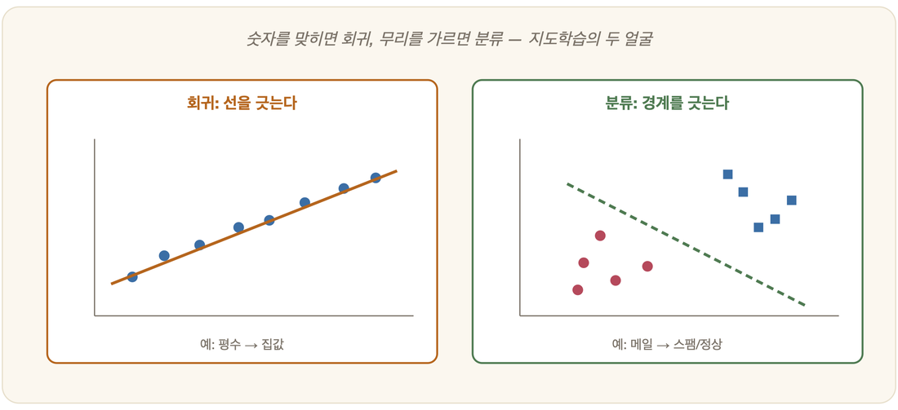

# 18-02. 회귀와 분류

부동산 중개소의 한 직원이 매물 정보를 들여다본다. 평수, 층, 역까지의 거리. 그가 머릿속에서 굴리는 질문은 단 하나, "이 집은 얼마쯤 받을 수 있을까"다. 옆 책상의 동료는 다른 화면을 본다. 받은 편지함에 쌓인 메일들, 그가 묻는 것은 "이건 스팸인가 아닌가"다. 두 사람이 던지는 질문은 닮은 듯 전혀 다르다. 한쪽은 숫자를 원하고, 다른 쪽은 한쪽 편을 고르길 원한다.

정답이 붙은 데이터로 입력에서 출력으로 가는 길을 배우는 일, 그것이 지도학습(18-01)이었다. 그런데 그 길의 끝에 놓인 '출력'이 어떤 얼굴을 하고 있느냐에 따라 지도학습은 두 갈래로 갈라진다. 연속적인 값을 맞히려는 길과, 범주를 가르려는 길. 앞의 중개소 직원이 걷는 길이 첫 번째고, 동료가 걷는 길이 두 번째다. 지도학습이 마주하는 거의 모든 문제는 이 두 길 중 하나로 흘러든다.

## 회귀: 숫자를 예측하다

집의 크기와 위치를 넣으면 가격이 나온다. 얼마? 공부한 시간을 넣으면 시험 점수가 나온다. 몇 점? 오늘의 날씨 데이터를 넣으면 내일의 기온이 나온다. 몇 도? 이 물음들의 공통점은 답이 끊김 없이 이어지는 수의 띠 위 어딘가에 찍힌다는 데 있다. 이렇게 연속적인 값을 예측하는 일을 **회귀(regression)**라 부른다.

그중에서도 가장 단순하고 정직한 형태가 **선형 회귀**다. 데이터의 점들 사이로 가장 잘 맞는 직선을, 혹은 차원이 늘면 평면을 그어 보는 것이다. "공부 시간이 1시간 늘면 점수가 약 8점 오른다" 같은 관계는, 알고 보면 적당한 기울기를 가진 한 줄의 직선으로 붙잡을 수 있다.

그렇다면 기계는 무엇을 '가장 잘 맞는' 직선이라 여기고 그것을 찾아낼까. 답은 이미 5장에서 본 그대로다. 예측한 값과 실제 값 사이의 어긋남, 곧 **오차(손실)**를 먼저 정의한 뒤, 그 어긋남이 가장 작아지도록 직선의 기울기와 절편을 경사 하강으로 조금씩 밀고 당긴다. *학습이란 오차를 줄여 가는 최적화다* — 추상으로만 들리던 그 문장이 여기서 비로소 손에 잡히는 모양을 갖춘다.

## 분류: 범주를 가르다

이번엔 답이 수의 띠 위가 아니라, 몇 개의 칸 중 하나에 떨어진다. 메일은 스팸이거나 정상이고, 사진 속 동물은 고양이거나 개거나 새이며, 종양은 양성이거나 악성이다. 이렇게 이산적인 범주(class) 중 하나를 골라내는 일을 **분류(classification)**라 한다.

분류기가 실제로 하는 일을 그림으로 그리자면, 데이터가 흩어진 공간 위에 선을 하나 긋는 것이다. 이 선 이쪽은 고양이, 저쪽은 개. 그 선에는 **결정 경계(decision boundary)**라는 이름이 붙어 있다. 5장에서 익힌 벡터의 언어로 옮기면, 각각의 데이터를 특징 벡터로 세워 둔 공간을 둘로, 혹은 여럿으로 나누는 경계를 찾는 일이 된다.

## 결정 트리: 스무고개로 나누기

분류기가 경계를 긋는 방식은 한 가지가 아니다. 그중에서도 사람의 직관에 가장 가까운 것이 **결정 트리(decision tree)**다. 어릴 적 하던 스무고개를 떠올리면 된다. "동물인가? 그렇다면 다리가 넷인가? 그렇다면 짖는가?" 이렇게 질문을 차례로 던지며 후보를 점점 좁혀 가다 보면, 끝내 답 하나에 다다른다. 결정 트리는 데이터를 이런 질문들의 나무로 바꾼다. 맨 위 뿌리에서 시작해 특징을 하나씩 묻고, 그 답에 따라 가지를 타고 내려가, 잎에 이르러 범주를 읽는다.

그렇다면 어떤 질문을 맨 위에 놓아야 할까. 스무고개의 고수는 단번에 후보를 절반으로 자르는 질문부터 던진다. 결정 트리도 똑같다. 데이터를 가장 깔끔하게 갈라 주는 특징, 곧 섞여 있던 범주들을 가장 잘 추려 주는 질문을 위로 올린다. 이 '가장 잘 나눈다'를 숫자로 재는 잣대가 **정보이득(information gain)**이다. 뒤섞여 어지러운 정도를 **엔트로피(entropy)**라 부르는데, 한 질문으로 데이터를 나눴을 때 이 엔트로피가 가장 많이 줄어드는 — 다시 말해 가장 가지런해지는 — 분할을 고르는 것이다. 이렇게 정보이득이 큰 질문부터 위에서 아래로 차례차례 나무를 키워 가는 고전적인 방법이 바로 로스 퀸런(Ross Quinlan)의 **ID3** 알고리즘이다.

결정 트리의 가장 큰 미덕은 그 결과를 사람이 눈으로 따라 읽을 수 있다는 데 있다. "키가 크고 머리색이 금발이면 이 무리, 그렇지 않으면 저 무리"처럼, 학습이 끝난 나무는 곧장 if-then 규칙의 묶음으로 옮겨 적을 수 있다. 왜 그렇게 분류했는지를 설명할 수 있다는 것 — 많은 모델이 속을 들여다볼 수 없는 깜깜한 상자인 것과 견주면 이것은 적잖은 강점이다. 무엇을 보고 어떻게 나눌지를 파고드는 이 이야기는 22장의 패턴 인식에서 다시 만나게 된다.

## 회귀와 분류, 무엇이 다른가

| | 회귀 | 분류 |
|---|---|---|
| 출력 | 연속값(숫자) | 이산 범주(레이블) |
| 예 | 가격·기온 예측 | 스팸·이미지 분류 |
| 묻는 것 | "얼마?" | "어느 쪽?" |

겉모습은 이렇게 갈라서지만, 두 길의 뿌리는 한 곳에서 만난다. 둘 다 입력에서 출력으로 가는 함수를 데이터로부터 더듬어 찾는 일이고, 그 '찾기'의 정체는 오차를 줄이는 최적화다. 5부에서 만나게 될 신경망(19장)은, 이 두 가지를 모두 — 그리고 직선 한 줄로는 도저히 그릴 수 없는 훨씬 구불구불한 형태로 — 한꺼번에 해낸다.

## 다음으로: 잘 맞히면 끝일까?

그런데 여기에 조용한 함정이 하나 도사리고 있다. 학습에 쓴 데이터에 지나치게 완벽히 들어맞도록 모델을 다듬으면, 정작 처음 보는 새로운 데이터 앞에서 형편없이 무너지곤 한다. 시험 문제의 답을 통째로 외운 학생과 원리를 이해한 학생의 차이 — 외운 것과 이해한 것 사이의 그 틈이, 곧 다가올 **과적합과 일반화**의 이야기다.

---

### 정리

- **회귀**는 연속값("얼마?")을, **분류**는 범주("어느 쪽?")를 예측한다.
- 회귀=가장 잘 맞는 함수(직선), 분류=결정 경계 긋기 — 둘 다 **오차 최소화**(5장).
- 신경망(19장)은 이 둘을 더 복잡한 형태로 수행한다.

### 생각해보기

- "내일 비가 올 확률"을 예측하는 것은 회귀일까요 분류일까요? '얼마나(확률)'와 '올까/안 올까'는 어떻게 이어질 수 있을까요?
