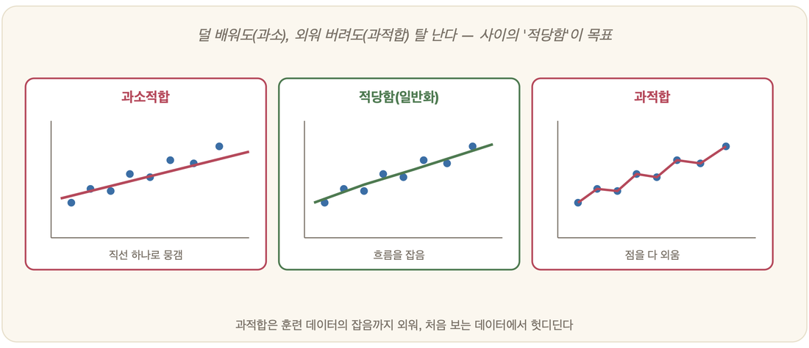

# 18-03. 과적합과 일반화

시험 전날 밤, 누구나 한 번쯤은 그런 친구를 보았다. 기출문제집을 펴 놓고 답을 통째로 외우던 친구. 3번 문제의 답은 ②, 7번 문제의 답은 ④. 문항의 순서까지 머릿속에 새겨 넣은 그 친구는 기출만큼은 백 점이었다. 그런데 정작 시험장에 들어가 처음 보는 문제를 마주하자 손이 멈췄다. 잘 맞히는 것과 잘 배운 것은 같지 않다. 학습한 자료는 완벽히 맞히고도 실전에서 무너지는 일은, 기계에게도 그대로 일어난다. 그 이유와 대처를 모르고서는 기계학습을 안다고 말하기 어렵다.

## 일반화: 학습의 진짜 목표

기계학습이 노리는 것은 *본 적 있는 데이터를 잘 맞히는 것*이 아니다. 진짜 목표는 따로 있다. **처음 보는 데이터를 잘 맞히는 것**, 이것을 **일반화(generalization)**라 부른다. 다시 시험으로 비유하자면, 기출문제 답을 통째로 외운 학생이 아니라 *원리를 이해해 새 문제를 푸는* 학생이야말로 잘 일반화한 쪽이다.

## 과적합: 외워 버리기

문제는, 외우는 능력이 지나칠 때 생긴다. **과적합(overfitting)**은 모델이 학습 데이터에 **지나치게** 맞춰진 나머지, 데이터의 *진짜 패턴*뿐 아니라 *우연한 잡음까지* 외워 버린 상태다.

숫자로 보면 그 함정이 또렷하다. 학습 데이터 정확도는 99퍼센트, 완벽해 보인다. 그러나 새 데이터에서는 60퍼센트로 무너진다. 7장에서 본 사람의 학습과 똑같은 풍경이다. 기출 답만 외운 학생은 학습 점수는 높아도 새 문제 앞에서 약하다.

## 과소적합: 덜 배우기

반대편에는 정반대의 실패가 있다. **과소적합(underfitting)**이다. 모델이 너무 단순해 데이터의 패턴조차 잡아내지 못한 상태다. 굽이치는 곡선 모양의 데이터를 자 한 자루로 그은 직선에 억지로 끼워 맞추려는 경우를 떠올리면 된다.

> **균형이 핵심**
> - 너무 단순 → 과소적합(패턴을 못 잡음)
> - 너무 복잡 → 과적합(잡음까지 외움)
> - 그 사이의 **적당한 복잡도**가 가장 잘 일반화한다.

이 아슬아슬한 줄타기를 **편향-분산 트레이드오프**라 부른다.

## 어떻게 막을까

그렇다면 과적합은 어떻게 다스리는가. 오래 다듬어진 몇 가지 길이 있다.

첫째, 데이터를 나눈다. 학습용과 검증용, 시험용으로 갈라 두고, *본 적 없는 데이터*로 성능을 정직하게 재는 것이다. 가장 기본이면서 가장 중요한 원칙이다. 둘째, 단순함을 선호한다. 이를 정규화라 하는데, 모델이 너무 복잡해지지 않도록 제약을 걸어 둔다. 설명력이 같다면 단순한 쪽이 낫다는 오컴의 면도날이 여기서 칼을 든다. 셋째, 데이터를 늘린다. 더 많고 더 다양한 데이터 앞에서는 잡음을 외울 여지 자체가 줄어든다.

## 왜 이것이 근본인가

과적합과 일반화는 5부 전체를 가로질러 흐르는 잣대다. 신경망(19장)이 거대해질수록 외울 수 있는 능력도 함께 커지고, 그만큼 과적합의 위험도 깊어진다. 19-05에서 본 LLM의 한계 — *본 패턴은 잘 흉내 내지만 새 구조 앞에서는 약하다* — 역시 결국은 일반화의 문제다. **"외웠는가, 이해했는가."** 이 한 줄의 물음은 기계에게나 사람에게나 똑같이, 학습이라는 것의 본질을 정통으로 찌른다.

---

### 정리

- 학습의 목표는 *본 데이터*가 아니라 **처음 보는 데이터**를 잘 맞히는 **일반화**.
- **과적합**(잡음까지 외움) ↔ **과소적합**(패턴도 못 잡음), 그 사이 **적당한 복잡도**가 최선.
- 대처: **데이터 분리(검증)·정규화(단순함 선호)·데이터 확충**.

### 생각해보기

- "기출문제를 다 외웠는데 시험을 망쳤다." 이 학생은 무엇을 잘못한 걸까요? 기계의 과적합과 정확히 같은 이 현상을, 당신의 공부 경험과 견주어 보세요.
