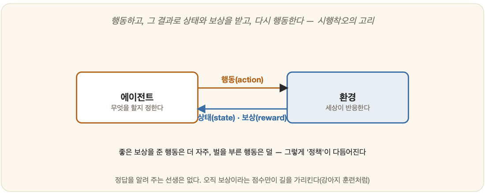

# 18-04. 강화학습

강아지에게 "앉아"를 가르쳐 본 사람은 안다. 처음엔 개도 사람도 막막하다. 손짓을 해도 개는 멀뚱히 서 있거나 엉뚱하게 빙빙 돈다. 그러다 어쩌다 한 번, 우연히 엉덩이를 바닥에 붙인다. 그 순간 간식이 날아간다. 개는 무슨 일이 일어났는지 정확히는 모른다. 다만 방금 한 무언가가 좋은 결과로 이어졌다는 어렴풋한 감각만 남는다. 그 일이 수십 번 되풀이되면, 개는 "앉아"라는 소리와 엉덩이를 붙이는 행동과 간식 사이의 보이지 않는 줄을 잇는다. 누구도 개에게 "엉덩이를 15도 굽힌 뒤 무게중심을 뒤로 보내라"고 정답을 알려 준 적이 없다. 개는 오직 **해 보고, 결과를 받고, 다음을 고치며** 배웠다.

18-01에서 우리는 학습의 세 갈래 길을 멀리서 바라보았다. 정답을 곁에서 알려 주는 지도학습, 정답 없이 스스로 질서를 더듬는 비지도학습, 그리고 답 대신 결과가 돌아오는 세 번째 길. 그때 강화학습은 자전거 타기에 빗댄 한 줄의 비유로만 스쳐 지나갔다. 이제 그 비유를 본격적으로 펼칠 차례다. 강화학습은 머신러닝을 떠받치는 셋째 기둥이다. 앞의 두 기둥이 **이미 쌓인 데이터**에서 배운다면, 이 기둥은 **스스로 움직여 만든 경험**에서 배운다.

## 시행착오로 배운다: 보상과 벌의 학습

지도학습에는 선생님이 있었다. 입력마다 "이게 정답이야" 하고 짝지어 주는 누군가가. 강화학습에는 그런 선생님이 없다. 대신 **채점관**이 있다. 채점관은 정답을 가르쳐 주지 않는다. 그저 네가 한 행동을 보고 점수를 매길 뿐이다. 잘했으면 보상(reward)을, 못했으면 벌을 돌려준다. 벌이라 해도 거창한 것이 아니라, 그저 작은 보상이거나 0점, 혹은 마이너스 점수일 뿐이다. 무엇이 옳은 행동이었는지는 끝내 말해 주지 않는다. 그것은 네가 점수의 흐름을 읽고 직접 알아내야 한다.

이 차이는 생각보다 깊다. 7장에서 본 강화, 칭찬과 꾸지람으로 행동을 빚어 가던 그 원리가 여기 그대로 들어와 있다. 게임 점수를 떠올리면 가장 쉽다. 벽돌깨기를 처음 하는 사람은 공이 어디로 튈지도 모르고 막대를 아무렇게나 움직인다. 그러다 막대가 공을 받아내면 점수가 오르고, 놓치면 공을 잃는다. 누구도 "지금 막대를 오른쪽으로 3칸 옮겨라"라고 일러 주지 않는다. 오직 올라가고 내려가는 점수판만이 잘하고 있는지를 말해 준다. 사람은 그 점수의 오르내림만 보고도 점점 능숙해진다. 강화학습이 기계에게 시키려는 일이 정확히 이것이다.

여기에 강화학습 특유의 어려움이 하나 숨어 있다. 보상이 **한참 뒤에야** 돌아올 때가 많다는 것이다. 바둑에서 60수째에 둔 한 점이 결정적 실수였다 해도, 그 벌(패배)은 150수가 끝난 뒤에야 도착한다. 그 많은 수 가운데 어느 것이 잘했고 어느 것이 망쳤는지를 가려내는 일 — 늦게 도착한 보상을 과거의 여러 행동에 공평하게 나눠 주는 일이야말로 강화학습이 풀어야 할 핵심 난제다.

## 에이전트와 환경, 끝없이 도는 고리

강화학습의 무대는 단 두 배우로 이루어진다. 행동하는 쪽인 **에이전트(agent)**와, 그를 둘러싼 **환경(environment)**이다. 강아지가 에이전트라면 훈련사와 거실은 환경이고, 게임을 하는 프로그램이 에이전트라면 게임 화면과 규칙이 환경이다. 이 둘 사이에서 같은 고리가 끝없이 돈다.

매 순간 에이전트는 먼저 자신이 처한 **상태(state)**를 살핀다. 공이 지금 어디 있고 막대는 어디쯤인지, 바둑판의 돌이 어떻게 놓였는지. 그 상태를 보고 에이전트는 가능한 것 중 하나의 **행동(action)**을 고른다. 막대를 왼쪽으로 민다거나, 어느 자리에 돌을 놓는다거나. 그러면 환경이 응답한다. 행동의 결과로 세상이 한 칸 바뀌어 **새로운 상태**가 되고, 동시에 그 행동에 대한 **보상**이 따라온다. 에이전트는 바뀐 상태를 다시 살피고, 다시 행동을 고르고, 다시 보상을 받는다. 상태 → 행동 → 보상 → 새 상태 → 다시 행동…. 이 끝없이 도는 고리가 강화학습의 심장이다.

에이전트의 목표는 한 번의 보상을 키우는 것이 아니다. 고리를 끝까지 돌렸을 때 **쌓인 보상의 총합**을 가장 크게 만드는 것이다. 이 점이 미묘하게 중요하다. 눈앞의 점수만 탐하다 보면 나중에 더 큰 점수를 놓칠 수 있기 때문이다. 당장 사탕을 받는 행동보다, 지금은 손해 같지만 끝에 가서 큰 보상을 안기는 행동이 진짜 좋은 행동이다. 그래서 강화학습은 늘 **멀리 내다보는** 학습이다. 행동하고 결과를 받으며 세상과 부대끼는 이 에이전트의 모습은, 뒤의 24장에서 만나게 될 에이전트의 그림과 그대로 겹친다. 강화학습이란 그 에이전트가 경험을 통해 스스로 똑똑해지는 한 가지 방식이다.

## 마르코프 결정 과정: 무대를 정리하는 틀

이 고리를 수학자들이 단정하게 정리해 둔 틀이 있다. **마르코프 결정 과정(Markov Decision Process, MDP)**이라는 다소 위압적인 이름이다. 그러나 속을 들여다보면 방금 본 고리를 부품별로 늘어놓은 것에 지나지 않는다. 상태들의 집합, 행동들의 집합, 어떤 상태에서 어떤 행동을 하면 다음에 어떤 상태로 옮겨 갈지(전이), 그리고 그때 받는 보상. 강화학습의 거의 모든 문제는 이 MDP라는 그릇에 담긴다.

이름 앞머리에 붙은 '마르코프'는 하나의 약속을 가리킨다. **다음에 무슨 일이 일어날지는 오직 지금 상태에만 달려 있다**는 것이다. 여기까지 어떤 길을 거쳐 왔는지, 과거의 긴 사연은 따지지 않는다. 체스를 생각하면 와닿는다. 지금 이 판이 어떻게 놓이게 됐든, 다음 한 수의 좋고 나쁨은 오로지 지금 말들의 배치만으로 판단할 수 있다. 과거를 통째로 짊어지지 않아도 된다는 이 약속 덕분에, 끝없이 복잡해 보이던 문제가 다룰 만한 크기로 줄어든다. MDP는 그래서 강화학습뿐 아니라 결정을 다루는 여러 분야의 공용어다. 뒤에서 만날 결정이론(30장)이 불확실함 속에서 한 번의 선택을 저울질한다면, MDP는 그 선택이 **줄줄이 이어질 때** 어떻게 멀리 보고 최선을 고를지를 다룬다고 보면 된다.

## 가치와 정책, 그리고 탐험과 활용

에이전트가 결국 손에 넣어야 할 것은 두 가지로 정리된다. **정책(policy)**과 **가치(value)**다.

정책은 쉽게 말해 **상황별 행동 규칙**이다. "이런 상태에서는 이렇게 움직여라"를 모든 상태에 대해 정해 둔 일종의 행동 지침서다. 강아지가 익힌 "앉아라는 소리가 들리면 엉덩이를 붙인다"가 작은 정책 하나다. 강화학습이 궁극적으로 찾으려는 것이 바로 보상의 총합을 가장 크게 해 주는 좋은 정책이다.

가치는 좀 더 미묘하다. 어떤 상태나 행동이 **앞으로 받을 보상의 합을 어림한 값**이다. 지금 당장의 점수가 아니라, 여기서부터 잘 풀어 갔을 때 끝까지 받게 될 보상을 미리 매겨 둔 점수표라 보면 된다. 어떤 자리는 당장은 평범해 보여도 그로부터 좋은 길이 줄줄이 열려 가치가 높고, 어떤 자리는 화려해 보여도 그 뒤가 막혀 가치가 낮다. 가치를 정확히 알면 정책은 저절로 따라온다. 매 갈림길에서 가치가 가장 높은 쪽을 고르기만 하면 되니까. 그래서 강화학습의 많은 방법은 **가치를 잘 어림하는 일**에 매달린다.

여기서 에이전트는 한 가지 영원한 딜레마와 마주친다. **탐험(exploration)이냐 활용(exploitation)이냐**다. 활용은 지금까지 배운 바로는 가장 좋아 보이는 행동을 택하는 것이고, 탐험은 더 나은 길이 숨어 있을지 모르니 일부러 안 가 본 행동을 시도해 보는 것이다. 늘 가던 단골 식당만 가면(활용) 실패는 없지만, 모퉁이의 더 맛있는 가게를 영영 모른 채 산다. 매번 처음 보는 집만 가면(탐험) 가끔 대박을 만나지만 대개는 평범하거나 실망한다. 너무 안주하면 더 좋은 전략을 놓치고, 너무 헤매면 아는 것조차 써먹지 못한다. 이 둘 사이의 균형을 잡는 일이 강화학습 내내 에이전트를 따라다닌다.

## Q-러닝: 표를 채워 가며 배우다

그렇다면 가치를 어떻게 어림할까. 가장 직관적이고 유명한 방법이 **Q-러닝(Q-learning)**이다. 핵심 발상은 의외로 소박하다. **커다란 표를 하나 만들어 칸을 채워 가는 것**이다.

표의 한 축에는 가능한 모든 상태를, 다른 축에는 가능한 모든 행동을 늘어놓는다. 칸 하나하나에는 "이 상태에서 이 행동을 하면 앞으로 얼마쯤 좋을까"를 어림한 점수가 들어간다. 이 점수를 Q값이라 부른다. 처음에는 아무것도 모르니 표를 0으로, 혹은 아무 값으로나 채워 둔다. 그리고 에이전트를 세상에 풀어 놓는다. 미로를 헤매는 로봇 청소기를 떠올려 보자. 어느 칸에서 오른쪽으로 갔더니 벽에 부딪혔다 — 그 칸의 '오른쪽' Q값을 조금 낮춘다. 어느 칸에서 위로 갔더니 출구에 한 걸음 가까워졌다 — 그 칸의 '위' Q값을 조금 올린다. 이렇게 **실제로 겪은 결과로 해당 칸의 값을 조금씩 손보는** 일을, 수없이 되풀이한다.

이때 칸을 고치는 방식에 강화학습의 묘수가 들어 있다. 한 행동의 Q값은 **방금 받은 보상**에다 **옮겨 간 다음 상태가 약속하는 최고의 Q값**을 더해 갱신된다. 풀어 말하면, "이 행동이 좋은 이유는 당장 받은 점수 때문만이 아니라, 그 행동이 데려다준 자리가 또 그만큼 유망하기 때문"이라는 것이다. 좋은 자리로 이어지는 길은 그 좋음이 한 칸씩 뒤로 스며든다. 출구 바로 앞 칸이 먼저 높은 값을 얻고, 그 앞 칸이, 또 그 앞 칸이 차례로 물들어 간다. 미로 끝의 보상이 입구 쪽으로 거슬러 번져 오는 셈이다. 표가 충분히 무르익으면, 에이전트는 어느 칸에 떨어뜨려 놓아도 그저 가장 높은 Q값을 가리키는 방향으로 걸으면 된다. 그렇게 표 한 장에서 좋은 정책이 떠오른다.

이처럼 끝의 결과를 기다렸다가 한꺼번에 정산하는 대신, **한 걸음 옮길 때마다 곁의 칸을 조금씩 고쳐 가는** 방식을 **시간차 학습(temporal difference learning)**이라 부른다. 예상했던 가치와 한 걸음 뒤에 드러난 현실 사이의 어긋남, 그 작은 차이만큼 표를 매번 슬쩍 당겨 놓는 것이다. 18-02에서 회귀가 오차를 줄여 가며 직선을 다듬었듯, 시간차 학습은 예측의 어긋남을 줄여 가며 가치의 표를 다듬는다. 끝까지 가 보지 않고도, 매 순간의 작은 어긋남만으로 조금씩 똑똑해진다는 데에 그 영리함이 있다.

## 세상으로 나간 강화학습

이 시행착오의 학습이 가장 화려하게 빛난 무대가 알파고였다. 알파고는 사람의 기보를 익히는 데서 멈추지 않고, 스스로와 수없이 대국하며 이기면 +1, 지면 −1이라는 단순한 보상만으로 더 좋은 정책을 길러 냈다. 누구도 "이 국면에선 이렇게 두라"고 가르치지 않았는데, 인간 고수도 두지 않던 수를 두기에 이르렀다. 다만 바둑판의 상태는 표 한 장에 담기엔 천문학적으로 많다. 그래서 현대의 강화학습은 거대한 표 대신 19장에서 만날 신경망에게 그 가치를 어림하게 한다. 표가 신경망으로 바뀌었을 뿐, 보상으로 시행착오한다는 뼈대는 그대로다.

무대는 게임 밖으로도 넓게 뻗는다. 로봇은 수천 번 넘어지고 다시 서기를 반복하며 비틀거리지 않고 걷는 법을, 사람이 일일이 관절 각도를 적어 주지 않아도 스스로 익힌다. 건물의 엘리베이터는 어느 층에서 기다리고 있어야 사람들의 대기 시간이 가장 짧아지는지를 보상으로 배운다. 환경이 어떻게 돌아가는지를 미리 다 알지 못해도, 부딪히고 결과를 받으며 적응해 간다는 점 — 그 점이 강화학습을 현실의 어수선한 문제들에 특히 잘 맞는 도구로 만든다. 거실에서 "앉아"를 배우던 강아지와, 바둑판 앞의 알파고와, 비틀대며 걸음마를 떼는 로봇은 겉모습이 전혀 다르지만, 그 안에서는 똑같은 고리가 돌고 있다. 해 보고, 결과를 받고, 다음을 고친다.

---

### 정리

- 강화학습은 정답이 아니라 **보상과 벌**로 배운다. 에이전트가 환경 속에서 **상태 → 행동 → 보상 → 새 상태**의 고리를 돌며, 쌓인 보상의 총합을 키우는 학습이다.
- 이 무대는 **MDP**로 정리되고, 에이전트는 상황별 행동 규칙인 **정책**과 앞으로 받을 보상의 어림값인 **가치**를 손에 넣으려 한다. 그 길에서 늘 **탐험과 활용** 사이를 저울질한다.
- **Q-러닝**은 상태·행동의 표를 시행착오로 채워 가며, **시간차 학습**으로 매 걸음 조금씩 값을 고쳐 좋은 정책을 길러 낸다. 알파고와 걷는 로봇이 그 산물이다.

### 생각해보기

- 시험공부를 할 때, 늘 자신 있는 과목만 더 파는 것과 약한 과목을 새로 들춰 보는 것 중 어느 쪽이 점수를 더 올릴까요? 이것도 활용과 탐험 사이의 저울질이 아닐까요?
- 강아지에게 "앉아"를 가르칠 때 간식을 행동 직후가 아니라 한참 뒤에 준다면 왜 학습이 더뎌질까요? 늦게 도착하는 보상이 강화학습을 어렵게 만드는 것과 어떻게 닮았을까요?
