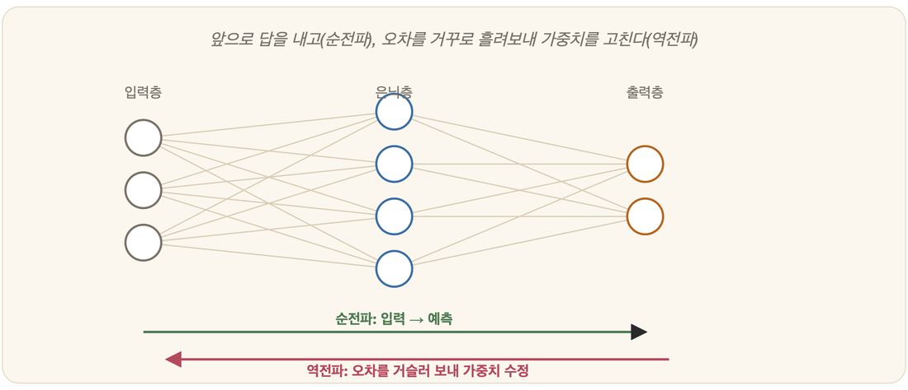

# 19-02. 다층 신경망과 역전파

퍼셉트론(19-01)은 칠판에 직선 하나를 긋고, 그 선 하나로 가를 수 있는 세상만을 이해했다. 그래서 XOR이라는 작고 비뚤어진 문제 앞에서 펜을 떨어뜨렸다. 한 줄로는 도저히 둘을 갈라놓을 수 없었기 때문이다. 막다른 골목 앞에서 사람들이 떠올린 답은 의외로 단순했다. 선이 하나로 부족하면, 층을 쌓으면 된다. 그러나 쌓는 것은 쉬워도 그렇게 쌓은 신경망을 *어떻게 가르칠 것인가*는 오래도록 풀리지 않은 매듭이었다. 그 매듭을 끊어낸 칼이 바로 **역전파(backpropagation)**였고, 그것이 죽어가던 신경망을 다시 일으켜 세웠다(2장의 1986년).

## 다층 신경망: 층을 쌓다

퍼셉트론 하나를 또 하나 위에 얹고, 그것들을 다시 **층(layer)으로 쌓는다**고 상상해 보자. 무엇이 달라질까.

```
입력층 → 은닉층(hidden) → 출력층
```

가장 먼저 **입력층**이 있다. 데이터가 세상으로부터 처음 들어오는 문이다. 그 너머에는 **은닉층**이 있는데, 이름 그대로 바깥에서는 보이지 않는 곳에서 입력을 주무르고 비틀며 새로운 특징을 빚어낸다. 한 겹일 수도, 여러 겹일 수도 있다. 그리고 마지막에 **출력층**이 서서 최종 답을 내놓는다.

은닉층이라는 중간 지대가 생기는 순간, 신경망은 더 이상 직선 하나에 매이지 않는다. 여러 경계를 겹치고 조합해 **휘어진 경계**를 그릴 수 있게 된다. 그러니 XOR 따위는 가볍게 넘어서고, 훨씬 더 복잡하게 얽힌 패턴까지 붙잡는다. (5장의 선형대수의 눈으로 보면, 각 층이 하는 일이란 결국 *행렬 곱 + 비선형 함수*일 뿐이다.) 놀랍게도, 은닉층을 충분히 크게 키우면 이론적으로 *거의 모든 함수*를 흉내 낼 수 있다.

## 문제: 은닉층을 어떻게 학습시키나

퍼셉트론에게 배움이란 단순한 일이었다. 틀리면 가중치를 고친다. 그것이 전부였다. 출력에 난 오차가 곧 그 뉴런 자신의 잘못이었으니, 책임 소재를 두고 고민할 것이 없었다. 그런데 **은닉층**의 뉴런은 사정이 다르다. 바깥에서 보이지도 않는 그 중간의 뉴런이 최종 출력의 오차에 *얼마나* 손을 보탰는지를, 도대체 어떻게 알아낼 수 있단 말인가.

여러 사람이 손을 거친 요리를 떠올려 보자. 완성된 국이 너무 짜다(이것이 '출력의 오차'다). 누구 탓일까? 간을 본 막내, 국물을 잡은 보조, 재료를 다듬은 또 다른 손 — 책임을 가리려면 **마지막 단계부터 거슬러 올라가며** "네가 더한 소금이 이 짠맛에 얼마나 기여했나"를 한 사람씩 따져야 한다. 신경망도 똑같다. 출력의 오차를 맨 뒷층부터 앞으로 거꾸로 흘려보내며, 중간 뉴런 하나하나에게 "이 잘못에 네 몫이 이만큼"이라고 책임을 나눠 매기는 것이다. 이 "책임 분배"의 문제야말로 다층 신경망을 가르치려는 이들의 발목을 붙든 가장 깊은 난관이었다.

## 역전파: 오차를 거슬러 보내다



**역전파**가 내놓은 답의 뼈대는 이렇다.

먼저 **순전파(forward)**가 있다. 입력을 층층이 통과시켜 출력, 곧 예측을 끝까지 밀어내는 과정이다. 그다음 그 예측이 정답에서 얼마나 빗나갔는지, 그 차이인 손실을 잰다(5장). 여기서부터가 진짜다. **역전파(backward)**는 그렇게 잰 오차를 **출력층에서 입력층 쪽으로 거꾸로** 흘려보내며, *각 가중치가 그 오차에 얼마나 기여했는지*, 곧 그래디언트를 한 겹 한 겹 되짚어 계산한다. 마지막으로 그 그래디언트가 가리키는 반대 방향으로 가중치를 아주 조금씩 밀어 갱신한다(5장의 경사 하강).

이 한 바퀴를 수많은 데이터에 대해 지치지 않고 반복하면, 신경망 전체가 조금씩, 그러나 분명하게 오차를 줄여 간다. 이 모든 계산을 떠받치는 핵심 도구는 미적분의 **연쇄법칙(chain rule)**이다. 출력에 맺힌 오차를 각 층의 기여로 잘게 쪼개어 거슬러 올라가는, 바로 그 계산. 5장에서 다룬 미적분이 여기서 비로소 결정적인 자리를 차지한다.

> **한 문장 요약**: 역전파 = *오차를 거꾸로 흘려보내, 각 가중치를 얼마나 고칠지 알아내는 방법.*

## 의의

역전파라는 이름이 세상에 널리 퍼진 것은 1986년 무렵이었고, 그 무렵 꺼져가던 신경망 연구의 불씨가 다시 살아났다(2장). 단순한 뉴런을 쌓아 올리고, 오차를 거슬러 보내며 가르친다는 이 원리는 — 그저 규모만 어마어마하게 키웠을 뿐 — 오늘날의 거대한 딥러닝 모델 속에서도 **그대로** 숨 쉬고 있다. 그 '규모 키우기'가 어떻게 딥러닝 혁명으로 번졌는지는, 그 자체로 또 하나의 이야기다.

---

### 정리

- **다층 신경망**(은닉층)은 휘어진 경계를 만들어 XOR 등 복잡한 문제를 푼다.
- **역전파**: 순전파로 예측 → 오차 계산 → 오차를 **거꾸로 흘려** 각 가중치의 그래디언트 계산 → 경사 하강으로 갱신.
- 미적분의 **연쇄법칙**이 핵심이며, 오늘의 딥러닝도 같은 원리를 쓴다.

### 생각해보기

- 역전파는 "결과의 잘못을 거슬러 올라가며 각 단계의 책임을 따진다"는 발상입니다. 팀 프로젝트가 실패했을 때 원인을 거슬러 분석하는 일과 닮지 않았나요? 차이가 있다면 무엇일까요?
