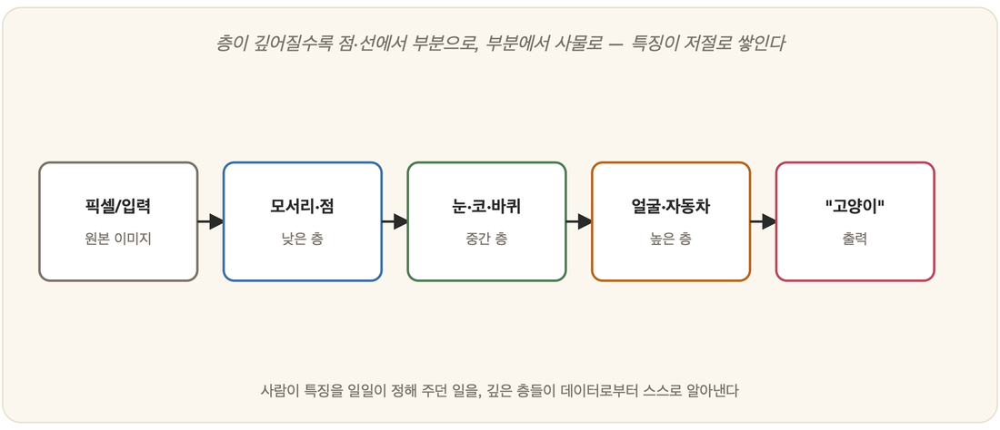

# 19-04. 딥러닝으로 가는 길

퍼셉트론(19-01)에서 시작해 다층 신경망과 역전파(19-02)까지, 우리는 한 걸음씩 올라왔다. 그 길의 끝에서 한 단어가 기다리고 있다. 누구나 들어봤지만 막상 무엇이 다른지는 흐릿한 단어, 딥러닝(deep learning)이다. 그런데 막상 그 안을 들여다보면 어쩐지 맥이 빠진다. 근본 원리는 거의 그대로이기 때문이다. 달라진 것은 원리가 아니라 깊이와 규모, 그리고 그것을 비로소 가능케 한 조건들이다.

## 딥러닝이란: 그냥 '깊은' 신경망

딥러닝의 정체는 의외로 단순하다. 은닉층을 아주 많이 쌓은 신경망, 그게 전부다. '깊다(deep)'는 말은 비유가 아니라 글자 그대로 층이 깊다는 뜻이다. 학습이 굴러가는 방식도 19-02에서 본 역전파에서 한 치도 벗어나지 않는다. 그렇다면 의문이 남는다. 그저 층을 더 쌓았을 뿐인데, 어째서 그 단순한 행위가 그토록 강력해지는가.

> **깊이 = 추상의 계층**
> 8장에서 본 뇌의 시각피질을 떠올려 보면 답의 실마리가 잡힌다. 층이 깊어질수록 신경망은 단순한 특징에서 복잡한 특징으로 점점 추상화해 간다. 앞 층은 에지를 붙잡고, 중간 층은 눈이나 코 같은 부분을 붙잡으며, 깊은 층에 이르러서야 얼굴이라는 전체를 붙잡는다. 사람이 특징을 일일이 설계해 떠먹여 주지 않아도, 기계가 층층이 스스로 특징을 빚어낸다. 바로 이것이 딥러닝의 핵심 위력이다(특징 학습, representation learning).

## 왜 갑자기 됐나: 세 박자

여기서 한 가지 사실이 마음에 걸린다. 다층 신경망이라는 아이디어는 1980년대에 이미 세상에 나와 있었다. 그런데 왜 30년을 묵힌 뒤 2010년대에야 폭발했을까. 답은 새로운 알고리즘 한 방이 아니라, 세 가지가 약속이라도 한 듯 동시에 맞아떨어진 데 있다(2장).

첫 박자는 데이터였다. 인터넷이라는 거대한 수도꼭지가 열리며 방대한 학습 데이터가 쏟아졌고, ImageNet 같은 것이 그 상징이었다. 두 번째 박자는 연산력이었다. GPU가 신경망을 떠받치는 대규모 행렬 곱(5장)을 단숨에 처리해 냈다. 마지막 박자는 기법의 발전이었다. 깊은 망을 무너뜨리지 않고 안정적으로 학습시키는 여러 기술이 차곡차곡 쌓였다.

이 셋이 한 점에서 만난 순간, 그 이름은 2012년 AlexNet이었다. 깊은 CNN(19-03)이 이미지 인식 대회를 압도하며, 비로소 딥러닝의 시대가 열렸다.

## 무엇을 바꿨나

딥러닝이 진짜로 갈아치운 것은 일의 주체였다. 그전까지 사람이 머리를 싸매고 손으로 하던 특징 설계(feature engineering)를, 이제 기계의 손에 통째로 넘겨버린 것이다. 19-03에서 보았듯, CNN의 첫 층은 누가 시키지 않아도 스스로 Gabor 같은 에지 필터를 학습한다. 음성에서 영상으로, 다시 언어로, 거의 모든 분야에서 이 자동 특징 학습은 사람이 공들여 쌓아 올린 기존 방법을 차례로 앞질러 갔다.

## 그러나 잊지 말 것

딥러닝의 성공은 눈부시다. 그러나 눈이 부실수록 시선은 더 차분해져야 한다. 그 화려한 성과의 토대는 결국 퍼셉트론과 역전파라는 고전이며(이 장 앞 절들), 본질은 지금도 데이터로부터의 최적화에서 한 발짝도 더 나아가지 않았다. 그리고 19-05에서 마주하게 되듯, 깊이와 규모를 아무리 키워도 끝내 뚫지 못하는 천장이 있다. 통계적 패턴 예측의 한계, 추론과 검증의 부재가 그것이다.

딥러닝은 마법이 아니다. 기초 위에 데이터와 연산이라는 동력을 얹은 것일 뿐이다. 그리고 그 기초를 아는 사람만이, 천장 너머를 설계할 수 있다.

---

### 정리

- **딥러닝** = 은닉층을 깊이 쌓은 신경망. 원리는 역전파 그대로, 달라진 건 **깊이·규모**.
- 깊이가 곧 **추상의 계층**(에지→부분→전체)이라, 기계가 **특징을 스스로 학습**한다.
- 폭발의 이유는 **데이터·GPU·기법**의 삼박자(2012 AlexNet). 단, 천장은 남는다(19-05).

### 생각해보기

- 딥러닝이 "특징을 스스로 학습한다"는 것은, 그전까지 전문가가 하던 일을 기계가 대신한다는 뜻입니다. 그렇다면 사람(전문가)의 역할은 사라질까요, 아니면 다른 곳으로 옮겨갈까요?
