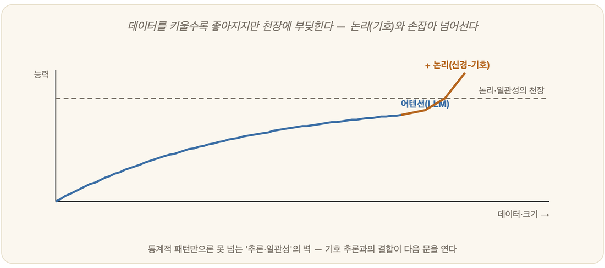

# 19-05. 어텐션의 천장과 논리의 귀환

당신은 새벽 두 시에 챗봇에게 묻는다. 답은 매끄럽고, 자신만만하고, 문장의 결이 흠잡을 데 없다. 그런데 다음 날, 그 답 한가운데에 존재하지도 않는 인용 하나가 끼어 있었다는 걸 알게 된다. 기계는 거짓말을 한 게 아니다. 그저 가장 그럴듯한 다음 말을 골랐을 뿐이다. 오늘날 인공지능의 얼굴이 된 거대 언어 모델(LLM)은 **트랜스포머(Transformer)**라는 신경망 구조 위에 서 있고, 그 심장은 **어텐션(attention)**이다. 그리고 바로 그 새벽의 매끄러운 거짓말 속에, 어텐션이라는 접근이 가진 **본질적 한계(천장)**가 숨어 있다. 이 천장 앞에서 다시 떠오르는 것이, 이 책이 줄곧 붙들어 온 **논리와 추론**이다 — 5부(학습)와 4부(지식·추론)가 다시 만나는 지점이다.

## 어텐션이 한 일

어텐션의 발상은 단순하면서도 강력하다. 문장을 처리할 때, 각 단어가 **다른 어떤 단어에 얼마나 '주목'할지**를 학습으로 정하게 한 것이다. 덕분에 문장의 양 끝에 떨어져 있는 단어들의 관계까지 유연하게 붙잡고, 방대한 텍스트에서 통계적 패턴을 길어 올려 놀라운 언어 능력을 보인다. 그러나 그 화려함의 밑바닥을 들여다보면, LLM이 하는 일은 결국 하나다 — **"지금까지의 맥락에서 다음에 올 가장 그럴듯한 말"을 확률로 예측**하는 것(5장 확률, 22장 언어 모델과 이어진다).

## 그런데 천장이 있다

바로 그 본질, *통계적 패턴 예측*이라는 본질에서 한계가 비롯된다.

첫째, 그럴듯함은 옳음이 아니다. LLM은 '참'을 보장하지 않고 '그럴듯함'을 최적화한다. 그래서 새벽의 그 인용처럼, 자신만만하게 틀린 답(환각, hallucination)을 지어낸다. 3장의 **중국어 방**이 일찍이 말했던 "구문은 의미가 아니다"가 여기서 현실이 되어 나타난다.

둘째, 체계적이고 구성적인 추론에 약하다. 여러 단계를 엄밀히 이어가는 논리적 추론, 긴 계산, 규칙을 일관되게 적용하는 일에서 자주 미끄러진다. 본 적 있는 패턴은 능숙하게 흉내 내지만, *처음 보는 구조*로 규칙을 확장하는 순간 발을 헛디딘다.

셋째, 검증과 보장이라는 장치 자체가 없다. 어텐션 어디에도 "이 결론이 전제로부터 타당하게 따라 나오는가"를 *보장*하는 메커니즘이 없다. 6장에서 본 추론의 **타당성**이 구조적으로 빠져 있는 것이다.

넷째, 규모를 키운다고 이 한계가 사라지지 않는다. 데이터와 파라미터를 늘리면 분명 좋아진다. 그러나 위의 문제들은 *키운다고 없어지는* 종류가 아니다. 스케일만으로는 넘기 어려운 **천장**이 거기 버티고 있다.

이 천장을 가장 손에 잡히게 보여 주는 예가 뜻밖에도 **암산**이다. 거대한 모델에게 "**과정은 적지 말고 답만** 내놓아라"라고 못 박은 채 `47,813 + 25,994` 같은 여러 자리 덧셈을 시켜 보면, 놀랍게도 곧잘 틀린다. 종이와 연필을 쥔 초등학생이라면 받아올림 몇 번으로 풀어낼 문제인데도 말이다. 이유는 어이없을 만큼 단순하다. 그 순간 모델은 *덧셈을 하는* 것이 아니라, '이쯤이면 그럴듯해 보이는 숫자'를 한 토큰씩 예측할 뿐이기 때문이다. 그런데 같은 모델에게 "한 자리씩 차근차근 풀어 보라"고 단계를 허락하면 — 이것이 바로 **생각의 사슬(chain-of-thought, CoT)**이다 — 정답률이 확 뛴다. 받아올림을 한 줄씩 적어 내려가는 동안, 풀이의 매 단계가 모델이 *흉내 내기 쉬운 작은 예측*으로 잘게 쪼개지는 덕이다. 곧, 통계적 예측기는 계산을 *못* 하는 게 아니라, 계산을 **펼쳐 적을 자리**가 있어야만 겨우 흉내 낸다. 답만 내놓으라며 그 자리를 빼앗는 순간, 천장이 그대로 드러나는 것이다. 두 자리 덧셈조차 '보장'이 아니라 '그럴듯함'으로 처리한다는 이 사실만큼, 어텐션의 본질을 적나라하게 보여 주는 장면은 없다.

> 사실 이건 새로운 이야기가 아니다. 연결주의(03-03)의 오랜 약점 — *강력한 학습, 그러나 설명과 보장의 어려움* — 이 LLM에서 역사상 가장 큰 규모로 다시 드러난 것뿐이다.

## 논리의 귀환: 신경-기호

천장을 넘는 가장 유력한 길은, 이 책이 첫 장부터 말해 온 **두 전통의 결합**에 있다. 한쪽에는 **연결주의(신경망)**가 있다 — 지각하고, 언어를 익히고, 패턴을 잡는 데 강하다. 다른 한쪽에는 **기호주의(논리·추론)**가 있다 — 규칙을 일관되게 적용하고, 단계를 검증하며, *이유를 보장*하는 데 강하다.

LLM의 유연한 언어 능력에 **논리·추론 엔진(4부)**을 붙이면 어떻게 될까. 사실을 지식베이스로 검증하고, 추론의 각 단계를 명시적 규칙으로 점검하고, 계산은 외부 도구에 맡긴다. 앞의 그 암산이 정확히 이 경우다 — 덧셈은 그럴듯하게 '예측'할 일이 아니라 계산기에 넘기면 그만인 일이고, 신경-기호의 발상은 바로 이렇게 "흉내 낼 일과 보장받아야 할 일"을 갈라 맡기는 데 있다. 그러면 새벽의 그 매끄러운 거짓말은 옳음의 시험대를 통과해야만 살아남는다. 그럴듯함을 *옳음*으로 끌어올리는 것 — 이것이 **신경-기호(neuro-symbolic) AI**의 핵심 발상이다. 직관(빠른 사고)과 논리(느린 사고)를 함께 굴리는 사람의 방식(7장)과도 닮았다.

## 그래서 기초다

이 절의 결론은 곧 이 책 전체의 결론이기도 하다. **가장 앞선 기술의 천장을 넘는 열쇠가, 가장 오래된 기초 — 논리와 추론 — 에 있다.** 최신 모델만 좇은 사람은 이 천장 앞에서 막혀 선다. 그러나 논리와 추론과 표현이라는 토대를 갖춘 사람은 그 너머를 설계할 수 있다. 트렌드에 휘둘리지 않고 기초부터 차근차근 쌓아 온 공부가 왜 끝내 실제 역량이 되는지를, 어텐션의 천장이 역설적으로 증명해 준다.

---

### 정리

- LLM은 **어텐션 기반의 통계적 다음-단어 예측**이며, 그래서 *그럴듯함 ≠ 옳음*, 추론·검증의 한계라는 **천장**을 가진다. (과정 없이 답만 시키면 쉬운 암산도 틀리지만, 생각의 사슬(CoT)로 풀이를 펼치게 하면 나아진다 — 계산을 *하는* 게 아니라 *예측*하기 때문이다.)
- 이는 연결주의의 오랜 약점(03-03)이 큰 규모로 드러난 것 — 스케일만으로는 넘기 어렵다.
- 유력한 돌파구는 **논리·추론(기호주의)과의 결합 = 신경-기호 AI** → 4부의 기초가 다시 핵심이 된다.

### 생각해보기

- LLM이 "2+2=5"라고 그럴듯하게 우길 때, 무엇이 그것을 바로잡아 줄 수 있을까요? 그 '바로잡는 장치'는 학습으로 얻어질까요, 아니면 논리로 보장되어야 할까요?
