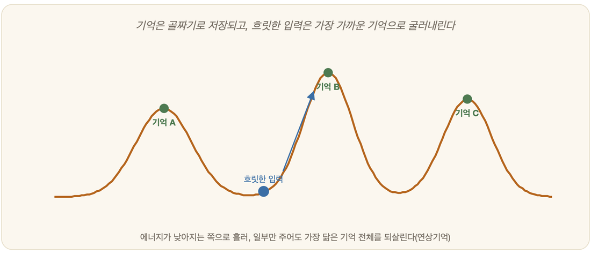

# 19-06. 또 다른 신경망들: 홉필드·볼츠만·자기조직화지도

오래된 사진 한 귀퉁이만 보고도 우리는 그날의 풍경을 통째로 떠올린다. 낡아 흐릿해진 노랫말 한 소절이, 잊고 있던 멜로디 전부를 끌어올린다. 사람의 기억은 그렇게 작동한다. 일부만 던져 주면 나머지를 알아서 메우는 것이다. 퍼셉트론에서 역전파, CNN, 어텐션으로 곧게 뻗어 온 19장의 큰길 옆에는, 바로 이런 "기억하고 떠올리는" 일을 다른 방식으로 풀어 보려던 샛길들이 여럿 나 있었다. 1980년대 연결주의를 떠받친 고전 신경망들이다. 신경망은 결코 한 갈래가 아니었다.

## 홉필드 네트워크: 흐릿한 조각으로 전체를 되살리다

1982년, 물리학자 존 홉필드는 자석 속 원자들이 서로 영향을 주고받는 스핀 모델에서 신경망의 새 그림을 끌어왔다. 그가 들여온 가장 인상적인 발상은 에너지라는 개념이다.

홉필드 네트워크에는 입력층도 출력층도 따로 없다. 뉴런들이 자기 자신만 빼고 모두 서로서로 양방향으로 묶여 있을 뿐이다. 각 뉴런은 앞서 본 인공뉴런처럼 켜짐과 꺼짐, 둘 중 하나의 상태를 가진다. 그리고 이 그물망 전체에는 하나의 숫자, 곧 에너지가 매겨진다.

여기서 골짜기를 굴러내리는 공을 떠올리면 된다. 울퉁불퉁한 지형 어딘가에 공을 놓으면, 공은 제멋대로 멈추는 법이 없다. 늘 더 낮은 곳, 더 낮은 곳으로 굴러 내려가다 결국 골짜기 바닥에 자리를 잡는다. 홉필드 네트워크도 똑같다. 어떤 상태로 출발하든, 뉴런들이 하나씩 제 상태를 고쳐 가며 망 전체의 에너지가 줄어드는 쪽으로만 움직인다. 그러다 더는 낮아질 데가 없는 바닥에 닿으면 멈춘다. 이 멈춘 자리를 안정 상태라 부른다.

그렇다면 그 골짜기 바닥들은 무엇인가. 바로 우리가 미리 저장해 둔 패턴들이다. 뉴런 사이의 연결 강도를 잘 조정해 두면, 기억시키고 싶은 패턴들이 저마다 하나의 골짜기 바닥이 되도록 지형을 빚을 수 있다. 이제 흐릿하고 망가진 패턴 하나를 입력으로 던져 보자. 그것은 지형 위 비탈 어딘가에 놓인 공과 같다. 공은 가장 가까운 골짜기로 굴러 내려가고, 네트워크는 그 흠집투성이 입력을 가장 닮은 원래 패턴으로 또박또박 복원해 낸다.

이것이 연상기억이다. 보통의 컴퓨터 메모리가 "몇 번지에 무엇이 있나"라는 주소로 정보를 찾는다면, 홉필드 네트워크는 "이것과 비슷한 게 뭐였지"라며 내용의 일부로 전체를 불러온다. 노이즈가 잔뜩 낀 글자, 절반쯤 가려진 얼굴을 던져도 본래 모습을 떠올려 주는 것이다. 사람의 기억을 닮은 이 성질 덕분에, 홉필드 네트워크는 연상기억뿐 아니라 순회 외판원 문제 같은 최적화 문제를 푸는 데에도 쓰였다. 답을 찾는 일을, 에너지가 가장 낮은 골짜기를 찾는 일로 바꿔 놓은 것이다.

## 볼츠만 머신: 흔들어서 더 깊은 골짜기로

골짜기로 굴러내리는 공에는 함정이 하나 있다. 진짜 가장 깊은 골짜기에 닿기도 전에, 얕고 작은 웅덩이에 빠져 그만 멈춰 버릴 수 있다는 것이다. 주변보다는 낮지만 전체로 보면 바닥이 아닌 자리, 이를 지역 최소점이라 한다. 에너지가 줄어드는 쪽으로만 고집스레 움직이는 홉필드 네트워크는 한번 이런 웅덩이에 빠지면 빠져나올 길이 없다.

1984년 제프리 힌턴과 테런스 세이노프스키가 내놓은 볼츠만 머신은 이 함정에 영리한 해법을 댔다. 발상은 단순하다. 웅덩이에 빠진 공을 꺼내려면 상자째 흔들어 주면 된다. 흔들리는 동안 공은 가끔 비탈을 거꾸로 타고 오르기도 하면서 얕은 웅덩이를 빠져나오고, 흔들기를 차차 멈추면 더 깊은 골짜기에 가라앉는다.

볼츠만 머신은 홉필드 네트워크에 바로 이 "흔들기"를 더한 것이다. 뉴런이 켜질지 꺼질지를 딱 잘라 정하지 않고 확률에 맡긴다. 그래서 에너지가 줄어드는 쪽이 아니라 늘어나는 쪽으로도, 작은 확률로나마 움직일 수 있다. 가끔 비탈을 거꾸로 오르는 셈이다. 이 흔들기의 세기를 처음엔 크게 두었다가 서서히 줄여 가는 방법을 모의 담금질이라 부른다.

담금질이라는 이름은 대장간에서 왔다. 쇠를 단단하고 흠 없게 만들려면 벌겋게 달군 뒤 천천히 식혀야 한다. 급히 식히면 안에 결함이 남지만, 서서히 식히면 원자들이 가장 안정된 자리를 찾아 가지런히 들어앉는다. 볼츠만 머신의 흔들기도 마찬가지다. 뜨거울 때는 상태를 크게 휘저어 여기저기 비탈을 넘나들게 하고, 차차 식히며 흔들기를 줄여 가장 깊은 골짜기에 차분히 가라앉힌다. 그렇게 얕은 웅덩이를 건너뛰고 전체에서 가장 낮은 자리, 곧 진짜 답에 더 가까이 다가서는 것이다.

확률을 들여온 이 발상은 멀리까지 이어졌다. 볼츠만 머신을 손본 모델은 훗날 딥러닝이 막 깨어나던 시절, 깊은 망을 미리 길들이는 사전 학습 도구로 한 시대 요긴하게 쓰였다.

## 자기조직화지도: 비슷한 것끼리 자리를 잡는 지도

지금까지의 신경망이 "기억하고 떠올리는" 일이었다면, 핀란드의 테우보 코호넨이 1980년대에 내놓은 자기조직화지도(SOM)는 결이 다르다. 이것은 정답을 한 번도 알려 주지 않는 비지도 학습이다.

갓 태어난 아기가 눈의 초점 맞추는 법을 배우는 장면을 떠올려 보자. 아무리 정성스러운 부모라도 "이렇게 보아라" 하고 가르쳐 줄 수는 없다. 그런데도 아기는 며칠 새 스스로 깨친다. 자기조직화지도가 하려는 일이 꼭 이렇다. 누가 답을 일러 주지 않아도, 입력들을 보며 스스로 질서를 잡아 가는 것이다.

도서관 사서가 책을 정리하는 모습이 좋은 비유다. 누가 칸마다 번호를 정해 주지 않아도, 사서는 비슷한 책을 가까운 칸에, 다른 책을 먼 칸에 꽂는다. 그러다 보면 한쪽엔 역사책, 그 옆엔 지리책, 멀찍이 떨어진 곳엔 소설이 모여, 서가 전체가 하나의 지도처럼 된다. 자기조직화지도가 만드는 것이 바로 이런 지도다. 뉴런들을 2차원 격자로 펼쳐 놓고, 비슷한 입력은 격자에서 가까운 자리에, 다른 입력은 먼 자리에 모이도록 스스로 배치한다.

작동 방식은 경쟁이다. 입력 하나가 들어오면 격자의 모든 뉴런이 "내가 이 입력과 제일 닮았다"고 겨룬다. 가장 가까운 뉴런 하나가 승자가 되어, 그 입력을 더 잘 닮도록 제 값을 끌어당긴다. 여기서 묘미가 하나 있다. 승자 혼자만 변하는 게 아니라, 격자에서 이웃한 뉴런들도 함께 끌려온다는 점이다. 멀리 있는 이웃일수록 덜 끌려온다. 입력을 바꿔 가며 이 과정을 수없이 되풀이하면, 이웃끼리 닮은꼴로 물들면서 비슷한 것끼리 한 동네를 이룬다. 그 결과 여러 갈래로 흩어진 고차원 데이터가, 위상을 보존한 채 한눈에 들어오는 2차원 지도 위에 펼쳐진다. 가까이 있으면 비슷한 것, 멀리 있으면 다른 것 — 그 단순한 약속이 지도 전체에 살아 있다.

## 심화 · 잊지 않으며 새로 배우기: ART

> 💡 **심화 — 건너뛰어도 좋다.** 앞의 홉필드·볼츠만·자기조직화지도가 이 절의 핵심이다. ART는 그 곁가지다.

마지막으로 한 갈래만 더 짚자. 스티븐 그로스버그와 게일 카펜터의 적응 공명 이론(ART)이다. 앞의 많은 신경망에는 약점이 있었다. 새것을 가르치려면 옛것까지 통째로 다시 배워야 했고, 그 와중에 애써 익힌 기억이 덮여 지워지곤 했다. ART는 이 딜레마를 정면으로 겨눈다. 들어온 입력이 이미 아는 것과 충분히 맞아떨어지면 그 기억을 다듬어 강화하고, 어디에도 들어맞지 않으면 옛 기억은 건드리지 않은 채 새 자리를 마련해 받아들인다. 옛 친구를 몇 년 만에 만나도 알아보면서, 그새 사귄 새 친구들도 잊지 않는 우리처럼. 옛것을 지키면서 새것을 받아들이는 균형, 이것이 ART가 붙든 물음이었다.

## 큰길과 샛길

이 신경망들은 19장 본류와 같은 뿌리에서 갈라져 나온 다른 가지들이다. 퍼셉트론에서 역전파로 이어진 큰길이 "정답을 보여 주며 가중치를 고치는" 학습이었다면, 여기 모인 모델들은 에너지를 굴려 내리고(홉필드), 확률로 흔들어 식히고(볼츠만), 비슷한 것끼리 모으는(자기조직화지도) 저마다 다른 발상에서 출발했다. 그 가운데 어떤 것은 딥러닝 본류에 녹아들었다. 볼츠만 머신의 확률 발상은 깊은 망의 사전 학습으로, 홉필드의 연상기억은 먼 훗날 어텐션의 기억 메커니즘을 이야기할 때 다시 호명된다. 또 어떤 것은 본류에 합류하지 않고 자기조직화지도처럼 데이터 시각화와 군집화라는 독자 영역에 단단히 뿌리내렸다. 신경망의 역사를 한 줄기 강으로만 보면 이 가지들을 놓친다. 그것은 여러 물길이 갈라지고 다시 만나며 흐른 지도였다.

---

### 정리

- **홉필드 네트워크**는 에너지가 낮아지는 쪽으로 상태가 굴러내려, 흐릿한 입력을 저장된 패턴으로 복원하는 연상기억이다.
- **볼츠만 머신**은 확률로 뉴런을 흔들고(모의 담금질) 서서히 식혀, 얕은 웅덩이를 건너뛰고 더 깊은 골짜기를 찾는다.
- **자기조직화지도(SOM)**는 정답 없이 비슷한 것끼리 2차원 격자에 모아, 데이터의 위상을 보존하는 지도를 그린다.

### 생각해보기

- 홉필드 네트워크는 흐릿한 조각만 던져도 전체를 떠올립니다. 사람의 기억도 이렇게 일부로 전체를 불러올 때가 많은데, 이런 "내용으로 찾는" 방식이 "주소로 찾는" 보통 컴퓨터 메모리보다 더 나은 경우는 언제일까요?
- 자기조직화지도는 누가 정답을 알려 주지 않아도 비슷한 것끼리 스스로 모입니다. 우리 주변에서 이렇게 "가르쳐 주지 않았는데 저절로 질서가 생기는" 예로는 어떤 것이 떠오르나요?
