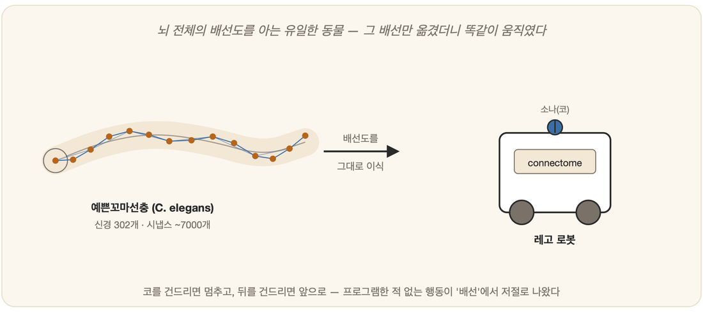

# 21-04. 커넥톰: 예쁜꼬마선충에서 OpenWorm·커넥톰 로봇까지

축축한 흙 한 줌. 그 속에서 1mm짜리 투명한 벌레 한 마리가 꿈틀거린다. 먹이가 있는 쪽으로 머리를 틀고, 무언가에 코가 닿으면 흠칫 물러난다. 너무 작아 맨눈으로는 잘 보이지도 않는 이 생물에게, 단순한 규칙에서 행동이 솟아오르는가를 묻던 질문이 가장 도발적인 형태로 던져진다. 살아 있는 동물의 신경 배선도를 통째로 복사하면, 그 행동까지 따라올까. 그 물음을 실제로 시험대 위에 올려놓을 수 있게 해 준 주인공이 바로 이 벌레, **예쁜꼬마선충(C. elegans)**이다.

## 뇌의 배선도를 모두 아는 유일한 동물

예쁜꼬마선충의 신경계는 뉴런이 정확히 **302개**다(자웅동체 기준). 적은 숫자지만 결코 시시하게 볼 것이 아니다. 이 벌레는 먹이를 찾고, 위험을 피하고, 심지어 학습까지 한다.

1986년, **시드니 브레너(Sydney Brenner)** 연구진(White·Southgate·Thomson·Brenner)이 그 작은 몸을 전자현미경 아래 두고 얇게 저몄다. 그리고 뉴런 하나하나가 어디에 닿아 있는지, 그 연결을 빠짐없이 추적해 나갔다. 그렇게 완성된 신경계 전체의 배선도가 곧 **커넥톰(connectome)**이다. 그들이 남긴 논문의 별명이 모든 것을 상징한다 — *"한 마리 벌레의 마음(the mind of a worm)"*. 브레너는 예쁜꼬마선충을 현대 생물학의 모델 동물로 끌어올린 공로로 2002년 노벨 생리의학상을 받았는데(공동 수상, 수상 사유는 기관 발생의 유전적 조절과 세포자멸사 연구였다), 이 커넥톰 작업도 그 토대 위에서 피어난 열매였다. 예쁜꼬마선충은 그 뒤로 오랫동안 **뇌의 배선을 완전히 아는 유일한 동물**로 남았다.

이 완전한 배선도가 있었기에, 선충은 "구조가 곧 기능인가"라는 물음을 검증할 **완벽한 실험대**가 되었다.

## OpenWorm: 벌레 한 마리를 통째로 시뮬레이션하기

누군가는 여기서 한 걸음 더 나아갔다. **OpenWorm**은 이 벌레를 커넥톰뿐 아니라 근육과 몸체, 그것을 둘러싼 물리 환경까지 모두 **디지털로 통째로 재현**하려는 오픈소스 프로젝트다. 신경 신호가 근육을 움직이고, 그 근육이 부드러운 몸을 꿈틀거리게 하는 과정을 물리 엔진(Sibernetic) 위에서 모사한다. 살아 있던 한 생물을 컴퓨터 안에서 다시 되살려 보려는, 인공생명의 가장 야심 찬 시도 중 하나다.

## "배선만 옮겼더니 똑같이 움직였다" — 커넥톰 로봇

그러나 가장 가슴을 두드린 장면은 따로 있었다. OpenWorm 진영의 **티머시 버스바이스(Timothy Busbice)** 등이 선충의 커넥톰을 **레고 마인드스톰 로봇**에 그대로 옮겨 심은 것이다.

방식은 단순했다. 로봇의 **거리 센서**를 선충의 코 접촉 뉴런 자리에 연결하고, 로봇의 **바퀴(모터)**를 선충의 운동 뉴런 자리에 이어 붙였다. 그리고 정작 행동에 대해서는 단 한 줄의 코드도 쓰지 않았다. 오직 뉴런들의 *연결 구조*만 옮겨 놓았을 뿐이다.

그러자 로봇은 스스로 움직이기 시작했다. 앞으로 나아가다가 **벽에 부딪히면 멈추고 뒤로 물러나며**, 자극에 반응해 방향을 트는, 영락없이 **선충을 닮은 행동**을 보였다. 그 행동을 설계해 넣은 사람은 아무도 없었다. 행동은 **배선에서 창발**한 것이다.

> **구조가 곧 행동인가?**
> 이 실험이 던지는 충격은 가장 깊은 질문과 맞닿아 있다. 지능과 행동은 어디에 담겨 있는가 — 정교하게 짜 넣은 *규칙(프로그램)*인가, 아니면 단지 *연결의 구조(배선)*인가. 선충 로봇은 적어도 단순한 행동에 대해서만큼은, **배선만으로 충분하다**고 답한다.

## 정직한 단서

물론 과장은 경계해야 한다. OpenWorm의 *완전하고 충실한* 시뮬레이션은 **아직 미완**이고, 레고 로봇 역시 302개 뉴런을 단순화해 매핑한 것에 지나지 않는다. "벌레를 디지털로 부활시켰다"고 말하기에는 가야 할 길이 멀다. 그럼에도 **연결 구조만 옮겼는데 닮은 행동이 나왔다**는 사실 그 자체는, 지능을 이해하는 방식에 묵직한 단서 하나를 떨어뜨린다.

## 마무리: 인공생명이 AI에게 주는 것

세포 자동자(규칙)에서 떼와 진화(선택)를 거쳐 커넥톰(구조)에 이르기까지, 이 장 전체를 관통한 것은 하나의 메시지였다. **지능과 생명은 위에서 설계해 넣는 것만이 아니라, 단순한 토대에서 아래로부터 솟아오를 수 있다.** 유행을 좇기보다 이런 근본 원리를 붙드는 것 — 그것이 인공생명을 한 장으로 따로 다루는 이유다.

---

### 정리

- 예쁜꼬마선충은 뉴런 302개의 **커넥톰을 완전히 아는** 동물이다(브레너 연구진 1986; 브레너는 2002년 노벨 생리의학상 — 모델 동물 확립·발생유전학 공로).
- **OpenWorm**은 이 벌레를 통째로 시뮬레이션하려는 프로젝트이며, **커넥톰 로봇**은 배선만 옮겨도 선충 닮은 행동이 창발함을 보였다.
- 단, 완전한 재현은 아직 미완 — 그럼에도 *구조 → 행동*이라는 단서는 강력하다.

### 생각해보기

- 만약 사람의 커넥톰(약 860억 뉴런)을 언젠가 완전히 복사한다면, 그 복사본은 '나'의 행동을, 나아가 '나'를 재현할까요? 배선이 곧 마음일까요?
