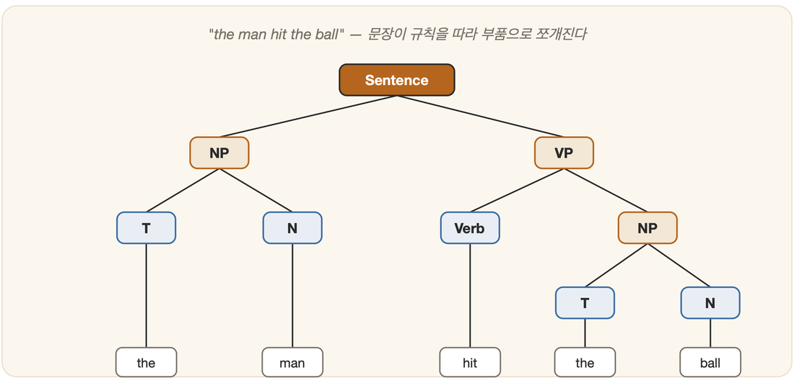

# 23-04. 형식문법과 구문분석

어린아이가 "나 밥 먹어"라고는 말하면서 "밥 나 먹어"라고는 좀처럼 말하지 않는 장면을 떠올려 보자. 누구도 그 아이에게 문장의 어순을 표로 정리해 가르친 적이 없다. 그런데도 아이는 옳은 문장과 어딘가 비뚤어진 문장을 귀신같이 가려낸다. 사람의 머릿속에는 적어 둔 적 없는 규칙이 이미 살고 있는 셈이다. 앞 절(23-02)에서 우리는 문장을 단어로 쪼개고 그 구조를 파스 트리로 세우는 일을 보았다. 그렇다면 기계는 무엇을 근거로 "문장이 옳게 짜였다"고 판단할까. 사람이 직관으로 아는 그 규칙을, 기계가 따라 할 수 있는 형태로 또박또박 적어 둔 것 — 그것이 **형식문법(formal grammar)**이다. 자연어 처리뿐 아니라 프로그래밍 언어와 컴파일러, 검색 패턴의 바닥에까지 깔려 있는, 기초 중의 기초다. 이 절은 그 적는 방법을 차근차근 따라간다.

## 형식문법이란 무엇인가

언어학자에게 문법이란 무엇이냐 물으면, "그 언어의 옳은 문장을 만들어 내는 규칙의 집합"이라 답할 것이다. 형식문법은 이 직관적인 생각을 수학적으로 또렷하게 다듬은 것이다. 알파벳(기호)으로 만들 수 있는 유한한 길이의 문자열은 헤아릴 수 없이 많은데, 그 가운데 *어떤 것이 그 언어에 속하는가*를 규칙으로 딱 잘라 규정한다.

흥미롭게도 형식문법은 서로 마주 보는 두 얼굴을 가진다.

- **생성문법(generative grammar)** — 시작 기호에서 출발해 규칙을 거듭 적용하며 올바른 문장을 *만들어 내는* 쪽이다. 즉 "어떻게 쓸 것인가"를 말한다.
- **분석문법(analytic grammar)** — 주어진 문장을 입력으로 받아 "이게 우리 언어에 속하는가? 예/아니오"를 *판정하는* 쪽이다. 즉 "어떻게 읽을 것인가"를 말한다. 이쪽이 바로 **파서(parser)**다.

생성과 분석은 결국 동전의 양면이다. 무언가를 만드는 규칙을 손에 쥐고 있으면, 그 규칙을 거꾸로 따져 읽어 낼 수도 있기 때문이다.

## 촘스키의 구절구조문법

1956년, 노엄 촘스키는 얇지만 언어학의 지형을 바꾼 책 『Syntactic Structures』에서 **구절구조문법(phrase structure grammar)**을 내놓았다. 문장을 구(句) 단위로 잘게 갈라 나가는 규칙들이다. 촘스키가 직접 든 예를 그대로 보자.

```
Sentence → NP + VP        (문장 = 명사구 + 동사구)
NP       → T + N          (명사구 = 관사 + 명사)
VP       → Verb + NP      (동사구 = 동사 + 명사구)
T        → the
N        → man, ball, ...
Verb     → hit, took, ...
```

각 규칙은 "왼쪽을 오른쪽으로 바꿔 써라(rewrite)"는 한 줄짜리 지시다. 시작 기호 `Sentence`에서 출발해 규칙을 차례로 적용해 나가면 "the man hit the ball" 같은 문장이 저절로 자라난다. 마치 레고 설명서를 따라가듯, 큰 덩어리를 더 작은 부품으로 계속 쪼개 내려가는 셈이다.

## 문맥자유문법(CFG)과 BNF

위 규칙들을 가만히 들여다보면 한 가지 공통점이 눈에 띈다. 화살표 왼쪽에 *기호 하나*만 덩그러니 놓여 있다는 것이다. 이렇게 "왼쪽이 변수 하나뿐"인 문법을 **문맥자유문법(context-free grammar, CFG)**이라 부른다. 이름의 뜻은 의외로 직관적이다. 어떤 변수를 바꿔 쓸 때, *주변에 무엇이 놓여 있든 아랑곳없이* 그 규칙 하나만 보고 치환할 수 있다는 것이다. 앞뒤 문맥을 살필 필요가 없으니 "문맥-자유"다.

CFG는 촘스키 계층(Chomsky hierarchy)에서 Type-2 자리에 앉는다. 이 계층은 규칙이 얼마나 자유로운가에 따라 언어를 네 층으로 나눈 것으로, 가장 강력한 Type-0(튜링기계)부터 가장 제한적인 Type-3(유한상태기계)까지 펼쳐져 있다. CFG는 그 한가운데에 자리 잡은, **거의 모든 프로그래밍 언어 문법의 이론적 토대**다. 이 계산능력 이야기는 자동기계·계산이론과 맞닿아 있다(6장의 형식체계와도 한 뿌리에서 갈라져 나왔다).

실무에서 CFG를 적는 표준 표기법은 **BNF(Backus-Naur Form)**다. 1959년 존 배커스가 ALGOL 언어를 정의하려고 만들었고, 피터 나우어가 다듬어 지금의 모습이 되었다. `::=`는 "왼쪽은 오른쪽으로 정의된다", `|`는 "둘 중 하나", `<>`는 구문 요소를 뜻한다. 미국 우편 주소를 BNF로 적으면 이런 모습이 된다.

```
<postal-address> ::= <name-part> <street-address> <zip-part>
<name-part>      ::= <personal-part> <last-name> <EOL>
                   | <personal-part> <name-part>
<last-name>      ::= ...
```

둘째 규칙이 정의 한가운데서 자기 자신(`<name-part>`)을 다시 불러내는 점에 주목하자. 이 **재귀(recursion)** 덕분에 손에 꼽을 만큼 적은 규칙으로 무한히 많은 문장을 다룰 수 있게 된다 — 형식문법의 힘은 바로 이 작은 되먹임 고리에 있다.

## 격문법과 몬태규문법

구절구조문법이 문장의 "겉모양(통사 구조)"에 매달렸다면, 그 무렵 흘러나온 다른 두 흐름은 처음부터 "속뜻"을 겨냥하고 있었다.

- **격문법(case grammar)** — 필모어가 제안했다. 주격·목적격 같은 표층의 격이 아니라, 동사를 중심으로 한 의미적 역할(행위자, 도구, 대상 등 '의미역')에 주목한다. 예컨대 "문이 열렸다 / 존이 문을 열었다 / 열쇠가 문을 열었다"를 보면, 겉문법은 제각각이어도 *문(대상)·존(행위자)·열쇠(도구)*라는 속 관계만큼은 한결같이 유지된다고 본다.
- **몬태규문법(Montague grammar)** — 자연어 문장을 **논리식으로 옮기려는** 야심 찬 시도다. "모든 사람은 잠을 잔다"를 `∀x[사람(x) → 잠잔다(x)]`로 적어 버린다. 보다시피 이는 6장(특히 06-02 술어논리)과 곧장 손을 맞잡는다. 문법이 의미를 만나고, 그 의미가 다시 논리를 만나는 지점이다.

## 파싱: top-down과 bottom-up

문법이 손에 들어왔으니, 이제 주어진 문장을 실제로 분석(파싱)할 차례다. 핵심은 *"이 문장을 규칙으로 만들어 낼 수 있는 경로를 찾아내는 일"*이며, 이는 본질적으로 **탐색(3부)**이다. 길은 두 방향으로 나 있다.

- **하향식(top-down)** — 시작 기호 `Sentence`에서 출발해 규칙을 펼치며 입력 문장과 맞춰 내려간다. "먼저 가설을 세우고 그게 맞는지 검증한다"는 식이다.
- **상향식(bottom-up)** — 입력 단어에서 출발해 규칙을 거꾸로 묶어 가며 `Sentence`까지 차곡차곡 올라간다. "흩어진 부품을 주워 모아 조립한다"는 식이다.

어느 쪽으로 가든 막다른 길에 다다르면 왔던 자리로 되돌아가(backtracking) 다른 가지를 더듬어 본다 — 3부에서 본 탐색 트리 그대로다. 그렇게 길을 다 더듬은 끝에 손에 쥐게 되는 것이 **파스 트리(parse tree)**다. "The man hit the ball"이라면 이런 모양으로 자라난다.



그런데 한 문장이 *둘 이상*의 파스 트리를 거느리게 되는 일이 있다. 바로 그것이 23-01에서 본 구조적 모호성이다. 규칙만으로는 어느 트리가 옳은지 끝내 가려내지 못하고, 그래서 다음 단계로 통계적 방법(23-03)의 손을 빌려야 한다.

---

### 정리

- **형식문법**은 언어의 옳은 문장을 규칙으로 규정하며, 만들기(생성)와 읽기(분석=파서)의 두 얼굴을 가진다.
- **CFG**(왼쪽이 변수 하나)는 프로그래밍 언어의 토대이고, 이를 적는 표준이 **BNF**다. 재귀로 유한 규칙이 무한 문장을 다룬다.
- **파싱**은 top-down/bottom-up으로 파스 트리를 세우는 일이며, 본질적으로 탐색(3부)이다. 격문법·몬태규문법은 구조 너머 의미·논리(6장)로 나아간 흐름이다.

### 생각해보기

- "the man hit the ball with the bat"를 위 문법에 `PP(전치사구)` 규칙을 더해 분석한다면, 파스 트리가 몇 가지로 나올까요? 그 차이는 어떤 의미 차이에 해당하나요?
- 같은 문법을 하향식과 상향식으로 각각 파싱할 때, 어느 쪽이 헛수고(되돌아가기)를 더 많이 할지 짧은 문장으로 따져 보세요.
