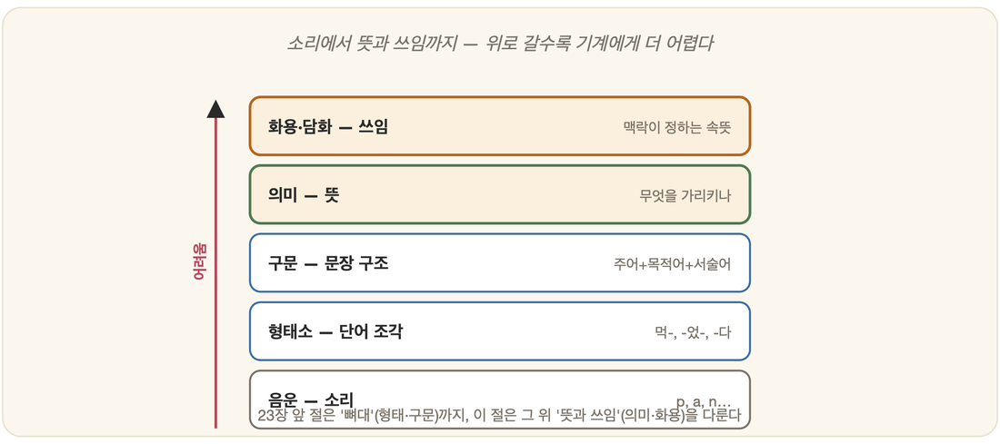

# 23-06. 의미와 화용: 문장 너머의 뜻

늦은 밤, 담배를 입에 문 사람이 처음 본 행인에게 다가가 묻는다. "불 좀 있어요?" 행인은 잠시도 망설이지 않고 주머니에서 라이터를 꺼내 내민다. 그런데 가만히 따져 보면 이상한 일이다. 그 사람이 입으로 낸 말은 분명 "당신은 불을 소유하고 있습니까"라는 단순한 질문이었다. 문장의 뼈대만 보면 "예" 또는 "아니오"로 답해야 옳다. 하지만 행인은 "예"라고만 답하고 가만히 서 있지 않았다. 라이터를 꺼냈다. 같은 말을 도서관 사서가 "화재 대비용 비상 불씨 있어요?"라고 물었다면 전혀 다른 뜻이 되었을 것이다. 한마디로, **말의 진짜 뜻은 문장 안에 다 들어 있지 않다.** 그것은 문장 너머, 말이 놓인 상황과 두 사람이 함께 아는 것들 속에 절반쯤 숨어 있다.

앞 절(23-04)까지 우리는 언어의 **뼈대**를 다뤘다. 단어를 쪼개고(형태소), 그 단어들이 짜이는 구조를 세우는(구문) 일이었다. 그러나 뼈대가 아무리 반듯하게 서도, 그것만으로는 "불 좀 있어요?"가 라이터를 빌려 달라는 부탁이라는 사실을 알 수 없다. 이 절은 그 뼈대 위에 올라앉은 층, 곧 **뜻과 쓰임**의 층을 다룬다. 단어와 문장이 *무엇을 가리키는가*(의미론), 그 말이 상황 속에서 *무엇을 하려는가*(화용론), 말로 어떻게 *행동까지 하는가*(화행), 그리고 한 문장을 넘어 글 전체가 *어떻게 흘러가는가*(담화). 그리고 끝에 가서 우리는, 바로 이 층이 어째서 기계에게 가장 험한 봉우리인지를 마주하게 된다.

## 의미론: 말이 가리키는 것

**의미론(semantics)**은 언어와 그 뜻 사이의 관계를 캐묻는 일이다. 형태소와 구문이 "이 문장이 옳게 짜였는가"를 따진다면, 의미론은 한 걸음 더 나아가 "그래서 이 문장이 가리키는 것이 무엇인가"를 묻는다. 그런데 이 물음 앞에 서자마자 기계는 첫 번째 함정에 빠진다. **중의성(ambiguity)**, 곧 한 표현이 여러 뜻을 거느리는 현상이다.

"배가 아프다"라는 짧은 말을 떠올려 보자. 여기서 '배'는 신체의 일부일 수도, 물 위에 뜬 탈것일 수도, 과일일 수도 있다. 글자는 똑같지만 가리키는 사물이 셋이나 된다. 사람은 이런 말 앞에서 거의 고민하지 않는다. "어제 회를 먹었더니 배가 아프다"라면 누구도 배(船)를 떠올리지 않는다. 앞뒤 문맥이 나머지 뜻을 조용히 솎아 내기 때문이다. 23-05에서 본 "spirit"이 정신도 술도 유령도 되었던 것, "bank"가 은행도 강둑도 되었던 것 모두 이 중의성의 다른 얼굴이다.

의미론이 문장의 속살을 들여다보는 또 하나의 방법은 **의미역(semantic role)**을 따지는 것이다. 문장 속 각 단어가 사건에서 맡은 *역할*을 묻는 일이다. "철수가 영희에게 책을 주었다"를 보자. 구문만 보면 '철수'는 주어, '영희에게'는 부사어, '책을'은 목적어다. 그러나 의미의 눈으로 보면 철수는 행위를 한 **행위자**, 책은 건네진 **대상**, 영희는 그것을 받은 **수혜자**다. 흥미로운 점은, 문장의 겉모습이 바뀌어도 이 속 역할은 그대로라는 데 있다. "책이 철수에 의해 영희에게 주어졌다"라고 어순과 격(格)을 통째로 뒤집어도, 행위자는 여전히 철수고 대상은 여전히 책이다. 한국어는 이 역할을 주로 조사가 떠맡는다. '-가'는 행위자, '-를'은 대상, '-에게'는 수혜자를 가리키는 표지인 셈이다. 그래서 한국어 의미 분석에서 조사는 단순한 토씨가 아니라 사건의 배역표나 다름없다.

결국 의미론의 꿈은, 문장을 그 뼈대 위에서 한 단계 더 추상화하여 "누가 무엇을 누구에게 어떻게 했다"는 *뜻의 골격*으로 환원하는 데 있다. 6장의 논리가 문장 위로 한 번 더 내려앉는 자리이기도 하다.

## 화용론: 상황이 정하는 뜻

그런데 의미론이 문장의 뜻을 아무리 또박또박 풀어내도, 끝내 손이 닿지 않는 영역이 있다. 첫머리의 "불 좀 있어요?"가 바로 그것이다. 의미론은 이 문장을 "당신은 불을 소유하는가"라는 의문문으로 정확히 분석할 수 있다. 하지만 그것이 *라이터를 빌려 달라는 부탁*이라는 사실은, 문장 안 어디를 뒤져도 나오지 않는다. 이 영역을 다루는 것이 **화용론(pragmatics)**이다.

화용론은 *상황 속에서* 말이 진짜 무엇을 뜻하는지를 따진다. aistudy의 화용론 설명에 실린 고전적인 예가 이를 단번에 보여 준다. 누군가 "Do you have a time?"이라고 물었을 때, "Yes"라는 대답은 적절치 않다. 이 말은 글자 그대로 "당신은 시간을 가지고 있는가"가 아니라 "지금 몇 시인가"를 묻는 것이므로, "12시 40분"처럼 답해야 옳다. 문장의 형태는 의문문이지만, 그 쓰임은 정보를 청하는 부탁인 것이다. 화용론이란 이렇게 "쓰인 답이 적절한지 아닌지"를 가려내는 일이다.

이런 예는 한국어에 차고 넘친다. 식탁에서 "소금 좀 건네줄 수 있어요?"라는 말에 "네, 건넬 수 있어요"라고만 답하고 가만히 있으면, 그것은 농담이거나 무례다. 이 의문문은 사실 명령에 가까운 부탁이다. 또 추운 방에서 누군가 "여기 좀 춥지 않아요?"라고 말한다면, 그것은 날씨 정보를 구하는 질문이 아니라 *창문을 닫아 달라*는 우회적 요청일 때가 많다. 말의 표면 아래로 흐르는 이런 숨은 뜻을 **함축(implicature)**이라 부른다. 직접 말하지 않았지만 듣는 이가 알아서 길어 올리도록 기대되는 뜻이다.

함축이 작동하려면 두 사람이 **함께 아는 것**이 있어야 한다. aistudy의 의미론 설명도 발화의 뜻을 이해시키는 요소로 언어표현뿐 아니라 상황, 말하는 이의 표정과 몸짓, 그리고 *공유하고 있는 예비지식*을 꼽는다. 그러면서 이 예비지식이 백과사전적 지식까지 포함하기에, 의미론은 결국 "우주에 대한 지식"과 맞닿는다고 적는다. 같은 "불 좀 있어요?"가 담배 문 사람의 입에서 나오느냐 사서의 입에서 나오느냐에 따라 뜻이 갈리는 까닭이 여기 있다. 말의 뜻을 정하는 마지막 열쇠는 문장이 아니라 세상이 쥐고 있다.

## 화행: 말로 행동하기

화용론을 한 발 더 밀고 들어가면, 더 놀라운 사실과 마주친다. 우리는 말로 *설명*만 하는 것이 아니라 말로 *행동*까지 한다는 것이다. 이를 **화행(speech act)**이라 한다.

"내일 갚을게"라고 말하는 순간, 나는 단순히 미래를 묘사한 것이 아니라 그 자리에서 **약속**이라는 행위를 한 것이다. "창문 닫아"는 정보가 아니라 **명령**이라는 행위다. 주례가 "두 사람이 부부가 되었음을 선언합니다"라고 말하면, 그 말이 끝나는 순간 실제로 두 사람은 부부가 된다. 말이 곧 **선언**이라는 행위가 되어 세상을 바꾸는 것이다. 이런 문장들은 참인지 거짓인지를 따질 수 없다. "내일 갚을게"는 거짓말이 될 수는 있어도, 문장 자체가 참/거짓인 것은 아니다. 그것은 *수행*되는 말이기 때문이다.

화행에서 어려운 대목은, 같은 행위가 전혀 다른 문장의 옷을 입고 나타난다는 점이다. 누군가에게 창문을 닫게 하려는 *명령*이라는 화행은, "창문 닫아"라는 명령문으로도, "창문 좀 닫아 줄래?"라는 의문문으로도, 앞서 본 "여기 좀 춥지 않아요?"라는 평서문으로도 실현된다. 문장의 겉 형태(명령문·의문문·평서문)와 그 말이 실제로 하는 행위가 따로 논다. 사람은 이 어긋남을 상황의 도움으로 거뜬히 풀어내지만, 기계에게는 이것이 또 하나의 벽이다.

## 담화: 문장을 넘어선 흐름

지금까지는 문장 하나하나를 들여다봤다. 그러나 우리가 실제로 주고받는 말은 문장이 따로따로 떨어진 모래알이 아니라, 앞뒤가 엮인 한 줄기 흐름이다. 이 흐름 전체를 다루는 것이 **담화(discourse)**다.

담화에서 가장 자주 등장하는 일꾼이 **대용어(代用語)**, 곧 앞에 나온 무언가를 도로 가리키는 말이다. "철수가 새 자전거를 샀다. **그것은** 빨간색이었다"에서 '그것'은 자전거를 가리킨다. 사람은 이 연결을 의식조차 하지 않고 잇는다. 하지만 기계에게는 매번 풀어야 할 수수께끼다. "철수가 영희에게 선물을 주었다. **그녀는** 기뻐했다"에서 '그녀'가 영희임을 알려면, 문장 하나를 넘어 앞 문장까지 거슬러 올라가 누가 여성이고 누가 선물을 받았는지를 따져야 한다. 더 고약한 경우도 있다. "트로피가 가방에 안 들어간다. **그게** 너무 크기 때문이다"에서 '그게'는 트로피지만, "트로피가 가방에 안 들어간다. **그게** 너무 작기 때문이다"에서 '그게'는 가방이다. 똑같은 두 문장에서 대명사가 가리키는 대상이 뒤바뀌는데, 이를 가르는 것은 문법이 아니라 *세상에 대한 상식*(큰 것은 작은 것에 들어가지 못한다)이다. 여기서도 마지막 열쇠를 쥔 것은 세상이다.

담화는 또 글 전체에 일관된 줄거리와 짜임이 있기를 요구한다. 한 문장 한 문장이 다 옳아도, 그것들이 앞뒤로 이어지지 않으면 글이 아니라 문장 무더기일 뿐이다. 말을 정말 이해한다는 것은, 결국 이 흐름 전체를 붙들고 있다는 뜻이다.

## 가장 험한 봉우리, 그리고 통계라는 우회로

23-02에서 보았듯 언어 처리는 형태소에서 화용으로 올라갈수록 길이 험해진다. 이제 그 까닭이 또렷하다. 아래층(뼈대)은 문장 안에 답이 들어 있다. 단어를 쪼개고 구조를 세우는 일은, 재료가 모두 문장 안에 있으니 규칙으로 어찌어찌 적어 낼 수 있다. 그러나 위층(뜻과 쓰임)은 답의 절반이 문장 *밖*에 — 상황 속에, 두 사람이 함께 아는 세상 속에 — 흩어져 있다. 화용·화행·담화가 기계에게 가장 어려운 봉우리인 까닭이 여기 있다. 규칙으로 적어 두려 해도, 적어야 할 것이 "세상 전체"이기 때문이다.

그렇다면 오늘날의 거대언어모델(19-05)은 이 봉우리를 어떻게 넘는가. 답은 의외로 옆길이다. 모델은 세상을 *이해*하려 들지 않는다. 대신 인터넷에 쌓인 어마어마한 글을 삼키고, "이런 상황에서 사람들은 보통 이렇게 말을 잇더라"는 **통계적 규칙성**을 익힌다. "불 좀 있어요?"라는 말 뒤에 라이터를 건네는 장면이 글 속에 수없이 등장했으니, 모델은 그 말 다음에 부탁에 응하는 반응을 그럴듯하게 내놓는다. "그게 너무 커서"와 "그게 너무 작아서"가 가리키는 대상이 다르다는 것도, 그런 문장 짝을 무수히 보아 통계로 익힌 결과다. 화행도 담화의 흐름도, 결국 "다음에 올 말"을 확률로 잇는 같은 방식으로 흉내 낸다.

그래서 오늘의 LLM은 함축을 알아듣는 것처럼, 약속과 명령을 가려내는 것처럼, 대명사를 척척 잇는 것처럼 *보인다.* 하지만 바로 여기서 우리는 3장의 **중국어 방**과, 19-05에서 짚었던 **천장**과 다시 만난다. 방 안의 사람이 중국어를 한 글자도 이해하지 못한 채 규칙표만으로 완벽한 답을 내놓듯, 모델 역시 "불 좀 있어요?"가 부탁임을 *이해*해서가 아니라 그렇게 이어지는 통계를 좇아 답할 뿐이다. 그럴듯한 흉내와 진짜 이해 사이에 놓인 이 틈은, 위층으로 올라갈수록 더 깊어진다. 문장의 뼈대는 통계가 거의 사람만큼 세우게 되었지만, 문장 *너머의 뜻*에 이르면 흉내와 이해의 경계가 가장 흐릿하면서도 가장 멀다.

### 정리

- 의미론은 단어·문장이 *무엇을 가리키는가*를 다룬다 — 한 표현이 여러 뜻을 거느리는 **중의성**, 그리고 문장 속 단어가 사건에서 맡은 배역인 **의미역**(한국어에선 주로 조사가 표시)이 그 핵심이다.
- 화용론은 *상황이 정하는 뜻*을 다룬다 — "불 좀 있어요?"가 부탁이 되듯, 직접 말하지 않은 **함축**은 두 사람이 함께 아는 세상 위에서만 풀린다. 나아가 **화행**은 약속·명령·선언처럼 말로 행동까지 하며, **담화**는 대용어와 흐름으로 문장을 넘어선 글 전체를 엮는다.
- 위층일수록 답의 절반이 문장 밖에 있어 기계에게 가장 어렵다 — 오늘의 LLM은 이를 통계로 그럴듯하게 흉내 내지만, 그것이 진짜 이해인지는 3장 중국어 방과 19-05의 천장이 묻는 그대로 열린 물음이다.

### 생각해보기

- "여기 좀 춥지 않아요?"라는 똑같은 말이 어떤 상황에서는 창문을 닫아 달라는 부탁이 되고, 어떤 상황에서는 그저 안부 인사가 됩니다. 무엇이 그 뜻을 갈라놓을까요? 그 '무엇'을 기계에게 어떻게 적어 줄 수 있을까요?
- LLM이 "불 좀 있어요?"에 라이터를 건네듯 답한다면, 그 기계는 부탁을 *이해한* 걸까요, 아니면 그렇게 이어지는 말을 통계로 *흉내 낸* 걸까요? 둘을 가려낼 방법이 우리에게 있을까요?
