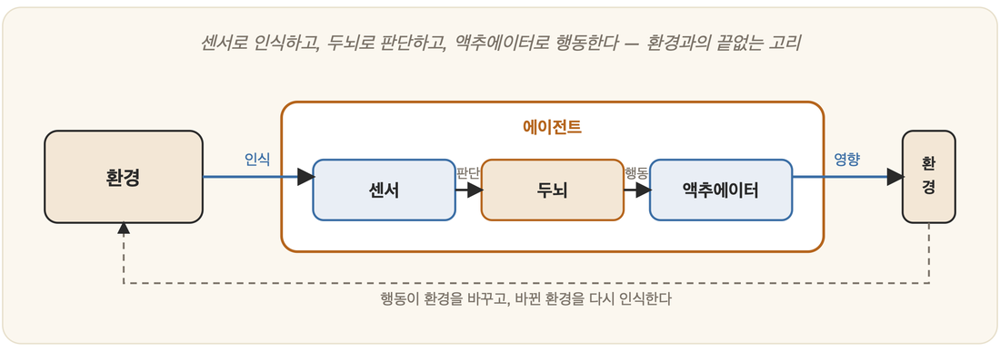

# 24-01. 에이전트란 무엇인가

거실 한쪽에서 로봇 청소기가 벽에 부딪혔다 방향을 틀고, 다시 굴러가다 문턱 앞에서 잠시 멈춘다. 그것은 바닥의 먼지를 '보고', 부딪힌 벽을 '느끼고', 그 느낌에 따라 바퀴를 돌린다. 같은 시각 누군가는 체스판 앞에서 다음 수를 두고, 어떤 프로그램은 웹을 돌아다니며 페이지를 긁어 온다. 겉모습은 제각각이지만, 이들에게는 똑같은 한 가지 리듬이 있다. 세상을 받아들이고, 무언가를 판단하고, 다시 세상을 향해 손을 뻗는 리듬이다.

지금까지 우리는 AI의 능력을 하나씩 따로 들여다보았다 — 탐색, 추론, 학습, 언어. 그러나 그 조각들이 한 몸에서 함께 움직이기 시작할 때, 우리는 비로소 그것들을 묶는 하나의 이름을 필요로 하게 된다. 그 이름이 **에이전트(agent)**다. 현대 AI를 꿰는 가장 중요한 틀이며, 1장에서 본 ④ '합리적으로 행동하는 기계'가 마침내 구체적인 형체를 얻는 자리이기도 하다.

## 에이전트: 인식하고 행동하는 주체

**에이전트**란 **환경을 인식(perceive)하고, 그에 따라 행동(act)하는 무언가**다. 정의는 놀랄 만큼 넓다. 그 넓이의 비밀은 단 두 개의 통로에 있다.

하나는 **센서(sensor)**다. 환경으로부터 정보를 받아들이는 입구이며, 눈일 수도 마이크일 수도 온도계일 수도, 혹은 웹에서 흘러드는 입력일 수도 있다. 다른 하나는 **액추에이터(actuator)**다. 환경에 직접 영향을 미치는 출구이며, 팔이나 바퀴, 화면에 찍히는 출력, 어딘가로 날아가는 메시지가 모두 여기에 해당한다.

그러므로 사람도, 로봇 청소기도, 자율주행차도, 체스 프로그램도, 웹을 돌아다니는 봇도 모두 에이전트다. **"인식 → 판단 → 행동"의 고리**를 가진 것이라면 그 무엇이든.

## 왜 에이전트 관점이 강력한가

에이전트가 강력한 까닭은, 그것이 이 책의 모든 주제를 담아내는 하나의 그릇이기 때문이다.

무엇을 할지 정하려면 **탐색·계획**(3부)이 필요하고, 세상을 이해하려면 **지식·추론**(4부)이 있어야 한다. 경험에서 조금씩 나아지려면 **학습**(5부)이, 사람과 말을 주고받으려면 **언어**(6부)가, 세상을 두 눈으로 보고 몸을 움직이려면 **지각·행동**(25장)이 받쳐 주어야 한다. 따로따로 흩어져 있던 이 능력들이 "환경 속에서 목표를 이루는 하나의 주체"라는 틀 안에서 비로소 한자리에 모인다. 2장에서 본 1990년대의 **"전체 에이전트로 돌아가자"**는 흐름(SOAR 등)이 바로 이 깨달음의 다른 이름이었다.

## 부분에서 전체로

초기 AI는 지능을 *조각*으로 나누어 다루었다. 체스만 두는 기계, 번역만 하는 기계처럼, 한 번에 한 조각씩. 그러나 진짜 지능은 그 조각들이 **한 몸에서 함께** 작동하는 순간에야 모습을 드러낸다. 에이전트 관점은 우리의 시선을 "조각을 잘 푸는 것"에서 "환경 속에서 온전히 살아가는 주체를 만드는 것"으로 옮겨 놓는다. 이 시선은 21장의 인공생명으로, 그리고 오늘날 우리가 입에 올리는 'AI 에이전트'로 곧장 이어진다.

에이전트를 이렇게 정의하고 나면, 자연히 두 가지 물음이 따라붙는다. 첫째, 무엇이 **'잘' 행동하는 것**인가 — 곧 합리성의 문제다. 둘째, 그 에이전트의 **두뇌는 대체 어떻게 만들어지는가** — 곧 구조의 문제다. 이 두 질문이 앞으로 우리가 걸어갈 길의 이정표가 된다.

---

### 정리

- **에이전트** = 센서로 환경을 **인식**하고 액추에이터로 **행동**하는 주체("인식→판단→행동" 고리).
- 사람·로봇·자율차·봇 모두 에이전트이며, 이 관점은 **탐색·추론·학습·언어·지각을 하나로 통합**한다.
- AI의 시선을 *조각 풀기*에서 *온전한 주체 만들기*로 옮긴다.

### 생각해보기

- 자동 온도조절기(설정 온도에 맞춰 난방을 켜고 끔)도 에이전트일까요? 가장 단순한 에이전트와 사람 사이에는 무엇이 더해지며 '지능'이 깊어질까요?
