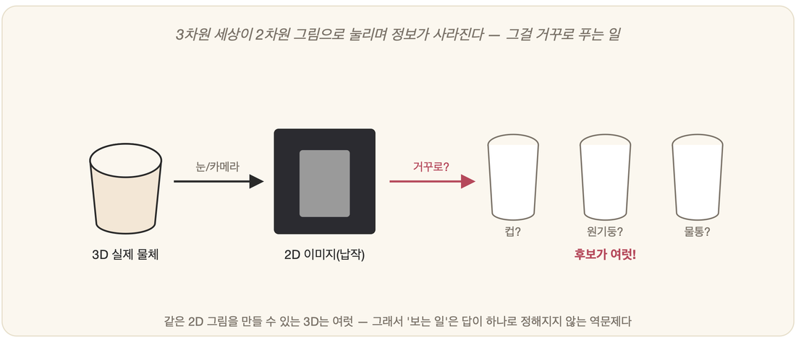

# 25-01. 지각: 보고 듣기

어두운 복도를 처음 굴러 나온 청소 로봇을 떠올려 보자. 바퀴는 멀쩡하고 배터리도 가득하지만, 그것은 아직 아무 데도 갈 수 없다. 눈앞에 무엇이 있는지를 모르기 때문이다. 에이전트(24장)가 환경 속에서 무언가를 하려면, 그보다 먼저 환경이 *있다는 것*을 알아채야 한다. 그 알아챔의 첫 관문, 센서로 들어온 날것의 신호를 *의미 있는 정보*로 바꾸는 일 — 사람들은 이것을 **지각(perception)**이라 부른다. 로봇이 현실 세계에서 한 발이라도 떼려면, 먼저 세상을 *제대로 보고 들어야* 한다.

## 지각: 신호에서 의미로

카메라 렌즈로 빛이 쏟아져 들어오는 순간, 그 안에서 일어나는 일은 의외로 초라하다. 거기에 맺히는 것은 풍경도 얼굴도 아니고, 그저 밝기를 적어 둔 픽셀 값의 거대한 배열일 뿐이다. 마이크도 사정은 다르지 않아서, 그것이 붙잡는 것은 공기가 떨린 흔적, 출렁이는 파형 하나다. 지각의 본질은 바로 이 **변환**에 있다. 그 *숫자의 바다*에서 **"저기 사람이 있다", "이건 '안녕'이라는 말이다"** 같은 의미를 건져 올리는 일.

픽셀의 행렬에서 물체와 얼굴과 장면을 읽어 내는 쪽을 컴퓨터 비전이라 부른다. 사람의 뇌에서는 8장의 시각피질이, 기계에서는 19장의 CNN이 바로 이 일을 맡는다. 음파의 출렁임을 단어로 되돌리는 쪽은 음성 인식인데, 2장에서 만났던 HMM에서 출발해 이후 딥러닝으로 크게 자라났다. 그리고 빛과 소리 너머에도 세상을 더듬는 손길은 많아서, 촉각과 거리를 재는 라이다, 온도에 이르기까지 온갖 센서가 저마다의 신호를 들고 온다.

## 왜 어려운가: 역문제

지각이 그토록 까다로운 데에는 근본적인 이유가 있다. 그것이 **역문제(inverse problem)**이기 때문이다. 입체로 가득 찬 3차원 세상이 카메라 안에서 2차원 이미지로 *납작하게* 눌리는 순간, 무언가가 영영 사라진다. 깊이가, 뒤편이, 가려진 것들이 빠져나간다. 그런데 지각은 그 납작해진 한 장으로부터 원래의 입체 세상을 *거꾸로* 되살려야 한다.

게다가 같은 물체라도 빛이 달라지고 각도가 틀어지고 거리가 멀어지거나 무언가에 가려지면 전혀 다른 얼굴로 나타난다. 반대로 전혀 다른 두 물체가 어쩌다 보면 꼭 닮은 모습으로 카메라 앞에 서기도 한다. 23장에서 본 언어가 그러했듯, 지각에도 **모호성**이 가득 차 있다. 그러니 지각은 자를 대고 재는 단순한 측정이 아니라, *가장 그럴듯한 해석을 추론하는* 일이다. 여기에는 5장의 확률과 15장의 가추가 동원된다.

## 지각과 딥러닝

지각은 딥러닝이 가장 극적으로 승리를 거둔 무대다. 19장에서 보았듯이, CNN은 사람이 일일이 특징을 설계해 주지 않아도 *스스로* 시각 특징을 길어 올려 영상 인식의 수준을 단숨에 끌어올렸다. 음성 인식 또한 딥러닝에 올라타 사람의 귀에 바짝 다가섰다(2장). **"보고 듣는" 능력에서 연결주의, 곧 신경망은 유독 강하다.** 23장에서는 언어를, 이곳에서는 지각을, 모두 패턴 학습이 앞장서 이끈다는 사실은 결코 우연이 아니다.

## 다음으로

세상을 지각해 냈다 해도 이야기는 거기서 멈추지 않는다. 무엇이 있는지 알았으니, 이제 그것을 가지고 *무엇을 할지 정하고 실제로 몸을 움직여야* 한다. 지각을 행동으로 잇는 다리 — 계획과 행동이 그 너머에서 기다리고 있다.

---

### 정리

- **지각**은 센서의 날것 신호(픽셀·음파)를 **의미**(물체·단어)로 바꾸는 변환.
- 어려운 이유는 **역문제**(3D→2D로 정보 손실)와 모호성 → *가장 그럴듯한 해석을 추론*.
- 컴퓨터 비전·음성 인식은 **딥러닝(19장)**이 주도하는 영역.

### 생각해보기

- 착시 그림은 같은 이미지가 두 가지로 보인다. 이는 지각이 단순 측정이 아니라 '해석'임을 보여 줍니다. 기계의 지각도 이렇게 '속을' 수 있을까요? (실제로 그런 사례가 있다.)
