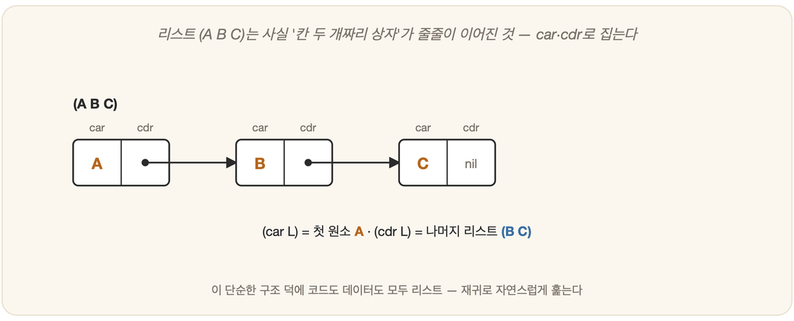

# 26-02. 리스트와 재귀

한 언어의 심장을 들여다본다는 것은, 결국 그 언어가 세상을 어떻게 자르는지를 본다는 뜻이다. LISP의 심장에는 두 개의 박동이 있다 — 리스트(list)와 재귀(recursion). 이 둘이 맞물려 뛰는 소리를 한 번 알아듣고 나면, LISP의 90%는 이미 손안에 들어온 셈이다. 그리고 이상하게도, 이 박동은 LISP라는 방을 나선 뒤에도 평생 따라다니며 사고의 바닥을 받쳐 준다.

## 모든 것이 괄호와 리스트

처음 LISP 코드를 마주한 사람은 괄호의 숲에 당황한다. 그러나 그 숲에는 단 하나의 규칙만 흐른다. 무엇이든 괄호로 둘러싼 리스트로 쓰고, 그 맨 앞에는 함수 이름을 둔다 — `(함수 인자1 인자2 …)`. 그게 전부다.

```lisp
(+ 1 2 3)        ; → 6      "1, 2, 3을 더하라"
(* 2 (+ 3 4))    ; → 14     "3+4를 한 뒤 2를 곱하라"
(list 'a 'b 'c)  ; → (a b c)  "a, b, c로 리스트를 만들라"
```

며칠만 머물러 보면 괄호는 더 이상 장벽이 아니라 골격으로 보이기 시작한다. 코드의 구조가 곧 괄호의 구조이기 때문이다. 더 묘한 일도 있다. `(+ 1 2 3)`이라고 적은 이 한 줄은 분명 더하라는 *코드*인데, 동시에 `+,1,2,3`이라는 네 원소가 나란히 늘어선 *리스트(데이터)*이기도 하다 — 26-01에서 만난 "코드=데이터"의 얼굴이 여기서 다시 떠오른다.

## 리스트 다루기: car와 cdr



리스트를 손에 쥐고 흔들려면 두 개의 기본 연산이면 충분하다. 이름은 옛 기계의 흔적을 그대로 물려받아 낯설지만, 하는 일은 더없이 소박하다.

```lisp
(car '(a b c))   ; → a       "첫 원소"
(cdr '(a b c))   ; → (b c)   "첫 원소를 뺀 나머지"
(cons 'a '(b c)) ; → (a b c) "맨 앞에 붙이기"
```

머리 하나(car)와 그 머리를 뺀 나머지(cdr) — 리스트를 이렇게 둘로 쪼개는 단순한 손동작이, 곧이어 만날 재귀의 열쇠가 된다.

## 재귀: 자기를 부르는 함수

재귀란 함수가 자기 자신을 다시 부르며 문제를 풀어 가는 방식이다. 리스트와는 떼어 놓을 수 없는 짝이다. "리스트를 처리한다"는 말은 가만히 들여다보면 결국 한 문장으로 줄어든다.

> **첫 원소(car)를 처리하고, 나머지(cdr)에 대해 같은 일을 반복한다.**

리스트의 길이를 세는 함수를 보자.

```lisp
(defun 길이 (lst)
  (if (null lst)          ; 리스트가 비었으면
      0                    ;   → 0 (멈춤: 기저 사례)
      (+ 1 (길이 (cdr lst))))) ; 아니면 1 + (나머지의 길이)
```

빈 리스트라면 0, 그렇지 않다면 1에 나머지의 길이를 더한다. 함수 `길이`는 자기 자신을 부르되 매번 `cdr`로 더 작아진 입력을 건네고, 그렇게 한 칸씩 줄어들다 마침내 빈 리스트라는 기저 사례에 닿아 멈춘다. 큰 문제를 *같은 모양의 작은 문제*로 끝없이 쪼개 내려가는 것 — 재귀의 본질은 이 한 동작에 다 담겨 있다.

## 왜 이 사고가 중요한가

재귀는 LISP의 사유물이 아니다. 돌이켜 보면 3부의 탐색 트리, 13장의 게임 트리, 4부의 추론은 모두 같은 골격을 품고 있었다 — 한 단계를 처리하고, 나머지에 같은 일을 반복하는 구조 말이다. 리스트와 재귀로 생각하는 법을 한 번 몸에 익히면, 흩어져 보이던 곳곳의 구조가 한 줄의 실에 꿰여 한꺼번에 끌려 나온다.

---

### 정리

- LISP는 **괄호 리스트** `(함수 인자…)`로 쓰며, 코드가 곧 데이터다.
- **car(머리)·cdr(나머지)·cons(붙이기)**로 리스트를 다룬다.
- **재귀** = *첫 원소 처리 + 나머지에 같은 일 반복* + *기저 사례에서 멈춤.* 탐색·추론의 공통 구조.

### 생각해보기

- 리스트의 모든 수를 더하는 LISP 함수 `(합 lst)`를 위 '길이' 함수를 본떠 직접 써 보세요. 기저 사례(빈 리스트)에서 무엇을 반환해야 할까요?
