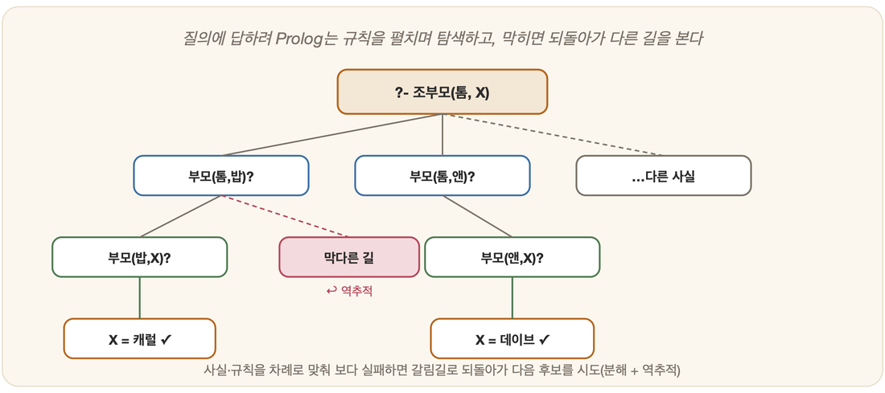

# 27-02. 사실·규칙·질의

어린아이가 가족을 처음 설명하는 방식을 떠올려 보자. 아이는 거창한 알고리즘을 모른다. 그저 손가락으로 가리키며 말할 뿐이다. "이 사람은 우리 아빠." "할머니는 아빠의 엄마야." 참인 것을 한 줄씩 늘어놓고, 거기서 새로운 관계를 끄집어내고, 궁금하면 어른에게 물어본다. 놀랍게도 Prolog라는 언어가 세상을 다루는 방식이 정확히 이 셋이다 — 무엇이 참인지 적는 **사실(facts)**, 사실에서 새 사실을 길어 올리는 **규칙(rules)**, 그리고 답이 궁금할 때 던지는 **질의(queries)**. 사실과 규칙으로 세상을 적고, 질의로 물어보면, 나머지는 Prolog가 한다. 이 단출한 삼각형 안에 4부에서 읽었던 지식 표현과 추론이 고스란히 들어앉아 있다.

## 사실: 참인 것을 적는다

먼저 **사실**부터다. 사실이란 "무엇이 참이다"라고 못 박는 단언이며, 군더더기 없이 그냥 적는다.

```prolog
부모(철수, 영희).      % 철수는 영희의 부모다
부모(영희, 민수).      % 영희는 민수의 부모다
부모(철수, 지영).      % 철수는 지영의 부모다
남자(철수).
여자(영희).
```

이렇게 쌓아 올린 사실의 더미가 곧 14장의 **지식베이스**다 — 세상에 대해 우리가 참이라고 믿는 것들의 모음이다.

## 규칙: 사실로부터 새 사실을 만든다

사실만으로는 세상이 좁다. 그래서 **규칙**이 등장한다. 규칙은 "이것이 참이면, 저것도 참이다"라는 약속이고, 기호 `:-`를 "~이면(if)"이라고 읽으면 된다.

```prolog
조부모(X, Z) :- 부모(X, Y), 부모(Y, Z).
% "X가 Y의 부모이고 AND Y가 Z의 부모이면, X는 Z의 조부모다"

할머니(X, Z) :- 조부모(X, Z), 여자(X).
```

여기 등장하는 `X, Y, Z`는 대문자로 시작하는 **변수**다. 6장 술어 논리의 한정사가 그러했듯, 이들은 "어떤 것이든" 들어설 수 있는 빈자리를 뜻한다. 규칙의 생김새는 14-02에서 본 IF–THEN 바로 그것이고, 조건들을 잇는 `,`(쉼표)는 논리의 AND다.

## 질의: 물어본다



세상을 다 적었으니, 이제 궁금한 것을 **질의**로 물어볼 차례다.

```prolog
?- 부모(철수, 영희).     % "철수는 영희의 부모인가?"
   → true

?- 조부모(철수, 민수).   % "철수는 민수의 조부모인가?"
   → true               % (규칙을 적용해 스스로 알아냄!)

?- 조부모(철수, 누구).   % "철수의 손주는 누구인가?"
   → 누구 = 민수          % (답을 찾아서 채워줌!)
```

세 번째 질의에서 Prolog의 마법이 드러난다. 빈자리로 둔 변수 `누구`에 들어맞는 값을 Prolog가 스스로 찾아 채워 넣는 것이다. 우리는 "어떻게 찾을지"를 단 한 줄도 적지 않았다. 사실과 규칙만 적어 두었을 뿐인데, 추론 엔진이 15장의 **후향 추론**으로 답을 길어 올린다.

## 무엇이 일어났나

`조부모(철수, 민수)`라고 물었을 때, Prolog는 결론에서 조건으로 거꾸로 거슬러 올라간다. 이것이 후향 추론이다. 먼저 조부모 규칙을 펼쳐 보고, `부모(철수, Y)`와 `부모(Y, 민수)`라는 두 조건이 필요함을 안다. 지식베이스를 뒤져 `부모(철수, 영희)`를 찾아내면 Y=영희로 자리가 메워진다. 이어 `부모(영희, 민수)`까지 발견되는 순간 두 조건이 모두 맞아떨어지고, 따라서 `조부모(철수, 민수)`는 **true**가 된다.

목표를 하위 목표로 쪼개어 거슬러 찾아가는 이 과정이 바로 15-01의 후향 추론이다. 4부에서 글로만 읽었던 추론이, 여기서는 실제로 돌아간다.

---

### 정리

- Prolog = **사실**(참인 것) + **규칙**(IF–THEN, `:-`) + **질의**(물음).
- 사실·규칙은 14장의 **지식베이스/규칙**, 변수는 6장의 한정사에 해당.
- 질의하면 **후향 추론(15장)**으로 답(변수 값까지) 을 *스스로* 찾는다.

### 생각해보기

- 위 가계도에 `형제(X,Y)` 규칙을 추가하려면 어떻게 적을까요? ("같은 부모를 가지면 형제" — 단, 자기 자신은 제외해야 합니다.)
