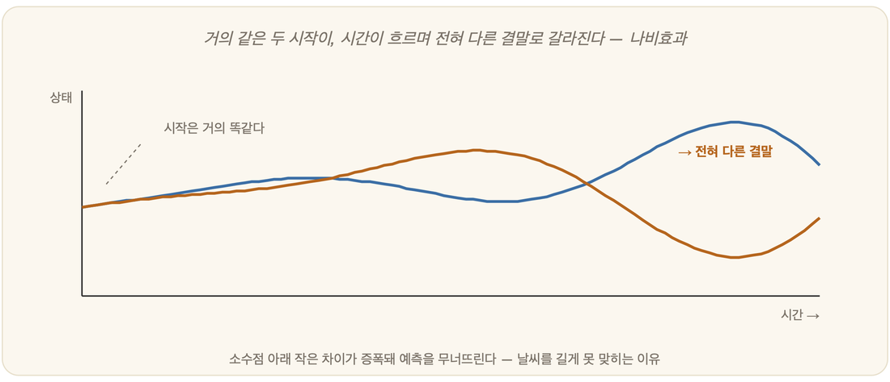

# 29-02. 카오스와 복잡계

신경세포 하나를 현미경 아래 두고 들여다본다고 상상해보자. 그것은 놀랍도록 단순하다. 신호가 들어오면 일정한 문턱을 넘을 때 발화하고, 아니면 침묵한다. 켜짐과 꺼짐, 그 정도의 일이다. 그런데 그런 단순한 부품을 백수십억 개 모아 서로 얽어놓으면, 어느 순간 '마음'이라 부르는 것이 거기서 솟아오른다. 앞에서 다룬 학습과 추론의 알고리즘도 결국은 비교적 단순한 규칙들의 반복이었다. 단순한 부품에서 어떻게 그보다 높은 차원의 무엇인가가 솟아나는가 - 이 질문에 답하려면 카오스와 복잡계라는 두 개념을 거쳐야 한다. 그리고 이것은 인공생명(21장)과 신경망(19장)을 이해하는 바탕이 된다.

## 결정론의 균열과 나비효과

오랫동안 과학은 세계를 거대한 시계로 보았다. 라플라스는 "우주의 모든 입자의 위치와 속도를 안다면 미래를 예측할 수 있다"고 단언했다. 뉴턴역학이 그린 세계는 그런 곳이었다. 초기 조건만 정확히 알면 결과가 어김없이 정해지는, 톱니가 맞물려 돌아가는 질서정연한 기계 - 이것이 결정론(determinism)이다.

이 믿음에 처음 금을 낸 사람은 수학자 푸앵카레(Henri Poincaré)였다. 1887년, 그는 세 개 이상의 물체가 서로 끌어당기는 삼체문제(Three Body Problem)를 붙들고 있었다. 두 물체라면 깔끔하게 풀린다. 그런데 셋이 되는 순간 방정식은 정확히 풀리지 않았고, 어떤 궤도는 아주 작은 변화만 주어도 혼돈한 양상으로 갈라졌다. 결정론의 단단한 표면에 처음으로 실금이 간 순간이었다.

그 발견은 한동안 잊혔다가, 컴퓨터가 손을 보태면서 1960년대에 되살아난다. MIT의 기상학자 에드워드 로렌츠(Edward Lorenz)는 1961년 대기 순환을 단순한 연립방정식으로 모형화하고 있었다. 어느 날 그는 계산을 이어서 돌리려고 중간값을 다시 입력했는데, 자릿수를 조금 줄여 적었다. 거의 같은 숫자였다. 그런데 결과는 처음에는 비슷하다가 점점 벌어지더니, 끝내 전혀 다른 날씨가 되어 있었다. 초기값의 사소한 차이가 갈수록 증폭되어 결과를 걷잡을 수 없이 흐트러뜨린 것이다. 이것이 그 유명한 나비효과(Butterfly Effect)다. 작은 차이가 큰 결과로 자라기에, 방정식이 아무리 결정론적이어도 예측은 불가능해진다.

## 단순한 규칙에서 솟는 복잡성

이 현상에 이름이 붙은 것은 1975년이다. 메릴랜드 대학의 제임스 요크(James Yorke)와 그의 제자 리(Tien-Yien Li)가 "단순한 수학식이 매우 복잡한 현상을 끌어낼 수 있음"을 증명하면서 'Chaos'라 불렀다. 같은 해는 풍년이었다. 파이겐바움은 그 혼돈 너머에 숨은 보편적인 상수를 찾아냈고, 만델브로는 부분이 전체를 닮는 자기유사성(self-similarity)의 프랙탈(Fractal) 기하학을 내놓았다.

카오스의 심장에는 두 단어가 있다. 비선형(nonlinear)과 피드백(feedback)이다. 선형의 세계는 정직하다. 하나의 원인에 하나의 결과가 있어, 부분을 따로 분석해 더하면 전체를 알 수 있다. 이것이 환원론이다. 그러나 비선형에서는 방정식의 결과가 다시 입력으로 되돌아오는 피드백이 거듭되면서, 식은 단 하나여도 결과가 수시로 표정을 바꾼다. 개미 한 마리는 작은 부스러기밖에 못 옮기지만, 여럿이 비선형적으로 협력하면 더 적은 수로 더 무거운 먹이를 나른다. 비선형은 이렇게 예상치 못한 높은 차원의 현상을 불러낸다.

## 복잡계와 창발

복잡계(complex system)란 단순한 구성요소가 수많은 방식으로 상호작용하는 계다. 세포 안의 분자 조직, 140억 개 신경세포로 짜인 두뇌, 생태계, 증권시장, 기후, 그리고 인간의 마음이 모두 여기에 든다. 이런 계들은 공통점을 갖는다. 비선형적이고 피드백 고리를 품으며, 에너지와 정보를 바깥과 주고받는 열린계이고, 환경에 능동적으로 적응한다.

그리고 복잡계가 보여주는 가장 놀라운 성질이 창발(emergence)이다. 그 이전에는 어디에도 보이지 않던 것이 어느 순간 갑자기 나타나는 것 - 그것이 창발이다. 잘 타는 기체인 수소와 산소를 결합시키면, 불을 끄는 데 쓰는 액체인 물이 된다. 개미를 한 마리씩 모으다 일정 수에 이르면 개체에는 없던 사회적 행동이 나타난다. 백수십억 개의 신경세포에서 '마음'이 솟는다. 창발은 1+1=2 같은 산술이 아니라, 구성요소를 아무리 따로 뜯어봐도 결코 예상할 수 없는, 차원이 다른 현상이다.

여기에 AI 기초의 깊은 함의가 놓여 있다. 설령 인간 지능을 몇 개의 수식으로 환원할 수 있다 해도, 그 수식으로 지능을 다시 조립해낼 수 있다는 뜻은 아니다(필립 앤더슨). 지능은 단순한 규칙들의 비선형적 상호작용에서 창발하는 복잡계의 산물일지 모른다. 그래서 우리는 부분을 일일이 설계하는 대신, 단순한 규칙을 풀어놓고 복잡성이 스스로 자라나게 하는 길 - 인공생명(21장)과 진화 계산 - 을 탐구하게 된다.

## 무작위로 푸는 법 - 몬테카를로

복잡계 앞에서 정확한 풀이를 고집하는 것이 늘 답은 아니다. 변수가 너무 많아 정면으로는 풀리지 않는 문제라면, 차라리 무작위에 기대는 길이 있다. 몬테카를로(Monte Carlo) 방법이다. 이름은 도박의 도시에서 따왔지만 발상은 의외로 단순하다. 정사각형 안에 원을 하나 그려 두고, 그 위에 다트를 마구잡이로 수없이 던진다고 해 보자. 원 안에 꽂힌 다트의 비율을 세기만 하면, 던진 수가 많아질수록 그 값은 원주율 π에 점점 가까워진다. 단 한 줄의 적분도 풀지 않고, 오직 임의의 수를 잔뜩 뿌리는 것만으로 답을 근사해 내는 것이다. 초기 조건에서 결과가 한 치의 어긋남 없이 정해지는 결정론적 계산의 정반대 편에, 이 무작위 표본의 방법이 서 있다. 차원이 높아질수록, 곧 변수가 많아질수록 다른 수치 기법보다 오히려 효율이 좋아진다는 점이 그 힘이다. 흥미롭게도 이 오래된 방법은 인공지능에서 화려하게 되살아났다. 바둑판의 무수한 경우의 수를 다 따질 수 없을 때, 앞으로 둘 수를 무작위로 끝까지 두어 보며 어느 길이 유망한지 가늠하는 몬테카를로 트리 탐색(MCTS)이 그것이다. 알파고의 심장에서 뛰던 것도 바로 이 다트 던지기의 후예였다.

### 정리

- 결정론적 방정식 안에서도 비선형과 피드백 때문에 카오스가 생겨, 초기값의 작은 차이가 증폭되는 나비효과로 예측이 불가능해진다.
- 복잡계는 단순한 요소들이 상호작용하며 적응하는 열린계이며, 그 핵심 성질이 창발이다.
- 지능은 단순한 규칙에서 창발하는 복잡성으로 볼 수 있어, 환원론만으로는 재구성되지 않는다.

### 생각해보기

- 거대 언어모델이 보여주는 예상치 못한 능력을 '창발'이라 부르곤 한다. 이것은 물이 보여주는 창발과 같은 종류일까, 다른 종류일까?
- 지능이 복잡계의 창발 현상이라면, AI를 부품 단위로 정밀하게 설계하는 방식과 단순 규칙을 풀어놓는 방식 중 어느 쪽이 더 유망할까?
