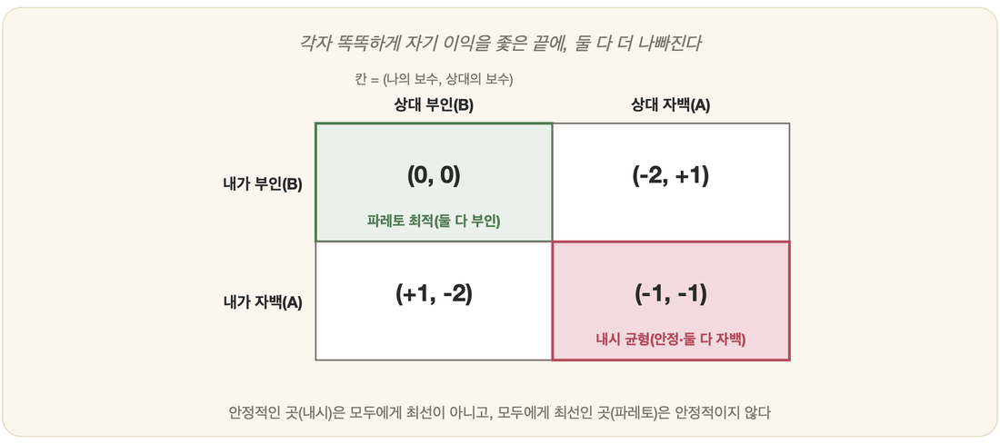

# 30-04. 게임이론과 전략적 의사결정

좁은 취조실이 두 개 있다. 벽 하나를 사이에 두고, 함께 붙잡혀 온 두 공범이 따로따로 앉아 있다. 둘은 서로의 얼굴을 볼 수 없고, 상대가 지금 무슨 말을 하고 있는지도 알 수 없다. 노련한 검사가 양쪽 방을 오가며 똑같은 제안을 건넨다. "자백하면 너만 빠져나갈 길이 있다. 단, 상대가 끝까지 입을 다물 때의 이야기지." 두 사람은 각자, 보이지 않는 벽 너머의 상대를 머릿속에 떠올리며 계산을 시작한다. 이 장면이야말로 이 절이 다루려는 문제의 축소판이다.

앞 절(30-01)에서 우리는 경제학이 AI에 합리적 에이전트와 기대효용이라는 언어를 물려주었음을 보았다. 그런데 그 합리성에는 조용한 전제가 하나 깔려 있었다. 세계는 가만히 있고, 에이전트 혼자만 머리를 굴린다는 것이다. 현실은 그렇게 한가하지 않다. 내가 머리를 굴리는 그 순간, 맞은편의 상대도 똑같이 머리를 굴리고 있다. 더구나 그는 내가 머리를 굴린다는 사실까지 계산에 넣고 있다. 이렇게 합리적 에이전트가 또 다른 합리적 에이전트와 얽혀 버리면, '무엇이 최선의 선택인가'라는 물음은 전혀 다른 결로 휘어진다. 이 절은 바로 그 '여럿이 얽힌 합리성'을 따라간다.

## 한 사람의 합리성: 효용과 결정이론

먼저 출발점을 다시 짚는다. 한 에이전트가 혼자 결정을 내릴 때, 무엇이 합리적인 선택일까. 경제학과 AI가 공유하는 대답은 단정하다. 모든 상태에는 그 에이전트에게 얼마나 좋은지를 나타내는 **효용(utility)**이라는 정도가 있고, 합리적인 에이전트는 더 높은 효용을 가진 상태를 선호한다는 것이다. 효용이란 전기회사를 뜻하는 그 단어가 아니라, '유용한 정도'를 가리키는 말로 쓴다.

문제는 세상이 불확실하다는 데 있다. 공항으로 90분 전에 출발하는 계획이 95퍼센트의 성공 확률을 가진다고 해서, 그것이 곧 합리적인 선택인 것은 아니다. 비행기를 절대 놓치지 말아야 한다면 더 일찍 떠나는 편이 낫고, 24시간 전에 나서는 것은 도착은 거의 보장하지만 견딜 수 없는 대기 시간을 안긴다. 그래서 효용에 확률을 곱해 따지는 틀이 필요하다. 이것이 **결정이론(decision theory)**이며, 한 줄로 적으면 이렇다.

결정이론 = 확률이론 + 효용이론

그 심장에는 **기대효용 최대화(Maximum Expected Utility, MEU)**라는 원리가 박혀 있다. 일어날 법한 모든 결과에 걸쳐 평균한 기대효용이 가장 큰 행동을 고를 때, 그리고 오직 그럴 때에만 에이전트는 비로소 합리적이라 불린다. 여기까지는 혼자만의 이야기다. 세계는 확률로만 흔들릴 뿐, 나를 속이거나 앞지르려 들지 않는다.

## 둘 이상이 얽히면: 게임이론

이제 맞은편 의자에 또 한 명의 합리적 에이전트를 앉혀 보자. 내 선택의 결과가 더 이상 확률에만 달려 있지 않고, **상대의 선택**에 달리는 순간 모든 것이 달라진다. 이렇게 한 행위자의 선택이 다른 행위자의 보상을 크게 흔드는 '작은 경제'를 다루는 분야가 **게임이론(game theory)**이다.

게임이론은 1944년 수학자 폰 노이만(von Neumann)과 경제학자 모르겐슈테른(Morgenstern)이 『게임과 경제행동 이론(Theory of Games and Economic Behavior)』을 펴내면서 본격적으로 시작되었다. 30-01에서 효용을 단단한 형식으로 굳힌 바로 그 책이다. 우연이 아니다. 효용이라는 단위가 있어야 비로소 '누가 더 이득을 보았는가'를 셈할 수 있고, 그 셈이 있어야 게임을 분석할 수 있기 때문이다.

게임을 이루는 요소는 단출하다.

- **경기자(player)**: 게임에 참여해 선택을 하는 합리적 행위자들. 두 명이면 2인 게임, 여럿이면 n인 게임이다.
- **전략(strategy)**: 각 경기자가 고를 수 있는 행동의 묶음. 하나를 골라 고수하면 순수전략(pure strategy), 확률을 섞어 임의로 고르면 혼합전략(mixed strategy)이다.
- **보수(payoff)**: 선택의 조합마다 각 경기자에게 돌아오는 효용. 보통 표로 정리하는데, 이를 보수표라 한다.

게임이론은 경기자들이 모두 이성적이라고 가정한다. 즉 나쁜 결과 중에서도 더 나은 쪽을 좋아하며, 결과에 가치를 매기고 순서를 세운다고 본다. 게임은 크게 두 부류로 나뉜다. 한쪽의 이익이 정확히 다른 쪽의 손실이 되어 둘의 득실을 합하면 언제나 0이 되는 게임을 **영합 게임(zero-sum game)**이라 한다. 바둑이나 장기처럼 한 사람이 이기면 다른 사람이 지는 순수한 대결이 그 전형이다. 반대로 모두가 함께 이득을 볼 수도, 함께 손해를 볼 수도 있어 득실의 합이 0이 아닌 게임을 **비영합 게임(non-zero-sum game)**이라 한다. 협력의 여지가 바로 이 비영합 게임에서 열린다.

## 죄수의 딜레마

이제 처음의 취조실로 돌아간다. 검사의 제안을 효용의 숫자로 옮겨 보자. 한 사람이 자백(전략 A)하고 다른 사람이 부인(전략 B)하면, 자백한 쪽은 보상을 받아 +1, 끝까지 부인한 쪽은 중벌을 받아 -2다. 둘 다 자백하면 둘 다 가벼운 벌로 -1, 둘 다 부인하면 증거 불충분으로 석방되어 0이다. 이를 보수표로 그리면 다음과 같다. 각 칸은 (나의 보수, 상대의 보수)다.

| 나 \ 상대 | 상대 부인(B) | 상대 자백(A) |
|---|---|---|
| **내가 부인(B)** | (0, 0) | (-2, +1) |
| **내가 자백(A)** | (+1, -2) | (-1, -1) |

이제 한쪽 죄수의 머릿속에 들어가 보자. 상대가 부인한다고 치자. 그러면 나는 같이 부인해 0을 받느니, 자백해 +1을 챙기는 편이 낫다. 상대가 자백한다고 치자. 그러면 나는 부인해 -2를 뒤집어쓰느니, 같이 자백해 -1로 막는 편이 낫다. 놀랍게도 상대가 무엇을 하든, 나에게는 언제나 자백이 더 유리하다. 상대가 어떻게 나오든 관계없이 늘 더 나은 결과를 주는 이런 전략을 **우세전략(dominant strategy)**이라 부른다. 자백이 바로 그것이다.

벽 너머의 상대도 똑같이 합리적이다. 그러니 그 역시 같은 결론에 이른다. 결국 두 사람 모두 자백하고, 게임은 (자백, 자백) = (-1, -1)에 도달한다. 그런데 표를 다시 보라. 만약 둘 다 입을 다물었다면 (0, 0)으로 둘 다 석방될 수 있었다. 각자가 더없이 합리적으로 자기 이익을 좇은 끝에, 두 사람 모두에게 더 나쁜 결과가 빚어진 것이다.

여기서 합리성의 두 얼굴이 정면으로 충돌한다. 우세전략을 따르라는 **개인의 합리성(individual rationality)**과, 모두에게 더 나은 결과를 향하라는 **집단의 합리성(group rationality)**이 어긋난다. 자기 이익을 똑똑하게 추구한 개인들이 끝내 다 함께 불행해진다. 이것이 1950년 드레셔(Dresher)와 플러드(Flood)가 정식화한 이래 사회과학 전체를 사로잡은 **죄수의 딜레마(Prisoner's Dilemma)**이며, 비영합 게임의 대표 사례다.

이 딜레마가 중요한 까닭은 수많은 현실이 근본적으로 이 모양을 하고 있기 때문이다. 두 상점이 서로 가격을 내려 둘 다 이윤이 줄어드는 가격 경쟁, 두 나라가 서로 군비를 늘려 둘 다 더 불안해지는 군비 경쟁, 아무도 줄이려 들지 않아 모두가 손해 보는 환경 오염이 모두 같은 골격이다. 다만 한 가지 빠져나갈 틈이 있다. 게임이 단 한 번이 아니라 거듭 반복되면 이야기가 달라진다. 이전에 배신한 상대에게 다음번에 벌을 줄 기회가 생기므로, 배신의 유혹이 보복의 위협으로 눌리고, 그 자리에서 협력이 균형으로 피어날 수 있다.

## 내시 균형과 파레토 최적

(자백, 자백)이라는 결말에는 묘한 안정감이 있다. 그 상태에서 한 죄수가 혼자 마음을 바꿔 부인으로 돌아서면, 그의 보수는 -1에서 -2로 더 나빠진다. 즉 상대가 전략을 그대로 둔다는 전제 아래에서는, 나 혼자 전략을 바꿔 봐야 득 될 것이 없다. 어느 경기자도 혼자서는 자기 선택을 바꿀 이유가 없는 이런 상태를 **내시 균형(Nash Equilibrium)**이라 한다.

이 개념은 수학자 존 내시(John Nash)가 스물한 살에 쓴 27쪽짜리 박사 논문 「비협조 게임(Non-cooperative games, 1950)」에서 나왔다. 그가 던진 통찰은 애덤 스미스를 정면으로 건드린다. 모두가 제 이익을 위해 최선을 다하면 '보이지 않는 손' 덕에 모두에게 최선인 결과가 나오리라던 그림에, 구멍이 있다는 것이다. 각자가 최선을 다해 다다른 균형이, 모두에게 최선이라는 보장은 어디에도 없다. 죄수의 딜레마가 바로 그 산 증거다. 내시는 더 나아가, 혼합전략까지 허용한다면 유한한 선택지를 가진 모든 n인 게임에는 적어도 하나의 내시 균형이 존재함을 증명했다.

그렇다면 '모두에게 더 나은 결과'는 어떻게 가려낼까. 여기서 또 한 명의 이름이 등장한다. 이탈리아의 경제학자 빌프레도 파레토(Vilfredo Pareto)다. 누군가에게 손해를 끼치지 않으면서 적어도 한 사람을 더 윤택하게 만들 수 있다면, 그 변화를 '파레토 개선'이라 한다. 그리고 더 이상 어떤 파레토 개선도 불가능한 상태, 곧 누군가를 이롭게 하려면 반드시 다른 누군가가 손해를 보아야만 하는 상태를 **파레토 최적(Pareto Optimal)**이라 부른다.

이 두 잣대를 죄수의 딜레마에 겹쳐 보면 딜레마의 정체가 또렷해진다. 두 죄수가 다다른 (자백, 자백)은 유일한 내시 균형이지만, 파레토 최적은 아니다. 둘 다 부인하는 (부인, 부인)으로 옮겨가면 두 사람 모두 형편이 나아지기 때문이다. 반대로 (부인, 부인)은 파레토 최적이지만 내시 균형이 아니다. 그 자리에서는 누구든 혼자 자백으로 돌아서고 싶은 유혹을 떨치지 못하는 까닭이다. 안정적인 곳은 모두에게 최선이 아니고, 모두에게 최선인 곳은 안정적이지 않다. 이 어긋남이야말로 딜레마의 핵이다.

여기서 한 가지를 덧붙여 둔다. 보수가 한 번에 떨어지지 않고 여러 행동에 걸쳐 순서대로 주어질 때의 최적 결정을 다루는 분야가 **경영과학(Operations Research, OR)**이며, 게임이론과 함께 자란 합리적 의사결정의 또 다른 줄기다(30-01).

## AI는 이미 이 발상을 쓰고 있었다

이 모든 이야기가 AI와 무슨 상관일까. 사실 AI는 게임이론의 발상을 진작부터 써 왔다. 13장에서 게임 트리를 탐색하던 **미니맥스(minimax)**가 바로 그것이다. 미니맥스는 상대도 나만큼 영리하다고 가정한 채, 상대가 내 이득을 최소로 깎으려 들 것이라 보고 그 최악의 경우에서 내 이득을 최대로 끌어올리는 수를 고른다. 이것은 정확히 영합 2인 게임의 풀이이며, 폰 노이만이 게임이론의 첫 정리로 증명했던 바로 그 구조다. 즉 알파고가 바둑판 위에서 사람을 이길 때, 그 안에서는 '상대도 합리적'이라는 게임이론의 가정이 조용히 돌아가고 있었던 셈이다.

그리고 이 그림은 미래로도 곧장 이어진다. 30-01에서 보았듯 알고리즘 거래처럼 수많은 AI 에이전트가 동시에 움직이는 멀티에이전트 환경에서는, 각 에이전트가 다른 에이전트를 또 하나의 경기자로 마주한다. 시장은 다시 하나의 거대한 게임이 된다. 더 나아가, 저마다 똑똑하게 제 보상을 좇도록 학습한 AI들이 끝내 죄수의 딜레마 같은 함정에 빠지지 않게 하려면 어떻게 해야 하는가. 개인의 합리성과 집단의 합리성을, 나아가 인간 전체의 이익과 어떻게 나란히 세울 것인가. AI 정렬(AI alignment)이라 불리는 이 물음은, 취조실의 두 죄수가 마주했던 바로 그 딜레마의 거대한 판본이다.

---

### 정리

- 한 에이전트의 합리적 선택은 결정이론(= 확률이론 + 효용이론)과 기대효용 최대화(MEU)로 다듬어지지만, 이는 세계가 나를 앞지르려 들지 않는다고 전제한다.
- 게임이론은 경기자, 전략, 보수로 이루어진 게임에서 상대도 합리적일 때의 선택을 다루며, 죄수의 딜레마는 개인의 합리성과 집단의 합리성이 어긋나는 비영합 게임의 대표 사례다.
- 내시 균형은 누구도 혼자 전략을 바꿀 이유가 없는 안정 상태이고, 파레토 최적은 누군가를 해치지 않고는 더 나아질 수 없는 상태인데, 죄수의 딜레마에서는 이 둘이 어긋나며 AI의 미니맥스와 멀티에이전트·정렬 문제로 곧장 이어진다.

### 생각해보기

- 죄수의 딜레마가 단 한 번이 아니라 같은 상대와 여러 번 반복된다면, 합리적인 에이전트는 왜 협력 쪽으로 마음을 바꾸게 될까요?
- 저마다 제 보상만 똑똑하게 좇도록 학습한 여러 AI가 모였을 때, 모두가 함께 나빠지는 결말을 피하려면 우리는 그들에게 무엇을 더 가르쳐야 할까요?
